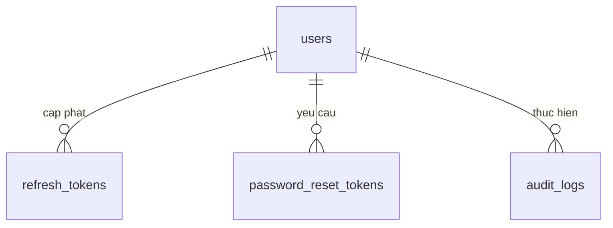
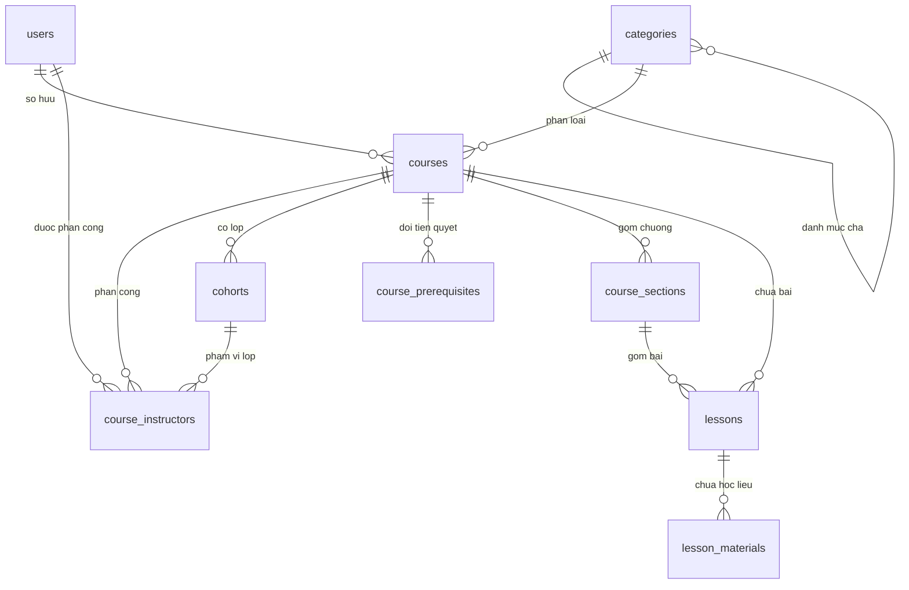
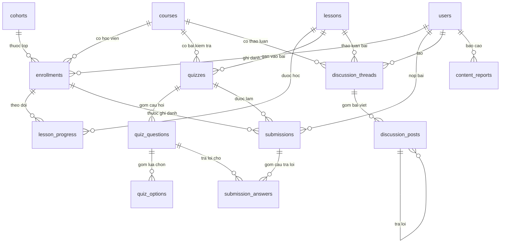
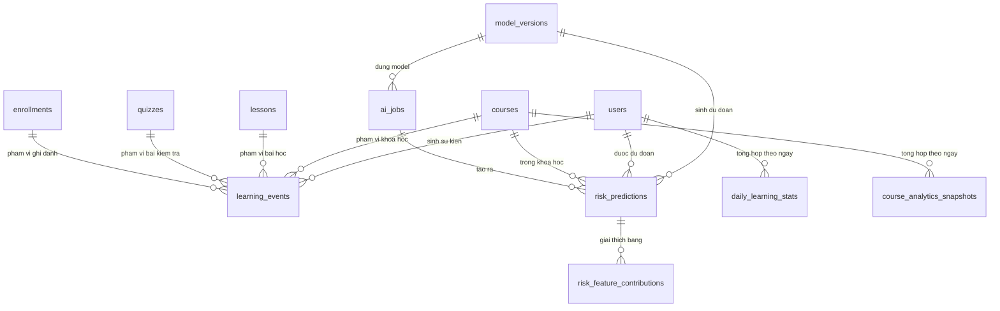
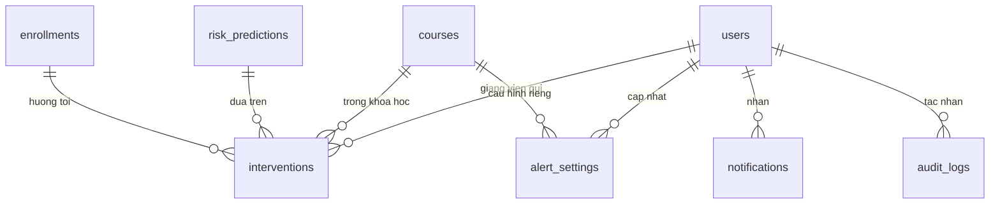

# Thiết kế cơ sở dữ liệu — UniPrep

> Phiên bản: v0.1 — Ngày: 2026-09-26

## 1. Phạm vi & quan hệ với tài liệu khác

Tài liệu này là **thiết kế đích** cho tầng dữ liệu của UniPrep (tên cũ trong mockup: "EduLMS Portal"),
được soạn trực tiếp từ `docs/proposal.md` — **source of truth của dự án, cả về phạm vi lẫn stack**
(§3.1 phạm vi chức năng, §4.1 lựa chọn thành phần nâng cao, §4.3 kế hoạch kiểm thử dữ liệu, §5.1–5.2
technology stack) — và tham khảo `docs/architecture.md` cho các **chi tiết kỹ thuật không làm đổi phạm vi**
(§2 nguyên tắc thiết kế, §4 phân rã module NestJS, §7 định nghĩa "nguy cơ chậm tiến độ", §8 bảo mật &
vận hành). Khi hai tài liệu mâu thuẫn, theo `README.md` §1.1: **proposal thắng**. Phần nghiệp vụ nền (tài khoản, khoá học, bài học,
bài tập, tiến độ) bám theo **`proposal.md` (source of truth)**: sản phẩm là nền tảng hỗ trợ học tập
trực tuyến, nội dung bài học gồm text/slide/video và quiz trắc nghiệm — **không** gắn với môn tiếng Anh
và không có phần luyện nói/viết. Schema chỉ mô hình hoá `course → course_sections → lessons →
lesson_materials/quizzes`; mọi ví dụ dữ liệu trong tài liệu dùng ví dụ trung tính (ví dụ môn "Giải tích 1",
"Vật lý đại cương") để tránh khoá cứng một môn.
Mục tiêu của tài liệu là đủ chi tiết để một thành viên mới viết được entity + migration mà không phải hỏi
lại; khi `proposal.md` hoặc `architecture.md` thay đổi, tài liệu này phải được cập nhật tương ứng.

### 1.1. Quy ước thiết kế bắt buộc

Các quy ước dưới đây áp dụng cho **toàn bộ** tài liệu và cho mọi tài liệu khác trong `docs/`.

| # | Quy ước | Cách thực hiện |
| --- | --- | --- |
| 1 | Tên bảng | `snake_case`, số nhiều, tiếng Anh (`users`, `lesson_progress`) |
| 2 | Tên cột | `snake_case` tiếng Anh; tên field TypeScript là `camelCase`. Do đó **mọi** `@Column` phải ghi rõ `name: 'snake_case'` |
| 3 | Union type thay cho TS `enum` | `export type UserRole = 'student' \| 'teacher' \| 'admin';` và cột Postgres `varchar` + `CHECK` khi cần |
| 4 | Khoá chính | `id` UUID, `@PrimaryGeneratedColumn('uuid')`, kế thừa `BaseEntityCustom` (`backend/src/common/entities/base-custom.entity.ts`) |
| 5 | Bảng nghiệp vụ | Đều có `created_at`/`updated_at`; **trừ** bảng log/append-only (`learning_events`, `audit_logs`, `risk_feature_contributions`) chỉ có `created_at` |
| 6 | Thời gian | `timestamptz` (UTC). Không dùng `timestamp without time zone` |
| 7 | Ngôn ngữ | Text/message/API cho người dùng: **tiếng Việt**. Tên bảng/cột/field/hằng số: tiếng Anh |
| 8 | Khoá ngoại | Tên cột `<singular>_id`; **bắt buộc** ghi rõ `onDelete` |
| 9 | Module NestJS | `AuthModule`, `UserModule`, `CourseModule`, `LessonModule`, `ExerciseModule`, `LearningActivityModule`, `AnalyticsModule`, `AIGatewayModule`, `NotificationModule`, `InterventionModule`, `AdminModule` |

### 1.2. Ghi chú kỹ thuật rút ra từ code hiện có

Ba điểm dưới đây được rút ra từ việc đọc code trong repo, không phải giả định:

1. **`BaseEntityCustom` chưa khai báo `name` cho cột thời gian — ✅ ĐÃ SỬA 2026-09-26.** Trước đây file
   `backend/src/common/entities/base-custom.entity.ts` dùng `@CreateDateColumn()` và `@UpdateDateColumn()`
   không có tham số. TypeORM 0.3 dùng `DefaultNamingStrategy`, và `columnName()` trả về nguyên tên property
   khi không có custom name → cột sinh ra sẽ là `createdAt`/`updatedAt` (camelCase), **không** phải
   `created_at`/`updated_at`, tức schema bị trộn hai kiểu đặt tên.
   **Cách đã chọn: (a)** — sửa trực tiếp entity cơ sở, không thêm `SnakeNamingStrategy`:
   ```ts
   @PrimaryGeneratedColumn('uuid', { name: 'id' }) id: string;
   @CreateDateColumn({ name: 'created_at', type: 'timestamptz' }) createdAt: Date;
   @UpdateDateColumn({ name: 'updated_at', type: 'timestamptz' }) updatedAt: Date;
   ```
   Lý do chọn (a): chỉ sửa 1 file, không cần thêm dependency `typeorm-naming-strategies`, và **không**
   mâu thuẫn với các `@Column({ name: ... })` đã ghi tay trong `student.entity.ts` và các entity mẫu ở §8.
   Kiểm chứng: bảng `students` đã tồn tại trên DB dev với cột `created_at`/`updated_at` (do `synchronize`
   tạo từ trước) — sau khi sửa, cần chạy `\d students` để xác nhận không sinh cột trùng; nếu có cột
   `createdAt` cũ thì xoá bảng và để `synchronize` tạo lại (dữ liệu hiện tại chỉ là dữ liệu mẫu).
2. **`synchronize: true` đang bật** (`backend/src/app.module.ts`, dòng 25) và **chưa có migration**.
   Xem lộ trình bỏ `synchronize` ở §9.
   → **✅ ĐÃ XỬ LÝ 2026-10-03 (E0-T4/T5):** `synchronize: false` ở cả `app.module.ts` và
   `src/database/data-source.ts`; đã có `src/database/data-source.ts` cho TypeORM CLI, migration baseline
   `src/database/migrations/1791015645541-BaselineCoreSchema.ts` (25 bảng) và CI kiểm tra drift bằng `schema:log`.
2. **Tầng schema lõi 25 bảng đã có (E0-T5) và auth đã dùng thật (E1).** Các bảng ngoài baseline
   (xem §1.3) vẫn là **cần làm**.

### 1.3. Hiện trạng repo & bảng legacy

| Hạng mục | Trạng thái | Ghi chú |
| --- | --- | --- |
| `health` module | **Đã có** | `GET /api/health`, ping DB; không tạo bảng nào |
| `students` table + `StudentModule` | **ĐÃ XOÁ 2026-10-03 (E0)** | Module CRUD mẫu, entity và bảng legacy đều bị xoá; baseline migration có `DROP TABLE IF EXISTS "students"` (chi tiết ở dưới) |
| `synchronize: true` | **ĐÃ TẮT 2026-10-03 (E0)** | `synchronize: false` ở cả `app.module.ts` lẫn `data-source.ts`; schema chỉ đổi qua migration (§9) |
| Tầng schema 25 bảng lõi | **Đã có** | Entity + migration baseline sinh bằng CLI (E0-T5), CI kiểm tra drift |
| `password_reset_tokens`, `course_instructors`, `cohorts`, `course_prerequisites`, `risk_feature_contributions`, 2 materialized view | **Một phần đã có** | `password_reset_tokens` **đã có ở E1-T4** (2026-10-03); `cohorts` + `course_instructors` + `course_prerequisites` **đã có ở E3** (migration `1791022171040`); còn `risk_feature_contributions` (E8-T3/E9-T9) và 2 view (E8-T2) |

Bảng `students` hiện tại (đọc từ `student.entity.ts`) — **không** nằm trong ERD §2 vì là bảng legacy:

| Cột | Kiểu Postgres | Null | Mặc định | Ràng buộc/Ghi chú |
| --- | --- | --- | --- | --- |
| `id` | `uuid` | NOT NULL | `gen_random_uuid()` | PK, kế thừa `BaseEntityCustom` |
| `created_at` | `timestamptz` | NOT NULL | `now()` | Xem cảnh báo §1.2 mục 1 (hiện có thể đang là `createdAt`) |
| `updated_at` | `timestamptz` | NOT NULL | `now()` | Như trên |
| `full_name` | `varchar(255)` | NOT NULL | | |
| `student_code` | `varchar(50)` | NOT NULL | | UNIQUE |
| `email` | `varchar(255)` | NOT NULL | | UNIQUE |
| `phone` | `varchar(20)` | NULL | | |
| `major` | `varchar(255)` | NULL | | |
| `is_active` | `boolean` | NOT NULL | `true` | |

**Hướng xử lý legacy (khuyến nghị):** giữ `students` nguyên trạng trong giai đoạn MVP để không phá
`/students` đang chạy; khi `UserModule` hoàn thành, tạo migration `MigrateStudentsToUsers` để copy
`full_name/email/phone/student_code` sang `users` (với `role = 'student'`) và `major` sang một cột
`users.major` **chỉ tồn tại trong bảng `users`** (xem §3.1.1), sau đó xoá bảng `students` và `StudentModule`.
Việc xoá bảng là quyết định của nhóm — đưa vào §11.

> **✅ ĐÃ CHỐT VÀ LÀM 2026-10-03 (E0):** nhóm chọn **xoá thẳng** thay vì migrate dữ liệu, vì bảng chỉ
> chứa dữ liệu mẫu do `synchronize` sinh ra. Đã thực hiện: xoá `StudentModule` + `student.entity.ts`,
> xoá trang/route/`apis/student`/`types/student.ts` ở FE, và baseline migration chạy
> `DROP TABLE IF EXISTS "students"`. Migration `MigrateStudentsToUsers` (§9.2 dòng 8) **không cần nữa**.
> Các cột `full_name/email/phone/student_code/major` vẫn nằm trong `users` như thiết kế §3.1.1.

## 2. Sơ đồ ERD

Năm sơ đồ dưới đây hợp lại phủ **toàn bộ 31 bảng** của tài liệu (chia theo cụm để đọc được trên màn hình).
Sơ đồ chỉ thể hiện **quan hệ giữa các bảng**; danh sách cột đầy đủ của từng bảng nằm ở §3. Mỗi bảng trong
sơ đồ đều có mục mô tả tương ứng ở §3 và ngược lại. Bảng legacy `students` không nằm trong sơ đồ (xem §1.3).

### 2.1. Cụm A — Identity & Access



### 2.2. Cụm B — Course & Content



### 2.3. Cụm C — Learning & Assessment



### 2.4. Cụm D — Analytics & AI



> `daily_learning_stats` và `course_analytics_snapshots` là **materialized view** (không phải entity
> TypeORM, không áp dụng quy ước `BaseEntityCustom`) — xem §3.4.6, §3.4.7 và §5.

### 2.5. Cụm E — Ops & Audit



## 3. Danh sách bảng theo cụm

**Ghi chú chung cho cả §3:** mọi bảng đều có `id uuid` (PK, `gen_random_uuid()`), `created_at`,
`updated_at` — kế thừa `BaseEntityCustom`, các dòng này vẫn được liệt kê đầy đủ trong từng bảng cột.
Bảng append-only chỉ có `created_at`. Cột Postgres ghi theo kiểu thật dùng khi tạo migration.

### 3.1. Cụm A — Identity & Access

#### 3.1.1 `users`

**Mục đích:** tài khoản duy nhất cho cả ba vai trò (học viên / giảng viên / quản trị viên), là gốc của
RBAC và là chủ thể của mọi dữ liệu hành vi. Thay thế bảng legacy `students`.
**Module:** `UserModule` (đăng ký, hồ sơ) + `AuthModule` (đăng nhập, token). **Trạng thái:** cần làm.

| Cột | Kiểu Postgres | Null | Mặc định | Ràng buộc/Ghi chú |
| --- | --- | --- | --- | --- |
| `id` | `uuid` | NOT NULL | `gen_random_uuid()` | PK, kế thừa `BaseEntityCustom` |
| `created_at` | `timestamptz` | NOT NULL | `now()` | UTC |
| `updated_at` | `timestamptz` | NOT NULL | `now()` | UTC |
| `email` | `varchar(255)` | NOT NULL | | UNIQUE; index `lower(email)` để không phân biệt hoa/thường |
| `password_hash` | `varchar(255)` | NOT NULL | | bcrypt (cost ≥ 10) hoặc argon2id. **`select: false`** trong TypeORM — không bao giờ trả qua API (§6) |
| `full_name` | `varchar(255)` | NOT NULL | | |
| `role` | `varchar(20)` | NOT NULL | `'student'` | `CHECK (role IN ('student','teacher','admin'))`; union `UserRole` |
| `status` | `varchar(20)` | NOT NULL | `'pending'` | `CHECK (status IN ('pending','active','suspended','disabled'))`; union `UserStatus` |
| `phone` | `varchar(20)` | NULL | | |
| `avatar_url` | `varchar(512)` | NULL | | |
| `bio` | `text` | NULL | | |
| `major` | `varchar(255)` | NULL | | Giữ từ bảng legacy `students` (ngành học) |
| `student_code` | `varchar(50)` | NULL | | UNIQUE **một phần** `WHERE student_code IS NOT NULL` |
| `date_of_birth` | `date` | NULL | | |
| `preferred_locale` | `varchar(10)` | NOT NULL | `'vi'` | |
| `email_verified_at` | `timestamptz` | NULL | | NULL = chưa xác thực |
| `last_login_at` | `timestamptz` | NULL | | Feature "tần suất đăng nhập N ngày" (architecture.md §7) |
| `failed_login_count` | `smallint` | NOT NULL | `0` | Phục vụ rate limit / tạm khoá |
| `locked_until` | `timestamptz` | NULL | | |
| `deleted_at` | `timestamptz` | NULL | | Soft delete (§3.3 soft delete toàn cục — xem §11) |

**Chỉ mục:** `uq_users_email_lower` UNIQUE `(lower(email))`; `uq_users_student_code` UNIQUE `(student_code) WHERE student_code IS NOT NULL`; `idx_users_role_status (role, status)` (màn hình admin lọc theo vai trò + trạng thái).

#### 3.1.2 `refresh_tokens`

**Mục đích:** lưu refresh token đã phát hành để hỗ trợ thu hồi, xoay token (rotation) và phát hiện tái sử
dụng token. **Chọn `refresh_tokens` thay vì `auth_sessions`** vì JWT access + refresh là mô hình đã chốt
(architecture.md §3.2) và cần theo dõi từng token; nếu sau này cần quản lý phiên thiết bị ở mức cao hơn
(đăng xuất mọi thiết bị, xem danh sách phiên) thì `auth_sessions` là bảng cha tự nhiên — đưa vào §11.
**Module:** `AuthModule`. **Trạng thái:** cần làm.

| Cột | Kiểu Postgres | Null | Mặc định | Ràng buộc/Ghi chú |
| --- | --- | --- | --- | --- |
| `id` | `uuid` | NOT NULL | `gen_random_uuid()` | PK |
| `created_at` | `timestamptz` | NOT NULL | `now()` | |
| `updated_at` | `timestamptz` | NOT NULL | `now()` | |
| `user_id` | `uuid` | NOT NULL | | FK → `users(id)` **ON DELETE CASCADE** |
| `token_hash` | `varchar(255)` | NOT NULL | | UNIQUE. **Chỉ lưu hash** (SHA-256), không lưu token gốc |
| `family_id` | `uuid` | NOT NULL | | Nhóm token của cùng một chuỗi rotation; phát hiện reuse → thu hồi cả family |
| `issued_at` | `timestamptz` | NOT NULL | `now()` | |
| `expires_at` | `timestamptz` | NOT NULL | | `CHECK (expires_at > issued_at)` |
| `revoked_at` | `timestamptz` | NULL | | NULL = còn hiệu lực |
| `revoked_reason` | `varchar(100)` | NULL | | `'logout'`, `'rotated'`, `'reuse_detected'`, `'admin_revoke'`, `'password_reset'`, `'password_changed'` (hai giá trị cuối thêm ở E1-T4; cột **không** đặt CHECK nên không cần migration) |
| `replaced_by_token_id` | `uuid` | NULL | | FK → `refresh_tokens(id)` **ON DELETE SET NULL** (self-FK) |
| `ip_hash` | `varchar(64)` | NULL | | Hash, không lưu IP thô |
| `user_agent` | `varchar(512)` | NULL | | |

**Chỉ mục:** `idx_refresh_tokens_user_active (user_id, expires_at) WHERE revoked_at IS NULL`; `idx_refresh_tokens_family (family_id)` (thu hồi cả family).

#### 3.1.3 `password_reset_tokens`

**Mục đích:** token dùng một lần cho luồng "quên mật khẩu" (proposal §3.1).
**Module:** `AuthModule`. **Trạng thái:** **đã có (E1-T4, 2026-10-03)** — entity
`backend/src/auth/entities/password-reset-token.entity.ts`, migration
`1791017471553-AddPasswordResetTokens`, API `POST /api/auth/forgot-password` và `/reset-password`.

| Cột | Kiểu Postgres | Null | Mặc định | Ràng buộc/Ghi chú |
| --- | --- | --- | --- | --- |
| `id` | `uuid` | NOT NULL | `gen_random_uuid()` | PK |
| `created_at` | `timestamptz` | NOT NULL | `now()` | |
| `updated_at` | `timestamptz` | NOT NULL | `now()` | |
| `user_id` | `uuid` | NOT NULL | | FK → `users(id)` **ON DELETE CASCADE** |
| `token_hash` | `varchar(255)` | NOT NULL | | UNIQUE; chỉ lưu hash |
| `expires_at` | `timestamptz` | NOT NULL | | Khuyến nghị TTL ngắn (ví dụ 30 phút — cấu hình, không hard-code) |
| `used_at` | `timestamptz` | NULL | | NULL = chưa dùng; dùng rồi thì không dùng lại |
| `requested_ip_hash` | `varchar(64)` | NULL | | |

**Chỉ mục:** `idx_password_reset_tokens_user (user_id, expires_at DESC)`.

### 3.2. Cụm B — Course & Content

#### 3.2.1 `categories`

**Mục đích:** danh mục/khoa quản lý khoá học, hỗ trợ phân cấp (danh mục cha → con) và lọc ở trang catalog
(proposal §3.1 "Course catalog featuring search, filtering, and pagination").
**Module:** `CourseModule` (đọc) + `AdminModule` (ghi). **Trạng thái:** ✅ E3-T3 (API đọc/ghi danh mục).

| Cột | Kiểu Postgres | Null | Mặc định | Ràng buộc/Ghi chú |
| --- | --- | --- | --- | --- |
| `id` | `uuid` | NOT NULL | `gen_random_uuid()` | PK |
| `created_at` | `timestamptz` | NOT NULL | `now()` | |
| `updated_at` | `timestamptz` | NOT NULL | `now()` | |
| `name` | `varchar(150)` | NOT NULL | | |
| `slug` | `varchar(180)` | NOT NULL | | UNIQUE, dùng cho URL lọc |
| `description` | `text` | NULL | | |
| `parent_id` | `uuid` | NULL | | FK → `categories(id)` **ON DELETE SET NULL** (self-FK) |
| `order_index` | `integer` | NOT NULL | `0` | Thứ tự hiển thị trong cùng cấp |
| `is_active` | `boolean` | NOT NULL | `true` | Ẩn danh mục mà không xoá |

**Chỉ mục:** `uq_categories_slug` UNIQUE `(slug)`; `idx_categories_parent_order (parent_id, order_index)`.

#### 3.2.2 `courses`

**Mục đích:** thực thể trung tâm của nội dung; chứa metadata catalog (mô tả, giảng viên, danh mục, học kỳ)
và vòng đời xuất bản. Tương ứng `Course` trong `frontend/src/types/course.ts` nhưng **không** lưu trạng thái
`in-progress/future/past` của FE — đó là trạng thái suy diễn theo từng học viên (xem §7.2).
**Module:** `CourseModule`. **Trạng thái:** ✅ E3-T1 (CRUD + publish/unpublish).

| Cột | Kiểu Postgres | Null | Mặc định | Ràng buộc/Ghi chú |
| --- | --- | --- | --- | --- |
| `id` | `uuid` | NOT NULL | `gen_random_uuid()` | PK |
| `created_at` | `timestamptz` | NOT NULL | `now()` | |
| `updated_at` | `timestamptz` | NOT NULL | `now()` | |
| `code` | `varchar(50)` | NOT NULL | | UNIQUE; mã khoá học hiển thị (dùng làm `code` của FE) |
| `title` | `varchar(255)` | NOT NULL | | |
| `slug` | `varchar(280)` | NOT NULL | | UNIQUE |
| `summary` | `varchar(500)` | NULL | | Mô tả ngắn cho card catalog |
| `description` | `text` | NULL | | Đề cương / điều kiện tiên quyết (proposal §3.1 "syllabus, prerequisites") |
| `category_id` | `uuid` | NULL | | FK → `categories(id)` **ON DELETE SET NULL** |
| `owner_id` | `uuid` | NOT NULL | | FK → `users(id)` **ON DELETE RESTRICT** — giảng viên phụ trách chính |
| `cover_url` | `varchar(512)` | NULL | | |
| `level` | `varchar(20)` | NULL | | union `CourseLevel` = `beginner`/`intermediate`/`advanced` |
| `language` | `varchar(10)` | NOT NULL | `'vi'` | Nội dung có thể là bất kỳ môn nào; không ràng buộc tiếng Anh |
| `semester` | `varchar(20)` | NULL | | Dạng hiển thị, ví dụ `'1/2026-2027'` (khớp `semester` của FE) |
| `status` | `varchar(20)` | NOT NULL | `'draft'` | `CHECK (status IN ('draft','published','hidden','archived'))`; union `CourseStatus` |
| `visibility` | `varchar(20)` | NOT NULL | `'public'` | `CHECK (visibility IN ('public','unlisted','private'))` |
| `estimated_hours` | `numeric(5,1)` | NULL | | |
| `enrollment_open` | `boolean` | NOT NULL | `true` | Cho phép tự ghi danh hay không |
| `max_students` | `integer` | NULL | | NULL = không giới hạn |
| `published_at` | `timestamptz` | NULL | | |
| `archived_at` | `timestamptz` | NULL | | |
| `created_by` | `uuid` | NULL | | FK → `users(id)` **ON DELETE SET NULL** (admin tạo hộ) |
| `deleted_at` | `timestamptz` | NULL | | Soft delete |

**Chỉ mục:** `uq_courses_code` UNIQUE `(code)`; `uq_courses_slug` UNIQUE `(slug)`; `idx_courses_status_published (status, published_at DESC) WHERE deleted_at IS NULL` (catalog chỉ hiển thị published); `idx_courses_category_status (category_id, status)`; `idx_courses_owner (owner_id)`; tìm kiếm `GIN (to_tsvector('simple', title || ' ' || coalesce(summary,'')))` — xem §4.4.

#### 3.2.3 `course_instructors`

**Mục đích:** bảng nối nhiều-nhiều giữa giảng viên và khoá học, **đồng thời là nguồn chân lý cho RBAC tầng
truy vấn**: "giảng viên chỉ xem được học viên của lớp mình" (architecture.md §8) được kiểm tra bằng bảng
này. Một dòng có `cohort_id` = giảng viên chỉ phụ trách lớp đó; `cohort_id IS NULL` = phụ trách cả khoá.
**Module:** `CourseModule` + `AdminModule`. **Trạng thái:** ✅ E3-T1 (bảng + API phân công; RBAC tầng truy vấn đi qua `CourseAccessService`).

| Cột | Kiểu Postgres | Null | Mặc định | Ràng buộc/Ghi chú |
| --- | --- | --- | --- | --- |
| `id` | `uuid` | NOT NULL | `gen_random_uuid()` | PK |
| `created_at` | `timestamptz` | NOT NULL | `now()` | |
| `updated_at` | `timestamptz` | NOT NULL | `now()` | |
| `course_id` | `uuid` | NOT NULL | | FK → `courses(id)` **ON DELETE CASCADE** |
| `user_id` | `uuid` | NOT NULL | | FK → `users(id)` **ON DELETE CASCADE** |
| `cohort_id` | `uuid` | NULL | | FK → `cohorts(id)` **ON DELETE SET NULL** |
| `role_in_course` | `varchar(20)` | NOT NULL | `'co_instructor'` | `CHECK (role_in_course IN ('owner','co_instructor','assistant'))` |
| `assigned_by` | `uuid` | NULL | | FK → `users(id)` **ON DELETE SET NULL** |
| `assigned_at` | `timestamptz` | NOT NULL | `now()` | |

**Ràng buộc đặc biệt:** UNIQUE `(course_id, user_id, COALESCE(cohort_id, '00000000-0000-0000-0000-000000000000'::uuid))`.
Không dùng UNIQUE ba cột thô vì trong Postgres các giá trị NULL được coi là khác nhau, nên
`(course_id, user_id, NULL)` có thể bị chèn trùng nhiều lần. (Postgres 15 có `UNIQUE NULLS NOT DISTINCT`
nhưng README chỉ yêu cầu PostgreSQL 14+, nên biểu thức `COALESCE` là lựa chọn an toàn.)

#### 3.2.4 `cohorts`

**Mục đích:** lớp/nhóm học viên trong một khoá học (khớp `group`/`classes` trong mockup FE, ví dụ
`CQ_HK261` và `L01`). Cần thiết để (a) scope RBAC theo lớp, (b) so sánh cohort trên dashboard.
**Module:** `CourseModule` + `AdminModule`. **Trạng thái:** ✅ E3-T1 (bảng + API phân công; RBAC tầng truy vấn đi qua `CourseAccessService`).

| Cột | Kiểu Postgres | Null | Mặc định | Ràng buộc/Ghi chú |
| --- | --- | --- | --- | --- |
| `id` | `uuid` | NOT NULL | `gen_random_uuid()` | PK |
| `created_at` | `timestamptz` | NOT NULL | `now()` | |
| `updated_at` | `timestamptz` | NOT NULL | `now()` | |
| `course_id` | `uuid` | NOT NULL | | FK → `courses(id)` **ON DELETE CASCADE** |
| `group_code` | `varchar(50)` | NULL | | Nhóm lớp, ví dụ `'CQ_HK261'` |
| `class_code` | `varchar(50)` | NULL | | Lớp, ví dụ `'L01'` |
| `name` | `varchar(150)` | NOT NULL | | Tên hiển thị đầy đủ |
| `semester` | `varchar(20)` | NULL | | Học kỳ của lớp |
| `starts_on` | `date` | NULL | | |
| `ends_on` | `date` | NULL | | `CHECK (ends_on IS NULL OR starts_on IS NULL OR ends_on >= starts_on)` |

**Chỉ mục:** `uq_cohorts_course_class` UNIQUE `(course_id, class_code) WHERE class_code IS NOT NULL`.

#### 3.2.5 `course_sections`

**Mục đích:** chương/chủ đề trong khoá học — cấp trung gian giữa `courses` và `lessons` (proposal §3.1
"chapter-lesson structure"). Ánh xạ `CourseSection` của FE. **Module:** `CourseModule`/`LessonModule`.
**Trạng thái:** ✅ E3-T2 (CRUD + reorder + publish).

| Cột | Kiểu Postgres | Null | Mặc định | Ràng buộc/Ghi chú |
| --- | --- | --- | --- | --- |
| `id` | `uuid` | NOT NULL | `gen_random_uuid()` | PK |
| `created_at` | `timestamptz` | NOT NULL | `now()` | |
| `updated_at` | `timestamptz` | NOT NULL | `now()` | |
| `course_id` | `uuid` | NOT NULL | | FK → `courses(id)` **ON DELETE CASCADE** |
| `title` | `varchar(255)` | NOT NULL | | |
| `description` | `text` | NULL | | |
| `order_index` | `integer` | NOT NULL | | UNIQUE theo `(course_id, order_index)` |
| `is_published` | `boolean` | NOT NULL | `false` | Chương publish nhưng bài bên trong vẫn có thể ẩn |
| `published_at` | `timestamptz` | NULL | | |

#### 3.2.6 `lessons`

**Mục đích:** bài học — đơn vị tiến độ nhỏ nhất mà học viên hoàn thành. `order_index` là **lộ trình**
(roadmap) dùng trực tiếp cho feature "tỷ lệ hoàn thành đúng hạn so với lộ trình" (architecture.md §7).
**Module:** `LessonModule`. **Trạng thái:** ✅ E3-T2 (CRUD + reorder + publish/hide).

| Cột | Kiểu Postgres | Null | Mặc định | Ràng buộc/Ghi chú |
| --- | --- | --- | --- | --- |
| `id` | `uuid` | NOT NULL | `gen_random_uuid()` | PK |
| `created_at` | `timestamptz` | NOT NULL | `now()` | |
| `updated_at` | `timestamptz` | NOT NULL | `now()` | |
| `course_id` | `uuid` | NOT NULL | | FK → `courses(id)` **ON DELETE CASCADE**. **Cố ý denormalize** (đã suy ra được qua `section_id`) để truy vấn analytics không phải join `course_sections` |
| `section_id` | `uuid` | NOT NULL | | FK → `course_sections(id)` **ON DELETE CASCADE** |
| `title` | `varchar(255)` | NOT NULL | | |
| `slug` | `varchar(280)` | NOT NULL | | UNIQUE theo `(course_id, slug)` |
| `summary` | `varchar(500)` | NULL | | |
| `content` | `text` | NULL | | Nội dung text (markdown) của bài |
| `content_format` | `varchar(20)` | NOT NULL | `'markdown'` | `CHECK (content_format IN ('markdown','html','tiptap_json'))` — repo dùng TipTap 3 |
| `order_index` | `integer` | NOT NULL | | **Lộ trình**; UNIQUE `(course_id, order_index) WHERE deleted_at IS NULL` |
| `estimated_minutes` | `integer` | NULL | | |
| `available_from` | `timestamptz` | NULL | | Mở bài theo lịch |
| `due_at` | `timestamptz` | NULL | | Hạn hoàn thành; NULL = không có hạn → query "đúng hạn" bỏ qua |
| `is_published` | `boolean` | NOT NULL | `false` | |
| `published_at` | `timestamptz` | NULL | | |
| `created_by` | `uuid` | NULL | | FK → `users(id)` **ON DELETE SET NULL** |
| `deleted_at` | `timestamptz` | NULL | | Soft delete |

#### 3.2.7 `lesson_materials`

**Mục đích:** học liệu đính kèm bài học: text/slide/video/tệp/link (proposal §3.1). `duration_seconds`
của video là một feature tiềm năng (so sánh thời lượng xem thực tế với thời lượng video).
**Module:** `LessonModule`. **Trạng thái:** ✅ E3-T4 (upload multipart + danh sách + xoá; `material_type` suy ra từ MIME).

| Cột | Kiểu Postgres | Null | Mặc định | Ràng buộc/Ghi chú |
| --- | --- | --- | --- | --- |
| `id` | `uuid` | NOT NULL | `gen_random_uuid()` | PK |
| `created_at` | `timestamptz` | NOT NULL | `now()` | |
| `updated_at` | `timestamptz` | NOT NULL | `now()` | |
| `lesson_id` | `uuid` | NOT NULL | | FK → `lessons(id)` **ON DELETE CASCADE** |
| `material_type` | `varchar(20)` | NOT NULL | | `CHECK (material_type IN ('text','slide','video','file','link'))` |
| `title` | `varchar(255)` | NOT NULL | | |
| `content` | `text` | NULL | | Bắt buộc khi `material_type = 'text'` |
| `url` | `varchar(1024)` | NULL | | Bắt buộc với `slide`/`video`/`link` |
| `storage_key` | `varchar(512)` | NULL | | Khoá trong object storage (nếu upload nội bộ) |
| `mime_type` | `varchar(100)` | NULL | | |
| `file_size_bytes` | `bigint` | NULL | | `CHECK (file_size_bytes IS NULL OR file_size_bytes >= 0)` |
| `duration_seconds` | `integer` | NULL | | Thời lượng video; `CHECK (duration_seconds IS NULL OR duration_seconds >= 0)` |
| `order_index` | `integer` | NOT NULL | `0` | |
| `is_published` | `boolean` | NOT NULL | `true` | |

**CHECK bắt buộc:** `CHECK (url IS NOT NULL OR content IS NOT NULL)` — không có học liệu rỗng.

#### 3.2.8 `course_prerequisites` (bổ sung ở E3-T5, 2026-10-03)

**Mục đích:** điều kiện tiên quyết giữa hai khoá học. **Vì sao bảng này không có trong bản gốc:** §3.2.2
coi "điều kiện tiên quyết" là *văn bản* trong `courses.description`, nên không mô hình hoá được; DoD của
E3-T5 lại đòi API trả cờ `eligible: false` **kèm lý do**, tức phải có dữ liệu có cấu trúc để đối chiếu.
`courses.description` vẫn giữ vai trò đề cương văn bản — hai thứ bổ sung nhau, không thay thế nhau.
**Module:** `CourseModule`. **Trạng thái:** ✅ E3-T5.

| Cột | Kiểu Postgres | Null | Mặc định | Ràng buộc/Ghi chú |
| --- | --- | --- | --- | --- |
| `id` | `uuid` | NOT NULL | `gen_random_uuid()` | PK |
| `created_at` | `timestamptz` | NOT NULL | `now()` | |
| `updated_at` | `timestamptz` | NOT NULL | `now()` | |
| `course_id` | `uuid` | NOT NULL | | FK → `courses(id)` **ON DELETE CASCADE** |
| `prerequisite_course_id` | `uuid` | NOT NULL | | FK → `courses(id)` **ON DELETE CASCADE** |

**Ràng buộc:** UNIQUE `(course_id, prerequisite_course_id)`; `CHECK (course_id <> prerequisite_course_id)`
(khoá học không thể là tiên quyết của chính nó).

**Quy tắc "đã đạt" (chốt 2026-10-03):** người gọi có dòng `enrollments` với `status = 'completed'` cho
khoá tiên quyết. Bảng `enrollments` đã có từ baseline E0 nên quy tắc này kiểm chứng được ngay ở E3,
trước khi `EnrollmentModule` (E4) hoàn thiện phần *ghi* trạng thái `completed`. Nơi thực thi duy nhất:
`backend/src/course/course-eligibility.service.ts` — dùng cho cả `GET /api/courses/:id` (trả cờ) lẫn
`POST /api/enrollments` (chặn), nên giao diện và đường ghi không thể bất đồng.

### 3.3. Cụm C — Learning & Assessment

#### 3.3.1 `enrollments`

**Mục đích:** ghi danh của học viên vào khoá học; là **phạm vi (scope)** để gom mọi dữ liệu hành vi của một
học viên trong một khoá; là bảng mà dashboard và model dự đoán lặp qua.
**Module:** `CourseModule`/`LearningActivityModule`. **Trạng thái:** cần làm.

| Cột | Kiểu Postgres | Null | Mặc định | Ràng buộc/Ghi chú |
| --- | --- | --- | --- | --- |
| `id` | `uuid` | NOT NULL | `gen_random_uuid()` | PK |
| `created_at` | `timestamptz` | NOT NULL | `now()` | |
| `updated_at` | `timestamptz` | NOT NULL | `now()` | |
| `user_id` | `uuid` | NOT NULL | | FK → `users(id)` **ON DELETE CASCADE** |
| `course_id` | `uuid` | NOT NULL | | FK → `courses(id)` **ON DELETE CASCADE** |
| `cohort_id` | `uuid` | NULL | | FK → `cohorts(id)` **ON DELETE SET NULL**; phục vụ scope theo lớp |
| `status` | `varchar(20)` | NOT NULL | `'active'` | `CHECK (status IN ('active','completed','dropped','expired'))`; union `EnrollmentStatus` |
| `source` | `varchar(20)` | NOT NULL | `'self'` | `CHECK (source IN ('self','invited','admin'))` |
| `enrolled_at` | `timestamptz` | NOT NULL | `now()` | |
| `started_at` | `timestamptz` | NULL | | Lần đầu thực sự học |
| `last_activity_at` | `timestamptz` | NULL | | **Cache** của feature recency; cập nhật bởi `LearningActivityModule` |
| `completed_at` | `timestamptz` | NULL | | |
| `dropped_at` | `timestamptz` | NULL | | |
| `progress_percent` | `numeric(5,2)` | NOT NULL | `0` | `CHECK (progress_percent BETWEEN 0 AND 100)`; cache, có thể tính lại (§11) |
| `final_score` | `numeric(5,2)` | NULL | | Điểm tổng kết nếu khoá có quy đổi |

**Chỉ mục:** `uq_enrollments_user_course` UNIQUE `(user_id, course_id)`; `idx_enrollments_course_status (course_id, status)`; `idx_enrollments_cohort (cohort_id) WHERE cohort_id IS NOT NULL`; `idx_enrollments_user_active (user_id, last_activity_at DESC) WHERE status = 'active'`.

#### 3.3.2 `lesson_progress`

**Mục đích:** trạng thái học từng bài của từng học viên, nguồn của "tỷ lệ hoàn thành" và "hoàn thành đúng
hạn" (`completed_at` so với `lessons.due_at`). **Module:** `LearningActivityModule`/`LessonModule`.
**Trạng thái:** cần làm.

| Cột | Kiểu Postgres | Null | Mặc định | Ràng buộc/Ghi chú |
| --- | --- | --- | --- | --- |
| `id` | `uuid` | NOT NULL | `gen_random_uuid()` | PK |
| `created_at` | `timestamptz` | NOT NULL | `now()` | |
| `updated_at` | `timestamptz` | NOT NULL | `now()` | |
| `enrollment_id` | `uuid` | NOT NULL | | FK → `enrollments(id)` **ON DELETE CASCADE** |
| `user_id` | `uuid` | NOT NULL | | FK → `users(id)` **ON DELETE CASCADE** |
| `course_id` | `uuid` | NOT NULL | | FK → `courses(id)` **ON DELETE CASCADE** (denormalize cho analytics) |
| `lesson_id` | `uuid` | NOT NULL | | FK → `lessons(id)` **ON DELETE CASCADE** |
| `status` | `varchar(20)` | NOT NULL | `'not_started'` | `CHECK (status IN ('not_started','in_progress','completed'))` |
| `first_viewed_at` | `timestamptz` | NULL | | |
| `last_viewed_at` | `timestamptz` | NULL | | |
| `completed_at` | `timestamptz` | NULL | | So với `lessons.due_at` để suy ra đúng hạn |
| `time_spent_seconds` | `integer` | NOT NULL | `0` | `CHECK (time_spent_seconds >= 0)` |
| `last_position_seconds` | `integer` | NULL | | Học viên "resume from where they left off" (proposal §1.2) |
| `view_count` | `integer` | NOT NULL | `0` | |

**Chỉ mục:** `uq_lesson_progress_enrollment_lesson` UNIQUE `(enrollment_id, lesson_id)`; `idx_lesson_progress_user_status (user_id, status)`; `idx_lesson_progress_course_completed (course_id, completed_at) WHERE status = 'completed'`.

#### 3.3.3 `quizzes`

**Mục đích:** bài kiểm tra / đề luyện thi có hẹn giờ, gắn vào một bài học (bài tập cuối bài) hoặc vào
khoá học (đề giữa kỳ/cuối kỳ). **Module:** `ExerciseModule`. **Trạng thái:** cần làm.

| Cột | Kiểu Postgres | Null | Mặc định | Ràng buộc/Ghi chú |
| --- | --- | --- | --- | --- |
| `id` | `uuid` | NOT NULL | `gen_random_uuid()` | PK |
| `created_at` | `timestamptz` | NOT NULL | `now()` | |
| `updated_at` | `timestamptz` | NOT NULL | `now()` | |
| `course_id` | `uuid` | NOT NULL | | FK → `courses(id)` **ON DELETE CASCADE** |
| `lesson_id` | `uuid` | NULL | | FK → `lessons(id)` **ON DELETE SET NULL** |
| `section_id` | `uuid` | NULL | | FK → `course_sections(id)` **ON DELETE SET NULL** |
| `title` | `varchar(255)` | NOT NULL | | |
| `description` | `text` | NULL | | |
| `quiz_type` | `varchar(20)` | NOT NULL | `'practice'` | `CHECK (quiz_type IN ('practice','graded','placement'))` |
| `time_limit_seconds` | `integer` | NULL | | NULL = không hẹn giờ; `CHECK (time_limit_seconds IS NULL OR time_limit_seconds > 0)` |
| `max_attempts` | `integer` | NULL | | NULL = không giới hạn số lần làm |
| `pass_score` | `numeric(5,2)` | NULL | | |
| `shuffle_questions` | `boolean` | NOT NULL | `false` | |
| `show_answers_after` | `varchar(20)` | NOT NULL | `'after_submit'` | `CHECK (show_answers_after IN ('never','after_submit','after_due'))` |
| `available_from` | `timestamptz` | NULL | | |
| `due_at` | `timestamptz` | NULL | | |
| `is_published` | `boolean` | NOT NULL | `false` | |
| `created_by` | `uuid` | NULL | | FK → `users(id)` **ON DELETE SET NULL** |
| `deleted_at` | `timestamptz` | NULL | | Soft delete |

#### 3.3.4 `quiz_questions`

**Mục đích:** câu hỏi thuộc một bài kiểm tra, giữ thứ tự và số điểm. `question_type` là union
`QuestionType`. **Module:** `ExerciseModule`. **Trạng thái:** cần làm.

| Cột | Kiểu Postgres | Null | Mặc định | Ràng buộc/Ghi chú |
| --- | --- | --- | --- | --- |
| `id` | `uuid` | NOT NULL | `gen_random_uuid()` | PK |
| `created_at` | `timestamptz` | NOT NULL | `now()` | |
| `updated_at` | `timestamptz` | NOT NULL | `now()` | |
| `quiz_id` | `uuid` | NOT NULL | | FK → `quizzes(id)` **ON DELETE CASCADE** |
| `question_type` | `varchar(25)` | NOT NULL | | `CHECK (question_type IN ('single_choice','multiple_choice','true_false','short_answer','essay'))` |
| `content` | `text` | NOT NULL | | Nội dung câu hỏi (markdown) |
| `explanation` | `text` | NULL | | Lời giải, hiển thị khi `show_answers_after` cho phép |
| `points` | `numeric(5,2)` | NOT NULL | `1` | `CHECK (points >= 0)` |
| `order_index` | `integer` | NOT NULL | | UNIQUE `(quiz_id, order_index)` |

#### 3.3.5 `quiz_options`

**Mục đích:** phương án lựa chọn cho câu hỏi trắc nghiệm. **Module:** `ExerciseModule`.
**Trạng thái:** cần làm.

| Cột | Kiểu Postgres | Null | Mặc định | Ràng buộc/Ghi chú |
| --- | --- | --- | --- | --- |
| `id` | `uuid` | NOT NULL | `gen_random_uuid()` | PK |
| `created_at` | `timestamptz` | NOT NULL | `now()` | |
| `updated_at` | `timestamptz` | NOT NULL | `now()` | |
| `question_id` | `uuid` | NOT NULL | | FK → `quiz_questions(id)` **ON DELETE CASCADE** |
| `content` | `text` | NOT NULL | | |
| `is_correct` | `boolean` | NOT NULL | `false` | **`select: false` trong TypeORM** — không được trả cho học viên khi đang làm bài (§6) |
| `order_index` | `integer` | NOT NULL | `0` | |

#### 3.3.6 `submissions`

**Mục đích:** một lần làm bài của một học viên; là nguồn của feature "điểm trung bình & xu hướng",
"số lần làm lại (`attempt_no`)", "`duration_seconds` bất thường" (architecture.md §7).
**Module:** `ExerciseModule`. **Trạng thái:** cần làm.

| Cột | Kiểu Postgres | Null | Mặc định | Ràng buộc/Ghi chú |
| --- | --- | --- | --- | --- |
| `id` | `uuid` | NOT NULL | `gen_random_uuid()` | PK |
| `created_at` | `timestamptz` | NOT NULL | `now()` | |
| `updated_at` | `timestamptz` | NOT NULL | `now()` | |
| `quiz_id` | `uuid` | NOT NULL | | FK → `quizzes(id)` **ON DELETE CASCADE** |
| `user_id` | `uuid` | NOT NULL | | FK → `users(id)` **ON DELETE CASCADE** |
| `enrollment_id` | `uuid` | NOT NULL | | FK → `enrollments(id)` **ON DELETE CASCADE** |
| `course_id` | `uuid` | NOT NULL | | FK → `courses(id)` **ON DELETE CASCADE** (denormalize để lọc analytics theo khoá không cần join) |
| `attempt_no` | `integer` | NOT NULL | `1` | `CHECK (attempt_no >= 1)`; UNIQUE `(quiz_id, user_id, attempt_no)` |
| `status` | `varchar(20)` | NOT NULL | `'in_progress'` | `CHECK (status IN ('in_progress','submitted','graded','expired'))` |
| `score` | `numeric(6,2)` | NULL | | Điểm thô; NULL khi chưa chấm |
| `max_score` | `numeric(6,2)` | NULL | | Tổng điểm tối đa tại thời điểm làm → chuẩn hoá `score/max_score` cho model |
| `correct_count` | `integer` | NULL | | |
| `total_questions` | `integer` | NULL | | |
| `started_at` | `timestamptz` | NOT NULL | `now()` | |
| `submitted_at` | `timestamptz` | NULL | | |
| `graded_at` | `timestamptz` | NULL | | |
| `duration_seconds` | `integer` | NULL | | `CHECK (duration_seconds IS NULL OR duration_seconds >= 0)` |
| `graded_by` | `uuid` | NULL | | FK → `users(id)` **ON DELETE SET NULL** (giảng viên chấm tay) |
| `feedback` | `text` | NULL | | Phản hồi của giảng viên (proposal §3.1) |
| `feedback_at` | `timestamptz` | NULL | | |
| `is_late` | `boolean` | NOT NULL | `false` | Nộp sau `quizzes.due_at` |

**Chỉ mục:** `uq_submissions_attempt` UNIQUE `(quiz_id, user_id, attempt_no)`; `idx_submissions_user_time (user_id, submitted_at DESC) WHERE status = 'graded'`; `idx_submissions_course_time (course_id, submitted_at DESC)`; `idx_submissions_quiz_user (quiz_id, user_id, attempt_no DESC)`.

#### 3.3.7 `submission_answers`

**Mục đích:** câu trả lời của từng câu hỏi trong một lần làm bài — cần để chấm lại, thống kê độ khó câu
hỏi và tính `duration_seconds` bất thường ở mức câu hỏi.
**Module:** `ExerciseModule`. **Trạng thái:** cần làm.

| Cột | Kiểu Postgres | Null | Mặc định | Ràng buộc/Ghi chú |
| --- | --- | --- | --- | --- |
| `id` | `uuid` | NOT NULL | `gen_random_uuid()` | PK |
| `created_at` | `timestamptz` | NOT NULL | `now()` | |
| `updated_at` | `timestamptz` | NOT NULL | `now()` | |
| `submission_id` | `uuid` | NOT NULL | | FK → `submissions(id)` **ON DELETE CASCADE** |
| `question_id` | `uuid` | NOT NULL | | FK → `quiz_questions(id)` **ON DELETE CASCADE** |
| `selected_option_ids` | `uuid[]` | NULL | | Dùng cho `single_choice` (1 phần tử), `multiple_choice` (n phần tử), `true_false` (1 phần tử). **Không có FK cho phần tử mảng** — xem §4.5 và §11 |
| `answer_text` | `text` | NULL | | Dùng cho `short_answer`/`essay` |
| `is_correct` | `boolean` | NULL | | NULL = chưa chấm (essay chờ giảng viên) |
| `points_awarded` | `numeric(5,2)` | NULL | | |
| `time_spent_seconds` | `integer` | NULL | | |
| `feedback` | `text` | NULL | | |

**Chỉ mục:** `uq_submission_answers_question` UNIQUE `(submission_id, question_id)` — **một dòng cho mỗi
câu hỏi**, các lựa chọn nhiều đáp án nằm trong mảng `selected_option_ids`.

#### 3.3.8 `discussion_threads`

**Mục đích:** chủ đề thảo luận trong khoá học/bài học; hoạt động thảo luận là một tín hiệu hành vi tích cực
cho model. **Module:** `CourseModule`/`LessonModule`. **Trạng thái:** cần làm.

| Cột | Kiểu Postgres | Null | Mặc định | Ràng buộc/Ghi chú |
| --- | --- | --- | --- | --- |
| `id` | `uuid` | NOT NULL | `gen_random_uuid()` | PK |
| `created_at` | `timestamptz` | NOT NULL | `now()` | |
| `updated_at` | `timestamptz` | NOT NULL | `now()` | |
| `course_id` | `uuid` | NOT NULL | | FK → `courses(id)` **ON DELETE CASCADE** |
| `lesson_id` | `uuid` | NULL | | FK → `lessons(id)` **ON DELETE SET NULL** |
| `author_id` | `uuid` | NOT NULL | | FK → `users(id)` **ON DELETE CASCADE** |
| `title` | `varchar(255)` | NOT NULL | | |
| `body` | `text` | NOT NULL | | |
| `is_pinned` | `boolean` | NOT NULL | `false` | |
| `is_locked` | `boolean` | NOT NULL | `false` | Khoá bình luận thêm |
| `is_hidden` | `boolean` | NOT NULL | `false` | Kết quả kiểm duyệt (`content_reports`) |
| `hidden_by` | `uuid` | NULL | | FK → `users(id)` **ON DELETE SET NULL** |
| `hidden_reason` | `varchar(255)` | NULL | | |
| `post_count` | `integer` | NOT NULL | `0` | Cache số bài viết |
| `last_post_at` | `timestamptz` | NULL | | Sắp xếp thread đang hoạt động |
| `deleted_at` | `timestamptz` | NULL | | Soft delete — bắt buộc để giữ ngữ cảnh của các bài viết khác |

#### 3.3.9 `discussion_posts`

**Mục đích:** bài viết trong một chủ đề, hỗ trợ trả lời lồng nhau một cấp (`parent_post_id`).
**Module:** `CourseModule`/`LessonModule`. **Trạng thái:** cần làm.

| Cột | Kiểu Postgres | Null | Mặc định | Ràng buộc/Ghi chú |
| --- | --- | --- | --- | --- |
| `id` | `uuid` | NOT NULL | `gen_random_uuid()` | PK |
| `created_at` | `timestamptz` | NOT NULL | `now()` | |
| `updated_at` | `timestamptz` | NOT NULL | `now()` | |
| `thread_id` | `uuid` | NOT NULL | | FK → `discussion_threads(id)` **ON DELETE CASCADE** |
| `author_id` | `uuid` | NOT NULL | | FK → `users(id)` **ON DELETE CASCADE** |
| `parent_post_id` | `uuid` | NULL | | FK → `discussion_posts(id)` **ON DELETE CASCADE** (self-FK) |
| `body` | `text` | NOT NULL | | |
| `is_hidden` | `boolean` | NOT NULL | `false` | |
| `hidden_by` | `uuid` | NULL | | FK → `users(id)` **ON DELETE SET NULL** |
| `hidden_reason` | `varchar(255)` | NULL | | |
| `deleted_at` | `timestamptz` | NULL | | Soft delete — quyết định còn mở (§11) |

**Chỉ mục:** `idx_discussion_posts_thread_time (thread_id, created_at)`; `idx_discussion_posts_author_time (author_id, created_at DESC)`.

#### 3.3.10 `content_reports`

**Mục đích:** báo cáo vi phạm nội dung (bài viết, học liệu, khoá học) để admin kiểm duyệt — proposal §3.1
"moderate reported content" và tiêu chí chấp nhận của Admin.
**Module:** `AdminModule`. **Trạng thái:** cần làm.

| Cột | Kiểu Postgres | Null | Mặc định | Ràng buộc/Ghi chú |
| --- | --- | --- | --- | --- |
| `id` | `uuid` | NOT NULL | `gen_random_uuid()` | PK |
| `created_at` | `timestamptz` | NOT NULL | `now()` | |
| `updated_at` | `timestamptz` | NOT NULL | `now()` | |
| `reporter_id` | `uuid` | NOT NULL | | FK → `users(id)` **ON DELETE CASCADE** |
| `target_type` | `varchar(25)` | NOT NULL | | `CHECK (target_type IN ('discussion_thread','discussion_post','lesson','lesson_material','course'))` |
| `target_id` | `uuid` | NOT NULL | | **Tham chiếu đa hình — không thể có FK.** Toàn vẹn do tầng service đảm bảo (§4.5) |
| `course_id` | `uuid` | NULL | | FK → `courses(id)` **ON DELETE SET NULL**; denormalize để lọc báo cáo theo khoá |
| `reason` | `varchar(30)` | NOT NULL | | `CHECK (reason IN ('spam','harassment','inappropriate','copyright','misinformation','other'))` |
| `description` | `text` | NULL | | Mô tả của người báo cáo |
| `status` | `varchar(20)` | NOT NULL | `'pending'` | `CHECK (status IN ('pending','reviewing','resolved','rejected'))` |
| `reviewed_by` | `uuid` | NULL | | FK → `users(id)` **ON DELETE SET NULL** |
| `reviewed_at` | `timestamptz` | NULL | | |
| `resolution_note` | `text` | NULL | | |

**Chỉ mục:** `idx_content_reports_status_time (status, created_at DESC)`; `idx_content_reports_target (target_type, target_id)`; `uq_content_reports_open` UNIQUE `(reporter_id, target_type, target_id) WHERE status IN ('pending','reviewing')` — chặn một người báo cáo trùng cùng một đối tượng.

### 3.4. Cụm D — Analytics & AI

#### 3.4.1 `learning_events` (append-only)

**Mục đích:** nhật ký sự kiện hành vi thô — **nguồn dữ liệu duy nhất** cho mọi feature của model và mọi
biểu đồ dashboard. Bảng chỉ ghi thêm, không sửa, không xoá (trừ khi xoá cứng theo yêu cầu quyền riêng tư).
**Module:** `LearningActivityModule` (ghi) + `AnalyticsModule` (đọc) + `AIGatewayModule` (đọc).
**Trạng thái:** cần làm.

| Cột | Kiểu Postgres | Null | Mặc định | Ràng buộc/Ghi chú |
| --- | --- | --- | --- | --- |
| `id` | `uuid` | NOT NULL | `gen_random_uuid()` | PK. **Khi partition theo tháng, PK phải là `(id, occurred_at)`** — xem §5.3 |
| `created_at` | `timestamptz` | NOT NULL | `now()` | **Không có `updated_at`** — bảng append-only |
| `user_id` | `uuid` | NOT NULL | | FK → `users(id)` **ON DELETE CASCADE** (xoá cứng người dùng ⇒ xoá dữ liệu hành vi của họ) |
| `course_id` | `uuid` | NULL | | FK → `courses(id)` **ON DELETE CASCADE** |
| `lesson_id` | `uuid` | NULL | | FK → `lessons(id)` **ON DELETE SET NULL** |
| `quiz_id` | `uuid` | NULL | | FK → `quizzes(id)` **ON DELETE SET NULL** |
| `enrollment_id` | `uuid` | NULL | | FK → `enrollments(id)` **ON DELETE SET NULL** |
| `event_type` | `varchar(40)` | NOT NULL | | Union `EventType` (§7.4). **Không đặt CHECK** để thêm loại sự kiện mới không cần migration — xem lập luận §4.3 |
| `occurred_at` | `timestamptz` | NOT NULL | `now()` | Thời điểm **phía client** báo; là **khoá partition** |
| `received_at` | `timestamptz` | NOT NULL | `now()` | Thời điểm **server** nhận; lệch nhiều so với `occurred_at` ⇒ đồng hồ client sai |
| `session_id` | `uuid` | NULL | | Gom các sự kiện trong một phiên |
| `duration_seconds` | `integer` | NULL | | `CHECK (duration_seconds IS NULL OR duration_seconds >= 0)`; feature "thời gian bất thường" |
| `ip_hash` | `varchar(64)` | NULL | | Hash, không lưu IP thô (§6) |
| `user_agent` | `varchar(512)` | NULL | | |
| `metadata` | `jsonb` | NOT NULL | `'{}'::jsonb` | Dữ liệu riêng theo loại sự kiện, ví dụ `{"video_percent": 0.62, "position_seconds": 180}` |

**`event_type` tối thiểu phải hỗ trợ:** `login`, `lesson_started`, `lesson_completed`, `material_viewed`,
`quiz_started`, `quiz_submitted`, `discussion_posted`, `video_watched`. Mở rộng đề xuất:
`logout`, `course_viewed`, `course_enrolled`, `lesson_resumed`, `quiz_abandoned`, `notification_opened`
(các loại này cũng nằm trong union `EventType` ở §7.4).

**Chỉ mục bắt buộc (lý do ở §4.4):**
`idx_learning_events_user_occurred (user_id, occurred_at DESC)`;
`idx_learning_events_course_occurred (course_id, occurred_at DESC)`;
`idx_learning_events_user_course_occurred (user_id, course_id, occurred_at DESC)`;
`idx_learning_events_type_occurred (event_type, occurred_at DESC)`;
`idx_learning_events_lesson_occurred (lesson_id, occurred_at DESC)`;
`idx_learning_events_logins (user_id, occurred_at DESC) WHERE event_type = 'login'`;
tuỳ chọn `idx_learning_events_metadata_gin GIN (metadata jsonb_path_ops)` — **chỉ tạo khi** thực sự có
truy vấn theo khoá trong `metadata`, vì index GIN làm chậm ghi.

#### 3.4.2 `model_versions`

**Mục đích:** đăng ký phiên bản model để mọi dự đoán truy vết được "dựa trên model nào" — yêu cầu bắt buộc
của architecture.md §8 (audit cho `risk_prediction`) và của đánh giá model (proposal §4.3).
**Module:** `AIGatewayModule` + `AnalyticsModule`. **Trạng thái:** cần làm.

| Cột | Kiểu Postgres | Null | Mặc định | Ràng buộc/Ghi chú |
| --- | --- | --- | --- | --- |
| `id` | `uuid` | NOT NULL | `gen_random_uuid()` | PK |
| `created_at` | `timestamptz` | NOT NULL | `now()` | |
| `updated_at` | `timestamptz` | NOT NULL | `now()` | |
| `name` | `varchar(100)` | NOT NULL | | Ví dụ `'risk-rule-based'`, `'risk-logreg'` |
| `version` | `varchar(30)` | NOT NULL | | UNIQUE theo `(name, version)` |
| `algorithm` | `varchar(50)` | NOT NULL | | Tên thuật toán/chiến lược. **Giá trị cụ thể do nhóm chốt** — không tự đặt tên thư viện chưa dùng |
| `feature_list` | `jsonb` | NOT NULL | `'[]'::jsonb` | Danh sách `feature_key` theo đúng thứ tự vector đầu vào |
| `hyperparams` | `jsonb` | NULL | | |
| `metrics` | `jsonb` | NULL | | Kết quả precision/recall... **chỉ điền khi thực sự đo được**, không điền số mẫu |
| `training_data_ref` | `varchar(512)` | NULL | | Tham chiếu tới tập dữ liệu huấn luyện (không lưu dữ liệu ở đây) |
| `artifact_uri` | `varchar(512)` | NULL | | Đường dẫn file model |
| `is_active` | `boolean` | NOT NULL | `false` | Chỉ một phiên bản active cho mỗi `name` |
| `trained_at` | `timestamptz` | NULL | | |
| `activated_at` | `timestamptz` | NULL | | |
| `retired_at` | `timestamptz` | NULL | | |
| `notes` | `text` | NULL | | |
| `created_by` | `uuid` | NULL | | FK → `users(id)` **ON DELETE SET NULL** |

**Chỉ mục:** `uq_model_versions_name_version` UNIQUE `(name, version)`; `uq_model_versions_active` UNIQUE `(name) WHERE is_active`.

#### 3.4.3 `risk_predictions`

**Mục đích:** kết quả một lần chấm điểm rủi ro cho một học viên trong một khoá học: điểm, mức, ảnh chụp
feature, giải thích và model đã dùng. Đây là bảng mà dashboard giảng viên đọc (§3.5 của architecture.md).
**Module:** `AnalyticsModule` + `AIGatewayModule`. **Trạng thái:** cần làm.

| Cột | Kiểu Postgres | Null | Mặc định | Ràng buộc/Ghi chú |
| --- | --- | --- | --- | --- |
| `id` | `uuid` | NOT NULL | `gen_random_uuid()` | PK |
| `created_at` | `timestamptz` | NOT NULL | `now()` | |
| `updated_at` | `timestamptz` | NOT NULL | `now()` | Có, vì `is_current` bị lật khi có dự đoán mới |
| `user_id` | `uuid` | NOT NULL | | FK → `users(id)` **ON DELETE CASCADE** (học viên được dự đoán) |
| `course_id` | `uuid` | NULL | | FK → `courses(id)` **ON DELETE CASCADE**; NULL = dự đoán toàn hệ thống |
| `enrollment_id` | `uuid` | NULL | | FK → `enrollments(id)` **ON DELETE SET NULL** |
| `model_version_id` | `uuid` | NOT NULL | | FK → `model_versions(id)` **ON DELETE RESTRICT** — không cho xoá model đã có dự đoán |
| `ai_job_id` | `uuid` | NULL | | FK → `ai_jobs(id)` **ON DELETE SET NULL** |
| `risk_score` | `numeric(5,4)` | NOT NULL | | `CHECK (risk_score >= 0 AND risk_score <= 1)` — thang 0–1 |
| `risk_level` | `varchar(10)` | NOT NULL | | `CHECK (risk_level IN ('low','medium','high'))`; union `RiskLevel` |
| `is_at_risk` | `boolean` | NOT NULL | `false` | Nhãn nhị phân theo ngưỡng đang áp dụng → dùng để tính precision/recall (proposal §4.3) |
| `feature_snapshot` | `jsonb` | NOT NULL | `'{}'::jsonb` | **Giá trị thô** của toàn bộ feature tại thời điểm dự đoán (tái lập được kết quả) |
| `explanation_summary` | `text` | NULL | | Câu giải thích tiếng Việt cho người dùng cuối |
| `horizon_days` | `integer` | NOT NULL | `14` | Cửa sổ dự báo; giá trị mặc định là **điểm khởi đầu cần tinh chỉnh**, không phải số đã kiểm chứng |
| `computed_at` | `timestamptz` | NOT NULL | `now()` | Thời điểm tính |
| `is_current` | `boolean` | NOT NULL | `true` | Chỉ một dòng current cho mỗi `(user_id, course_id, model_version_id)` |
| `triggered_by` | `varchar(20)` | NOT NULL | `'schedule'` | `CHECK (triggered_by IN ('schedule','manual','event'))` |

**Chỉ mục:** `uq_risk_predictions_current` UNIQUE `(user_id, COALESCE(course_id, '00000000-0000-0000-0000-000000000000'::uuid), model_version_id) WHERE is_current`;
`idx_risk_predictions_course_level (course_id, risk_level, computed_at DESC)` — nguồn cho danh sách at-risk;
`idx_risk_predictions_user_time (user_id, computed_at DESC)` — vẽ đường rủi ro theo thời gian.

#### 3.4.4 `risk_feature_contributions`

**Mục đích:** mức đóng góp của từng feature vào một dự đoán cụ thể (SHAP hoặc rule khớp), phục vụ yêu cầu
"explainable alerts" (proposal §2.2, §4.1).
**Module:** `AnalyticsModule` + `AIGatewayModule`. **Trạng thái:** cần làm.

**Quyết định thiết kế — bảng riêng hay JSONB?** Chọn **bảng riêng**, giữ `feature_snapshot` dạng JSONB trong
`risk_predictions` cho *giá trị thô*. Lý do:

1. Truy vấn chéo dự đoán là nhu cầu thật khi đánh giá model: "feature nào đóng góp nhiều nhất cho nhóm
   `high` trong 30 ngày qua", "học viên bị gắn cờ vì `recency` chiếm bao nhiêu %". Với JSONB, mọi truy vấn
   kiểu này phải `jsonb_each` + cast và không index được theo `feature_key` một cách tự nhiên.
2. Cần `UNIQUE (risk_prediction_id, feature_key)`, `rank` và `direction` — các ràng buộc này chỉ rõ ràng khi
   tách bảng.
3. Nhãn tiếng Việt (`feature_label`) đi kèm từng feature để FE hiển thị mà không phải hard-code ở client.
4. Chi phí chấp nhận được ở quy mô đồ án: khoảng `số dự đoán × số feature` dòng. Với ~30 học viên × 8
   feature × 1 lần/ngày ≈ 240 dòng/ngày — không đáng kể.

Đánh đổi: thêm một JOIN khi hiển thị dashboard. Nếu sau này số dòng tăng mạnh, có thể giữ bảng này cho
top-N feature và chuyển phần còn lại vào JSONB — ghi ở §11.

| Cột | Kiểu Postgres | Null | Mặc định | Ràng buộc/Ghi chú |
| --- | --- | --- | --- | --- |
| `id` | `uuid` | NOT NULL | `gen_random_uuid()` | PK |
| `created_at` | `timestamptz` | NOT NULL | `now()` | **Không có `updated_at`** — ghi một lần, bất biến |
| `risk_prediction_id` | `uuid` | NOT NULL | | FK → `risk_predictions(id)` **ON DELETE CASCADE** |
| `feature_key` | `varchar(60)` | NOT NULL | | Khoá máy đọc, ví dụ `recency_days`, `on_time_rate`, `avg_score_trend`, `retry_ratio`, `duration_anomaly`, `login_freq_14d` |
| `feature_label` | `varchar(150)` | NULL | | Nhãn tiếng Việt, ví dụ "Số ngày kể từ lần học gần nhất" |
| `feature_value` | `numeric(14,4)` | NULL | | Giá trị feature tại thời điểm dự đoán |
| `contribution` | `numeric(12,6)` | NOT NULL | | Mức đóng góp; **dấu** mang hướng tác động |
| `direction` | `varchar(20)` | NOT NULL | | `CHECK (direction IN ('increases_risk','decreases_risk'))` |
| `rank` | `smallint` | NOT NULL | | `CHECK (rank >= 1)`; 1 = đóng góp lớn nhất theo trị tuyệt đối |

**Chỉ mục:** `uq_risk_feature_contributions_pair` UNIQUE `(risk_prediction_id, feature_key)`; `idx_risk_feature_contributions_rank (risk_prediction_id, rank)`; `idx_risk_feature_contributions_key (feature_key)` (thống kê feature theo thời gian).

#### 3.4.5 `ai_jobs`

**Mục đích:** trạng thái các job AI/heavy task do NestJS đẩy sang BullMQ và FastAPI xử lý — để API không
phải chờ (architecture.md §2, §3.3) và để admin xem log job (proposal §3.1 admin).
**Module:** `AIGatewayModule`. **Trạng thái:** cần làm (chưa có Redis/BullMQ trong repo).

| Cột | Kiểu Postgres | Null | Mặc định | Ràng buộc/Ghi chú |
| --- | --- | --- | --- | --- |
| `id` | `uuid` | NOT NULL | `gen_random_uuid()` | PK; cũng là `jobId` khi đẩy vào BullMQ |
| `created_at` | `timestamptz` | NOT NULL | `now()` | |
| `updated_at` | `timestamptz` | NOT NULL | `now()` | |
| `job_type` | `varchar(40)` | NOT NULL | | Union `AIJobType` (§7.9) |
| `status` | `varchar(20)` | NOT NULL | `'queued'` | `CHECK (status IN ('queued','running','succeeded','failed','cancelled'))` |
| `bull_job_id` | `varchar(100)` | NULL | | ID trong Redis; NULL nếu chạy đồng bộ |
| `queue_name` | `varchar(50)` | NOT NULL | `'ai-jobs'` | |
| `requested_by` | `uuid` | NULL | | FK → `users(id)` **ON DELETE SET NULL**; NULL = do scheduler tạo |
| `course_id` | `uuid` | NULL | | FK → `courses(id)` **ON DELETE SET NULL** |
| `target_user_id` | `uuid` | NULL | | FK → `users(id)` **ON DELETE SET NULL** |
| `model_version_id` | `uuid` | NULL | | FK → `model_versions(id)` **ON DELETE SET NULL** |
| `payload` | `jsonb` | NOT NULL | `'{}'::jsonb` | Tham số job |
| `result` | `jsonb` | NULL | | Kết quả tóm tắt (không lưu toàn bộ dự đoán ở đây — dự đoán nằm ở `risk_predictions`) |
| `error_message` | `text` | NULL | | |
| `attempts` | `smallint` | NOT NULL | `0` | |
| `max_attempts` | `smallint` | NOT NULL | `3` | |
| `priority` | `smallint` | NOT NULL | `0` | |
| `scheduled_at` | `timestamptz` | NULL | | |
| `queued_at` | `timestamptz` | NOT NULL | `now()` | |
| `started_at` | `timestamptz` | NULL | | |
| `finished_at` | `timestamptz` | NULL | | |
| `duration_ms` | `integer` | NULL | | |

**Chỉ mục:** `idx_ai_jobs_status_queued (status, queued_at)`; `idx_ai_jobs_course_time (course_id, created_at DESC)`; `idx_ai_jobs_type_status (job_type, status)`.

#### 3.4.6 `daily_learning_stats` (materialized view — tuỳ chọn, giai đoạn 2)

**Mục đích:** tổng hợp hành vi theo `(user_id, course_id, ngày)` để dashboard không phải quét
`learning_events` mỗi lần tải trang. **Đây không phải entity TypeORM**; là materialized view có
`UNIQUE INDEX` để `REFRESH ... CONCURRENTLY`. Xem lập luận và ngưỡng chuyển đổi ở §5.

| Cột | Kiểu Postgres | Null | Mặc định | Ràng buộc/Ghi chú |
| --- | --- | --- | --- | --- |
| `user_id` | `uuid` | NOT NULL | | Nguồn: `learning_events.user_id` |
| `course_id` | `uuid` | NOT NULL | | Nguồn: `learning_events.course_id` |
| `stat_date` | `date` | NOT NULL | | `(occurred_at AT TIME ZONE 'UTC')::date` |
| `event_count` | `integer` | NOT NULL | | Tổng số sự kiện trong ngày |
| `active_seconds` | `integer` | NOT NULL | | Tổng `duration_seconds` (chỉ các sự kiện có duration) |
| `login_count` | `integer` | NOT NULL | | Đếm `event_type = 'login'` |
| `lessons_started` | `integer` | NOT NULL | | |
| `lessons_completed` | `integer` | NOT NULL | | |
| `materials_viewed` | `integer` | NOT NULL | | |
| `videos_watched` | `integer` | NOT NULL | | |
| `quizzes_started` | `integer` | NOT NULL | | |
| `quizzes_submitted` | `integer` | NOT NULL | | |
| `avg_score_ratio` | `numeric(5,4)` | NULL | | Trung bình `score/max_score` của submission trong ngày |
| `first_event_at` | `timestamptz` | NULL | | |
| `last_event_at` | `timestamptz` | NULL | | |

**Chỉ mục:** `uq_daily_learning_stats` UNIQUE `(user_id, course_id, stat_date)`; `idx_daily_learning_stats_course_date (course_id, stat_date DESC)`.

#### 3.4.7 `course_analytics_snapshots` (materialized view — tuỳ chọn, giai đoạn 2)

**Mục đích:** ảnh chụp chỉ số cấp khoá/lớp theo ngày, phục vụ biểu đồ xu hướng và so sánh cohort trên
dashboard giảng viên (proposal §2.2 "Centralized and visual dashboard").
**Đây không phải entity TypeORM.**

| Cột | Kiểu Postgres | Null | Mặc định | Ràng buộc/Ghi chú |
| --- | --- | --- | --- | --- |
| `course_id` | `uuid` | NOT NULL | | |
| `cohort_id` | `uuid` | NULL | | NULL = toàn khoá |
| `snapshot_date` | `date` | NOT NULL | | |
| `learner_count` | `integer` | NOT NULL | | Số ghi danh đang `active` |
| `active_learner_count` | `integer` | NOT NULL | | Có ít nhất 1 sự kiện trong ngày |
| `avg_progress_percent` | `numeric(5,2)` | NULL | | |
| `avg_score_ratio` | `numeric(5,4)` | NULL | | |
| `avg_events_per_learner` | `numeric(8,2)` | NULL | | |
| `completion_rate` | `numeric(5,4)` | NULL | | |
| `high_risk_count` | `integer` | NOT NULL | | Đếm từ `risk_predictions` (`is_current`) |
| `medium_risk_count` | `integer` | NOT NULL | | |
| `low_risk_count` | `integer` | NOT NULL | | |

**Chỉ mục:** `uq_course_analytics_snapshots` UNIQUE `(course_id, COALESCE(cohort_id, '00000000-0000-0000-0000-000000000000'::uuid), snapshot_date)`.

### 3.5. Cụm E — Ops & Audit

#### 3.5.1 `interventions`

**Mục đích:** hành động can thiệp của giảng viên (hoặc hệ thống) với một học viên bị gắn cờ: nhắn tin
trong ứng dụng, nhắc hạn qua email, gợi ý bài cần xem lại, gán mentor. Là mắt nối giữa dự đoán và hành động
(architecture.md §4 `InterventionModule`).
**Module:** `InterventionModule`. **Trạng thái:** cần làm.

| Cột | Kiểu Postgres | Null | Mặc định | Ràng buộc/Ghi chú |
| --- | --- | --- | --- | --- |
| `id` | `uuid` | NOT NULL | `gen_random_uuid()` | PK |
| `created_at` | `timestamptz` | NOT NULL | `now()` | |
| `updated_at` | `timestamptz` | NOT NULL | `now()` | |
| `course_id` | `uuid` | NOT NULL | | FK → `courses(id)` **ON DELETE CASCADE** |
| `user_id` | `uuid` | NOT NULL | | FK → `users(id)` **ON DELETE CASCADE** — người nhận |
| `instructor_id` | `uuid` | NULL | | FK → `users(id)` **ON DELETE SET NULL** — người gửi; NULL = hệ thống tự động |
| `risk_prediction_id` | `uuid` | NULL | | FK → `risk_predictions(id)` **ON DELETE SET NULL** — căn cứ của can thiệp |
| `enrollment_id` | `uuid` | NULL | | FK → `enrollments(id)` **ON DELETE SET NULL** |
| `intervention_type` | `varchar(30)` | NOT NULL | | `CHECK (intervention_type IN ('in_app_message','email_reminder','recommended_lesson','mentor_assignment','manual_note'))` |
| `channel` | `varchar(20)` | NOT NULL | `'in_app'` | `CHECK (channel IN ('in_app','email','websocket'))` |
| `title` | `varchar(255)` | NOT NULL | | |
| `content` | `text` | NOT NULL | | Nội dung tiếng Việt gửi cho học viên |
| `recommended_lesson_ids` | `uuid[]` | NULL | | Danh sách bài nên ôn; kiểm tra tồn tại ở tầng service |
| `status` | `varchar(20)` | NOT NULL | `'draft'` | `CHECK (status IN ('draft','sent','acknowledged','completed','cancelled'))` |
| `sent_at` | `timestamptz` | NULL | | |
| `acknowledged_at` | `timestamptz` | NULL | | Học viên đã đọc/xác nhận |
| `completed_at` | `timestamptz` | NULL | | |
| `outcome` | `varchar(20)` | NULL | | `CHECK (outcome IS NULL OR outcome IN ('improved','no_change','worsened','unknown'))` — phục vụ đánh giá hiệu quả can thiệp |
| `outcome_note` | `text` | NULL | | Giảng viên ghi chú kết quả |
| `created_by` | `uuid` | NULL | | FK → `users(id)` **ON DELETE SET NULL** |

**Chỉ mục:** `idx_interventions_user_time (user_id, created_at DESC)`; `idx_interventions_course_status (course_id, status)`; `idx_interventions_instructor_time (instructor_id, created_at DESC)`.

#### 3.5.2 `notifications`

**Mục đích:** thông báo trong ứng dụng/email/websocket cho học viên (cảnh báo sớm, nhắc hạn, nội dung mới,
điểm đã chấm) — proposal §4.2 "Learner: When a risk flag is triggered, the system automatically dispatches
personalized in-app notifications or emails".
**Module:** `NotificationModule`. **Trạng thái:** cần làm.

| Cột | Kiểu Postgres | Null | Mặc định | Ràng buộc/Ghi chú |
| --- | --- | --- | --- | --- |
| `id` | `uuid` | NOT NULL | `gen_random_uuid()` | PK |
| `created_at` | `timestamptz` | NOT NULL | `now()` | |
| `updated_at` | `timestamptz` | NOT NULL | `now()` | |
| `user_id` | `uuid` | NOT NULL | | FK → `users(id)` **ON DELETE CASCADE** |
| `notification_type` | `varchar(30)` | NOT NULL | | Union `NotificationType` (§7.8) |
| `channel` | `varchar(20)` | NOT NULL | `'in_app'` | `CHECK (channel IN ('in_app','email','websocket'))` |
| `title` | `varchar(255)` | NOT NULL | | |
| `body` | `text` | NOT NULL | | Tiếng Việt |
| `payload` | `jsonb` | NOT NULL | `'{}'::jsonb` | Dữ liệu để FE mở đúng màn hình |
| `related_type` | `varchar(30)` | NULL | | `'intervention'`, `'risk_prediction'`, `'lesson'`, `'quiz'` |
| `related_id` | `uuid` | NULL | | Tham chiếu đa hình, không FK |
| `is_read` | `boolean` | NOT NULL | `false` | |
| `read_at` | `timestamptz` | NULL | | |
| `sent_at` | `timestamptz` | NOT NULL | `now()` | |
| `delivered_at` | `timestamptz` | NULL | | Với kênh email |
| `failed_reason` | `varchar(255)` | NULL | | |

**Chỉ mục:** `idx_notifications_unread (user_id, sent_at DESC) WHERE is_read = false` — badge chưa đọc;
`idx_notifications_user_time (user_id, sent_at DESC)`.

#### 3.5.3 `alert_settings`

**Mục đích:** cấu hình ngưỡng cảnh báo do admin quản lý (proposal §3.1: "Risk detection settings are
configurable via the admin portal, with all actions and configuration changes logged in audit trails").
Có phạm vi `global` và `course` để một khoá có thể dùng ngưỡng riêng.
**Module:** `AdminModule` + `AnalyticsModule` (đọc). **Trạng thái:** cần làm.

| Cột | Kiểu Postgres | Null | Mặc định | Ràng buộc/Ghi chú |
| --- | --- | --- | --- | --- |
| `id` | `uuid` | NOT NULL | `gen_random_uuid()` | PK |
| `created_at` | `timestamptz` | NOT NULL | `now()` | |
| `updated_at` | `timestamptz` | NOT NULL | `now()` | |
| `scope` | `varchar(20)` | NOT NULL | `'global'` | `CHECK (scope IN ('global','course'))` |
| `course_id` | `uuid` | NULL | | FK → `courses(id)` **ON DELETE CASCADE**; NULL khi `scope = 'global'` |
| `threshold_medium` | `numeric(5,4)` | NOT NULL | `0.4` | `CHECK (threshold_medium >= 0 AND threshold_medium <= 1)` |
| `threshold_high` | `numeric(5,4)` | NOT NULL | `0.7` | `CHECK (threshold_high >= threshold_medium AND threshold_high <= 1)` |
| `lookback_days` | `smallint` | NOT NULL | `14` | Cửa sổ tính feature |
| `inactivity_days` | `smallint` | NOT NULL | `7` | Ngưỡng "không hoạt động" |
| `min_events_for_prediction` | `smallint` | NOT NULL | `5` | Dưới ngưỡng này thì không kết luận rủi ro (tránh gắn cờ học viên mới) |
| `retry_attempt_threshold` | `smallint` | NOT NULL | `3` | Ngưỡng "số lần làm lại bất thường" |
| `auto_intervention_enabled` | `boolean` | NOT NULL | `false` | Có tự gửi can thiệp hay chỉ gắn cờ |
| `notify_student` | `boolean` | NOT NULL | `true` | |
| `notify_instructor` | `boolean` | NOT NULL | `true` | |
| `schedule_cron` | `varchar(50)` | NOT NULL | `'0 2 * * *'` | Lịch chạy pipeline |
| `is_enabled` | `boolean` | NOT NULL | `true` | |
| `updated_by` | `uuid` | NULL | | FK → `users(id)` **ON DELETE SET NULL** |

> **Cảnh báo về số liệu:** tất cả giá trị mặc định trong bảng này là **điểm khởi đầu đề xuất để code chạy
> được**, không phải ngưỡng đã được kiểm chứng bằng dữ liệu. Nhóm phải tinh chỉnh bằng thực nghiệm trên
> tập mô phỏng và ghi lại kết quả (proposal §4.3). Không được trích dẫn các con số này như "ngưỡng tối ưu".

**Chỉ mục:** `uq_alert_settings_scope` UNIQUE `(scope, COALESCE(course_id, '00000000-0000-0000-0000-000000000000'::uuid))`.

#### 3.5.4 `audit_logs` (append-only)

**Mục đích:** nhật ký hành động quản trị và hành động hệ thống quan trọng (tạo/sửa/xoá người dùng, publish
khoá học, kiểm duyệt báo cáo, đổi ngưỡng cảnh báo, chạy job AI, xuất dữ liệu) — proposal §3.1 và
architecture.md §8. Chỉ ghi thêm, không sửa.
**Module:** `AdminModule` (ghi qua interceptor/middleware). **Trạng thái:** cần làm.

| Cột | Kiểu Postgres | Null | Mặc định | Ràng buộc/Ghi chú |
| --- | --- | --- | --- | --- |
| `id` | `uuid` | NOT NULL | `gen_random_uuid()` | PK |
| `created_at` | `timestamptz` | NOT NULL | `now()` | **Không có `updated_at`** |
| `actor_id` | `uuid` | NULL | | FK → `users(id)` **ON DELETE SET NULL** — NULL = hệ thống/scheduler |
| `actor_role` | `varchar(20)` | NULL | | **Ảnh chụp** vai trò tại thời điểm hành động (vai trò có thể đổi sau đó) |
| `action` | `varchar(60)` | NOT NULL | | Ví dụ `'user.role_changed'`, `'course.published'`, `'report.resolved'`, `'alert_settings.updated'`, `'data.exported'` |
| `entity_type` | `varchar(50)` | NOT NULL | | Tên bảng/thực thể bị tác động |
| `entity_id` | `uuid` | NULL | | |
| `before_data` | `jsonb` | NULL | | **Đã lọc bỏ trường nhạy cảm** (không bao giờ chứa `password_hash`) |
| `after_data` | `jsonb` | NULL | | Như trên |
| `ip_hash` | `varchar(64)` | NULL | | Hash, không lưu IP thô |
| `user_agent` | `varchar(512)` | NULL | | |
| `request_id` | `uuid` | NULL | | Truy vết request xuyên log |
| `status` | `varchar(20)` | NOT NULL | `'success'` | `CHECK (status IN ('success','failure'))` |

**Chỉ mục:** `idx_audit_logs_entity (entity_type, entity_id, created_at DESC)`; `idx_audit_logs_actor (actor_id, created_at DESC)`; `idx_audit_logs_action_time (action, created_at DESC)`.

### 3.6. Bảng tổng hợp trạng thái

> **Cập nhật 2026-10-03 (E0-T5):** cột "Trạng thái" dưới đây phân biệt **tầng schema** (entity + migration)
> với **tầng API** (dto/service/controller). 25 bảng baseline đã có entity + migration; API của chúng
> vẫn do các epic sau làm.

| Cụm | Bảng | Module NestJS | Trạng thái |
| --- | --- | --- | --- |
| A | `users` | `UserModule`, `AuthModule` | Entity + migration ✅ (E0-T5); API đăng nhập/đăng ký ở E1-T1, hồ sơ ở E2-T1 |
| A | `refresh_tokens` | `AuthModule` | Entity + migration ✅ (E0-T5); API ở E1-T2 ✅ |
| A | `password_reset_tokens` | `AuthModule` | **Đã có (E1-T4)** — entity + migration `1791017471553-AddPasswordResetTokens`, index DESC viết tay |
| B | `categories` | `CourseModule`, `AdminModule` | Entity + migration ✅ (E0-T5); API ở E3-T3 ✅ |
| B | `courses` | `CourseModule` | Entity + migration ✅ (E0-T5); API ở E3-T1 ✅ |
| B | `course_instructors` | `CourseModule`, `AdminModule` | **Đã có (E3-T1)** — migration `1791022171040-CreateCohortsInstructorsPrerequisites`; index unique trên biểu thức `COALESCE(cohort_id, …)` viết tay |
| B | `cohorts` | `CourseModule`, `AdminModule` | **Đã có (E3-T1)** — việc E2-T3 dời sang E3; kèm FK `enrollments.cohort_id → cohorts(id)` (trước đó là cột uuid trần) |
| B | `course_prerequisites` | `CourseModule` | **Đã có (E3-T5)** — bảng ngoài bản gốc, xem §3.2.8 |
| B | `course_sections` | `CourseModule`, `LessonModule` | Entity + migration ✅ (E0-T5); API ở E3-T2 ✅ |
| B | `lessons` | `LessonModule` | Entity + migration ✅ (E0-T5); API ở E3-T2 ✅ |
| B | `lesson_materials` | `LessonModule` | Entity + migration ✅ (E0-T5); API ở E3-T4 ✅ |
| C | `enrollments` | `CourseModule`, `LearningActivityModule` | Entity + migration ✅ (E0-T5); API ở E4-T1 |
| C | `lesson_progress` | `LearningActivityModule` | Entity + migration ✅ (E0-T5); API ở E4-T2 |
| C | `quizzes` | `ExerciseModule` | Entity + migration ✅ (E0-T5); API ở E5-T1 |
| C | `quiz_questions` | `ExerciseModule` | Entity + migration ✅ (E0-T5) |
| C | `quiz_options` | `ExerciseModule` | Entity + migration ✅ (E0-T5) |
| C | `submissions` | `ExerciseModule` | Entity + migration ✅ (E0-T5); API ở E5-T2 |
| C | `submission_answers` | `ExerciseModule` | Entity + migration ✅ (E0-T5) |
| C | `discussion_threads` | `CourseModule`, `LessonModule` | Entity + migration ✅ (E0-T5); API ở E6-T1 |
| C | `discussion_posts` | `CourseModule`, `LessonModule` | Entity + migration ✅ (E0-T5) |
| C | `content_reports` | `AdminModule` | Entity + migration ✅ (E0-T5); API ở E6-T2 |
| D | `learning_events` | `LearningActivityModule` | Entity + migration ✅ (E0-T5, đủ 6 index); API ghi ở E7-T2 |
| D | `model_versions` | `AIGatewayModule` | Entity + migration ✅ (E0-T5) |
| D | `risk_predictions` | `AnalyticsModule`, `AIGatewayModule` | Entity + migration ✅ (E0-T5); chưa seed tay (§9.3) |
| D | `risk_feature_contributions` | `AnalyticsModule`, `AIGatewayModule` | **Chưa có** — ngoài baseline, thêm ở E8-T3/E9-T9 |
| D | `ai_jobs` | `AIGatewayModule` | Entity + migration ✅ (E0-T5); API ở E9-T8 |
| D | `daily_learning_stats` (MV) | `AnalyticsModule` | **Chưa có** — tuỳ chọn, giai đoạn 2 (E8-T2) |
| D | `course_analytics_snapshots` (MV) | `AnalyticsModule` | **Chưa có** — tuỳ chọn, giai đoạn 2 (E8-T2) |
| E | `interventions` | `InterventionModule` | Entity + migration ✅ (E0-T5); API ở E10-T1 |
| E | `notifications` | `NotificationModule` | Entity + migration ✅ (E0-T5); API ở E11-T1 |
| E | `alert_settings` | `AdminModule`, `AnalyticsModule` | Entity + migration ✅ (E0-T5); API ở E12-T2 |
| E | `audit_logs` | `AdminModule` | Entity + migration ✅ (E0-T5); API ở E12-T1 |
| — | `students` (legacy) | — | **ĐÃ XOÁ 2026-10-03 (E0)**: bảng, entity, `StudentModule`, trang FE và `apis/student` đều bị xoá; baseline migration có `DROP TABLE IF EXISTS "students"` |

## 4. Ràng buộc & chỉ mục quan trọng

### 4.1. Unique constraint

| Bảng | Ràng buộc | Vì sao |
| --- | --- | --- |
| `users` | UNIQUE `(lower(email))` | Đăng nhập không phân biệt hoa/thường; chặn hai tài khoản cùng email |
| `users` | UNIQUE `(student_code) WHERE student_code IS NOT NULL` | Chỉ học viên mới có mã sinh viên; NULL không được coi là trùng |
| `courses` | UNIQUE `(code)`, UNIQUE `(slug)` | `code` hiển thị cho người dùng, `slug` cho URL; đều phải duy nhất |
| `course_instructors` | UNIQUE `(course_id, user_id, COALESCE(cohort_id, …))` | Chặn phân công trùng; `COALESCE` để NULL không tạo khe hở trùng lặp |
| `enrollments` | UNIQUE `(user_id, course_id)` | Một học viên chỉ có một ghi danh trên một khoá |
| `lesson_progress` | UNIQUE `(enrollment_id, lesson_id)` | Một trạng thái tiến độ cho mỗi bài trong mỗi ghi danh |
| `course_sections` | UNIQUE `(course_id, order_index)` | Thứ tự chương không được trùng |
| `course_prerequisites` | UNIQUE `(course_id, prerequisite_course_id)` | Một khoá không khai báo trùng cùng một tiên quyết |
| `cohorts` | UNIQUE `(course_id, class_code) WHERE class_code IS NOT NULL` | Hai lớp cùng mã trong một khoá là lỗi nhập liệu; lớp không có mã thì không ràng buộc |
| `course_instructors` | UNIQUE `(course_id, user_id, COALESCE(cohort_id, '00000000-0000-0000-0000-000000000000'::uuid))` | Chặn phân công trùng; biểu thức `COALESCE` để `cohort_id IS NULL` (phụ trách cả khoá) cũng bị chặn trùng |
| `lessons` | UNIQUE `(course_id, order_index) WHERE deleted_at IS NULL` | Lộ trình rõ ràng; bỏ qua bài đã soft delete |
| `quiz_questions` | UNIQUE `(quiz_id, order_index)` | Thứ tự câu hỏi ổn định |
| `submissions` | UNIQUE `(quiz_id, user_id, attempt_no)` | `attempt_no` chỉ có nghĩa khi không trùng |
| `submission_answers` | UNIQUE `(submission_id, question_id)` | Một câu trả lời cho mỗi câu hỏi |
| `content_reports` | UNIQUE `(reporter_id, target_type, target_id) WHERE status IN ('pending','reviewing')` | Chặn spam báo cáo trùng |
| `risk_predictions` | UNIQUE `(user_id, COALESCE(course_id,…), model_version_id) WHERE is_current` | Chỉ một dự đoán hiện hành → dashboard không đọc nhầm bản cũ |
| `risk_feature_contributions` | UNIQUE `(risk_prediction_id, feature_key)` | Mỗi feature chỉ một dòng cho mỗi dự đoán |
| `model_versions` | UNIQUE `(name, version)`, UNIQUE `(name) WHERE is_active` | Một model đang hoạt động cho mỗi họ model |
| `alert_settings` | UNIQUE `(scope, COALESCE(course_id,…))` | Một cấu hình cho mỗi phạm vi |

### 4.2. Khoá ngoại & `ON DELETE`

| Quan hệ | `ON DELETE` | Lý do |
| --- | --- | --- |
| `*` → `users(id)` (dữ liệu thuộc sở hữu người dùng: token, ghi danh, submission, progress, event) | `CASCADE` | Xoá cứng một người dùng phải xoá sạch dữ liệu cá nhân của họ (yêu cầu quyền riêng tư) |
| `*` → `users(id)` (dữ liệu tham chiếu: `graded_by`, `reviewed_by`, `created_by`, `updated_by`, `hidden_by`, `actor_id`, `requested_by`) | `SET NULL` | Giữ lại bản ghi nghiệp vụ/log ngay cả khi người dùng bị xoá |
| `*` → `courses(id)` (nội dung: section, lesson, quiz, thread) | `CASCADE` | Nội dung không tồn tại độc lập với khoá học |
| `risk_predictions` → `model_versions(id)` | `RESTRICT` | Không cho xoá model đã từng sinh dự đoán — phá vỡ khả năng giải trình |
| `learning_events` → `lessons/quizzes/enrollments` | `SET NULL` | Sự kiện là log bất biến, không được mất chỉ vì nội dung bị xoá |
| `discussion_posts` → `discussion_threads(id)` | `CASCADE` | Bài viết thuộc chủ đề |
| `discussion_posts` → `discussion_posts(id)` | `CASCADE` | Xoá bài cha kéo theo trả lời (theo dõi soft delete ở §11) |

### 4.3. Vì sao `learning_events.event_type` **không** có CHECK

Đặt `CHECK (event_type IN (...))` sẽ buộc phải viết migration mỗi lần thêm một loại sự kiện mới — trong khi
việc thêm loại sự kiện là thao tác thường xuyên khi hoàn thiện telemetry (proposal §4.2). Rủi ro của việc
thiếu CHECK là dữ liệu rác: được xử lý bằng (a) union type `EventType` ở tầng TypeScript (nguồn chân lý duy
nhất), (b) DTO validation ở controller ghi sự kiện, (c) một job kiểm tra định kỳ phát hiện `event_type`
ngoài danh mục. Ngược lại, các cột như `role`, `status`, `risk_level` **có** CHECK vì tập giá trị của chúng
ổn định.

### 4.4. Composite index phục vụ analytics

| Chỉ mục | Truy vấn nó phục vụ | Vì sao composite theo thứ tự này |
| --- | --- | --- |
| `learning_events (user_id, occurred_at DESC)` | Recency, đếm sự kiện/đăng nhập N ngày gần nhất của một học viên | Cột bằng nhau (`user_id`) đứng trước cột khoảng (`occurred_at`) thì Postgres mới dùng được cả hai phần của index; `DESC` khớp `ORDER BY ... DESC` |
| `learning_events (course_id, occurred_at DESC)` | Biểu đồ hoạt động theo khoá học, tổng hợp cohort | Như trên, ở phạm vi khoá |
| `learning_events (user_id, course_id, occurred_at DESC)` | Recency **trong một khoá** — feature chính của model | Hai cột bằng nhau rồi mới tới cột khoảng; tránh phải join `enrollments` |
| `learning_events (event_type, occurred_at DESC)` | Đếm theo loại sự kiện trong khoảng thời gian | |
| `learning_events (user_id, occurred_at DESC) WHERE event_type = 'login'` | Tần suất đăng nhập N ngày | Partial index nhỏ hơn nhiều so với index đầy đủ, nên nhanh và tốn ít dung lượng |
| `lesson_progress (enrollment_id, lesson_id)` | Tính % hoàn thành của một ghi danh | Unique index này phục vụ cả ràng buộc lẫn truy vấn |
| `lessons (course_id, order_index) WHERE is_published AND deleted_at IS NULL` | Danh sách bài đã publish theo lộ trình | Partial index giữ index nhỏ, đúng bằng tập dữ liệu mà dashboard quan tâm |
| `submissions (user_id, submitted_at DESC) WHERE status = 'graded'` | Điểm trung bình & xu hướng | Chỉ submission đã chấm mới có điểm, nên lọc bằng partial index |
| `submissions (course_id, submitted_at DESC)` | Thống kê điểm theo khoá | |
| `submissions (quiz_id, user_id, attempt_no DESC)` | Số lần làm lại, lấy lần làm mới nhất | Phục vụ `DISTINCT ON`/`ROW_NUMBER` theo `attempt_no` |
| `risk_predictions (course_id, risk_level, computed_at DESC)` | Danh sách at-risk của một khoá | Cột lọc (`course_id`, `risk_level`) trước, cột sắp xếp sau |
| `risk_predictions` UNIQUE `(user_id, …, model_version_id) WHERE is_current` | Lấy dự đoán hiện hành | Partial unique index chỉ chứa số dòng current |
| `risk_feature_contributions (risk_prediction_id, rank)` | Lấy top-N lý do của một dự đoán | |
| `notifications (user_id, sent_at DESC) WHERE is_read = false` | Badge thông báo chưa đọc | Partial index chỉ chứa thông báo chưa đọc |
| `enrollments (course_id, status)` | Danh sách học viên của khoá/lớp | |
| `audit_logs (entity_type, entity_id, created_at DESC)` | "Ai đã đổi bản ghi này" | |

**Nguyên tắc chung:** index composite chỉ hữu ích khi cột dẫn đầu xuất hiện trong `WHERE` với so sánh
bằng; cột khoảng thời gian phải đứng sau cùng. Không tạo index cho cột có ít giá trị phân biệt mà không đi
kèm cột khác (ví dụ index đơn trên `status` là vô nghĩa trên bảng nhỏ).

### 4.5. Ràng buộc không thể biểu diễn bằng FK

Ba chỗ dưới đây **cố ý** không có khoá ngoại, toàn vẹn phải do tầng service đảm bảo; đây là đánh đổi đã
biết, không phải sơ suất:

1. `content_reports.target_id` — tham chiếu đa hình tới 5 bảng khác nhau.
2. `notifications.related_id` — tham chiếu đa hình.
3. `submission_answers.selected_option_ids` (`uuid[]`) và `interventions.recommended_lesson_ids` (`uuid[]`)
   — Postgres không hỗ trợ FK cho phần tử mảng. Cách kiểm tra: validate ở DTO/service trước khi ghi.

Nếu nhóm muốn toàn vẹn tuyệt đối ở tầng DB, phương án là tách bảng nối (`submission_answer_options`,
`intervention_lessons`) — xem §11.

## 5. Chiến lược dữ liệu chuỗi thời gian

### 5.1. Nguyên tắc: một nguồn thô, nhiều tầng tổng hợp

`learning_events` là **nguồn chân lý duy nhất** cho hành vi. Mọi con số trên dashboard đều suy ra được từ
nó. Các bảng tổng hợp (nếu có) chỉ là bản sao tăng tốc, **luôn được phép xoá và dựng lại**.

| Tầng | Thành phần | Độ trễ chấp nhận | Dùng cho |
| --- | --- | --- | --- |
| 0 — thô | `learning_events` (+ `submissions`, `lesson_progress`) | 0 | Truy vấn chi tiết, điều tra một học viên, tính lại feature, huấn luyện lại model |
| 1 — tổng hợp theo ngày | `daily_learning_stats` (MV) | ≤ 1 ngày | Biểu đồ xu hướng, lịch sử hoạt động |
| 2 — ảnh chụp khoá/lớp | `course_analytics_snapshots` (MV) | ≤ 1 ngày | Dashboard giảng viên, so sánh cohort |
| 3 — cache nóng | Redis (BullMQ) — **chưa có trong repo** | giây | Kết quả dashboard, trạng thái job AI |

### 5.2. Khi nào dùng `learning_events` trực tiếp, khi nào dùng bảng tổng hợp

**Giai đoạn 1 (MVP + demo, quy mô đồ án) — khuyến nghị: KHÔNG dựng bảng tổng hợp.**
Dữ liệu dự kiến ở mức vài chục học viên × vài nghìn sự kiện; một truy vấn có index
`(user_id, course_id, occurred_at DESC)` trên vài trăm nghìn dòng vẫn trả về trong vài chục mili-giây.
Thêm materialized view lúc này chỉ làm tăng độ phức tạp vận hành (lịch refresh, dữ liệu lệch, migration
khó hơn) mà không giải quyết vấn đề có thật. **Khuyến nghị cụ thể: bắt đầu bằng truy vấn trực tiếp trên
`learning_events` + `submissions`; chỉ tạo `daily_learning_stats` khi có bằng chứng đo được rằng truy vấn
dashboard chậm.**

**Ngưỡng chuyển đổi (đề xuất, cần đo lại trên máy của nhóm — không phải số đã kiểm chứng):**

| Điều kiện | Hành động |
| --- | --- |
| Dashboard phản hồi < 300 ms ở p95 | Giữ nguyên, chỉ dùng `learning_events` |
| 300 ms – 1 s, hoặc `learning_events` > ~1 triệu dòng | Thêm `daily_learning_stats` (MV) refresh mỗi đêm; dashboard đọc MV cho khoảng thời gian dài, đọc bảng thô cho hôm nay |
| > 1 s ở p95, hoặc MV refresh vượt vài phút | Thêm cache Redis cho kết quả dashboard + refresh MV tăng dần (chỉ tính lại các ngày thay đổi) |
| MV lớn hơn vài triệu dòng | Partition MV theo tháng, hoặc chỉ giữ 12 tháng gần nhất trong MV |

Chi phí của từng lựa chọn: MV tốn dung lượng ≈ (số học viên × số khoá × số ngày × ~60 byte) và tốn thời
gian refresh; index GIN trên `metadata` làm chậm ghi; partition làm phức tạp mọi truy vấn viết sau này.

### 5.3. Partition theo tháng cho `learning_events`

Chỉ áp dụng khi bảng đã lớn; **không làm ở MVP** (vì partition đòi hỏi thay đổi PK và thêm bước tạo
partition định kỳ). Khi cần:

1. Chuyển khoá chính thành **`PRIMARY KEY (id, occurred_at)`** — trong Postgres, khoá chính của bảng
   partition **bắt buộc** chứa khoá partition. Điều này xung đột với `@PrimaryGeneratedColumn('uuid')` của
   `BaseEntityCustom`, nên entity `LearningEvent` sẽ phải **không** kế thừa `BaseEntityCustom` và khai báo
   `@PrimaryGeneratedColumn('uuid') id` + `@PrimaryColumn('timestamptz', { name: 'occurred_at' })`.
2. `PARTITION BY RANGE (occurred_at)`, mỗi tháng một partition
   (`learning_events_2026_10`, `learning_events_2026_11`, …).
3. Bắt buộc có **partition mặc định** (`learning_events_default`) để sự kiện ngoài khoảng không bị mất.
4. `FK` **không** được khai báo theo kiểu thông thường trên bảng partition cha trong một số trường hợp —
   kiểm tra lại hành vi của đúng phiên bản Postgres đang dùng trước khi migrate.
5. Tạo partition tự động bằng `pg_partman` **hoặc** một cron job của NestJS (`AnalyticsModule`) tạo trước
   partition tháng sau.
6. Lợi ích: `DROP PARTITION` thay vì `DELETE` hàng loạt khi hết hạn lưu trữ; planner chỉ quét partition
   liên quan nhờ partition pruning. Với partition theo tháng, mọi truy vấn analytics **phải** có điều kiện
   trên `occurred_at` mới tận dụng được pruning.

### 5.4. Chính sách lưu trữ (retention) — đề xuất

| Dữ liệu | Thời hạn đề xuất | Cơ chế |
| --- | --- | --- |
| `learning_events` | Toàn bộ thời gian của đồ án | Sau đồ án: tổng hợp rồi xoá các partition cũ |
| `audit_logs` | 12 tháng | Xoá theo lô có kiểm soát; log việc xoá |
| `refresh_tokens` hết hạn | 30 ngày sau khi hết hạn | Job xoá định kỳ |
| `password_reset_tokens` đã dùng | 7 ngày | Job xoá định kỳ |
| `notifications` đã đọc | 6 tháng | Tuỳ chọn |
| `daily_learning_stats` | 24 tháng | |

Các con số này là **đề xuất khởi điểm**, cần nhóm chốt (xem §11) — chưa có căn cứ pháp lý hay đo lường
nào được kiểm chứng trong khuôn khổ đồ án.

## 6. Bảo mật dữ liệu

### 6.1. Phân loại trường nhạy cảm

| Trường | Mức | Biện pháp bắt buộc |
| --- | --- | --- |
| `users.password_hash` | Rất cao | bcrypt (cost ≥ 10) hoặc argon2id. **`select: false`** ở tầng TypeORM **và** không bao giờ có DTO/mapper trả trường này. Không ghi vào `audit_logs.before_data/after_data` |
| `users.email` | Cao | Cần cho đăng nhập nên phải lưu dạng dùng được (không hash một chiều). Bảo vệ bằng quyền truy cập + mã hoá at-rest (mục 6.2) |
| `users.phone`, `date_of_birth` | Cao | Không trả trong API công khai; chỉ chủ tài khoản và admin |
| `learning_events` (toàn bộ bảng) | Cao — dữ liệu hành vi | Chỉ học viên đó, giảng viên phụ trách khoá/lớp, và admin được truy vấn. **Ẩn danh hoá khi xuất ra ngoài** (6.3) |
| `submissions`, `lesson_progress` | Cao | Như trên — đây là dữ liệu học tập cá nhân |
| `risk_predictions`, `risk_feature_contributions` | Cao | Chỉ giảng viên phụ trách + admin. Học viên chỉ thấy thông báo/can thiệp dành cho mình, không thấy `feature_snapshot` thô |
| `audit_logs.before_data/after_data` | Trung bình | Phải lọc bỏ trường nhạy cảm **trước khi** ghi |
| `*.ip_hash` | Trung bình | Chỉ lưu hash có salt, không lưu IP thô |
| `password_reset_tokens.token_hash`, `refresh_tokens.token_hash` | Rất cao | Chỉ lưu hash; token gốc chỉ tồn tại trong response/email |

### 6.2. Mã hoá at-rest

Ba mức, nhóm chọn theo hạ tầng thực tế (đây là quyết định cần chốt — §11):

1. **Mức hạ tầng (khuyến nghị cho đồ án):** mã hoá ổ đĩa/volume của PostgreSQL (BitLocker trên máy Windows
   dev/deploy, hoặc mã hoá volume trên VPS). Không thay đổi schema, không ảnh hưởng hiệu năng truy vấn.
2. **Mức cột với `pgcrypto`:** `pgp_sym_encrypt` cho `users.phone`; đánh đổi là **không tìm kiếm/lọc được**
   trên cột đã mã hoá. Chỉ áp dụng cho cột không cần truy vấn.
3. **Mức ứng dụng:** mã hoá trường nhạy cảm ở NestJS trước khi ghi. Linh hoạt nhất nhưng phải quản lý khoá
   ngoài DB và làm hỏng mọi truy vấn `WHERE` trên cột đó.

**Truyền tải:** `sslmode` cho kết nối Postgres khi DB không nằm cùng máy; HTTPS cho FE↔BE. FastAPI service
chạy trong mạng nội bộ, không expose public (architecture.md §8) và xác thực service-to-service bằng API
key/JWT nội bộ.

**Bí mật:** `JWT_SECRET`, mật khẩu DB, API key nội bộ chỉ nằm trong `.env` (đã gitignore). Không commit
`.env`; `.env.example` chỉ chứa khoá rỗng.

### 6.3. Ẩn danh hoá khi xuất dữ liệu huấn luyện/đánh giá model

Bắt buộc theo architecture.md §8 ("Ẩn danh hoá (hoặc giả danh) dữ liệu học viên khi xuất sang môi trường
huấn luyện/thử nghiệm model"). Quy trình đề xuất cho một job xuất dữ liệu:

1. **Giả danh (pseudonymise)** `user_id`: thay bằng `HMAC-SHA256(user_id, EXPORT_SALT)`; giữ nguyên khoá
   liên kết trong file xuất để còn nối được các bảng với nhau, nhưng **không thể** tra ngược nếu không có
   salt.
2. **Loại bỏ trực tiếp**: `email`, `full_name`, `phone`, `date_of_birth`, `student_code`, `avatar_url`,
   `ip_hash`, `user_agent`.
3. **Khái quát hoá thời gian**: chuyển `occurred_at` từ mốc giây sang ngày (hoặc giờ) để giảm khả năng
   nhận dạng từ chuỗi hành vi.
4. **Giữ nhãn**: `risk_level`, `score/max_score`, `lessons.order_index` — model cần những trường này.
5. **Ghi log**: mọi lần xuất dữ liệu phải ghi `audit_logs` với `action = 'data.exported'`, kèm số dòng và
   phạm vi, nhưng **không** ghi nội dung dữ liệu.
6. **Không bao giờ** xuất `password_hash`, `token_hash` dưới bất kỳ hình thức nào.
7. Salt xuất dữ liệu phải khác salt/khóa dùng trong production và phải được lưu ngoài repo.

### 6.4. RBAC ở tầng truy vấn

Không được kiểm tra quyền chỉ ở controller rồi sau đó chạy truy vấn "quên" điều kiện lọc — mọi truy vấn
đọc dữ liệu học viên phải đi qua một hàm dựng điều kiện (`scope`) dùng chung:

| Vai trò | Được đọc | Điều kiện bắt buộc trong `WHERE` |
| --- | --- | --- |
| `student` | Dữ liệu của chính mình | `user_id = :currentUserId` (và `course_id` nếu có ghi danh) |
| `teacher` | Dữ liệu học viên thuộc khoá/lớp mình phụ trách | `EXISTS (SELECT 1 FROM course_instructors ci WHERE ci.course_id = … AND ci.user_id = :currentUserId AND (ci.cohort_id IS NULL OR ci.cohort_id = e.cohort_id))` |
| `admin` | Toàn hệ thống | Không thêm điều kiện; nhưng mọi hành động ghi phải vào `audit_logs` |

Ghi chú triển khai: đặt helper này trong `AnalyticsModule` (ví dụ `buildLearnerScope(user)`) và **dùng lại**
ở `CourseModule`, `ExerciseModule`, `InterventionModule`, `NotificationModule`. Các API dashboard cần rate
limit (architecture.md §8). Học viên **không** được gọi trực tiếp API của giảng viên/admin — guard theo vai
trò ở cấp controller, còn scope theo lớp ở cấp query.

## 7. Danh mục dữ liệu (data dictionary) cho FE

Quy ước: DB lưu `varchar` (snake_case của giá trị), API trả **camelCase** theo `name` đã khai báo trong
`@Column`, FE khai báo union type + hằng `*_LABEL` theo đúng mẫu `COURSE_STATUS_LABEL` trong
`frontend/src/types/course.ts`. Tất cả nhãn dưới đây là **tiếng Việt**.

### 7.1. `UserRole` → `USER_ROLE_LABEL`

```ts
export type UserRole = 'student' | 'teacher' | 'admin';

export const USER_ROLE_LABEL: Record<UserRole, string> = {
  student: 'Học viên',
  teacher: 'Giảng viên',
  admin: 'Quản trị viên',
};
```

### 7.2. `CourseStatus` → `COURSE_STATUS_LABEL` (DB) và xung đột tên với FE hiện tại

```ts
/** Trạng thái vòng đời nội dung, lưu ở cột courses.status. */
export type CourseStatus = 'draft' | 'published' | 'hidden' | 'archived';

export const COURSE_STATUS_LABEL: Record<CourseStatus, string> = {
  draft: 'Bản nháp',
  published: 'Đã xuất bản',
  hidden: 'Đang ẩn',
  archived: 'Đã lưu trữ',
};
```

> **Xung đột cần xử lý:** `frontend/src/types/course.ts` đang dùng tên `CourseStatus` cho
> `'in-progress' | 'future' | 'past'` với `COURSE_STATUS_LABEL = { 'in-progress': 'Đang học', future: 'Sắp tới', past: 'Đã kết thúc' }`.
> Đó là **trạng thái của khoá học theo góc nhìn một học viên**, được suy ra từ `enrollments` +
> lịch của khoá, **không được lưu vào `courses.status`**. Đề xuất đổi tên type phía FE thành
> `LearnerCourseStatus` (giữ nguyên nhãn) và dùng `CourseStatus` cho cột DB; nếu nhóm không muốn động vào
> file FE đang chạy thì đặt tên union ở phía DB là `CoursePublishStatus`. Quyết định này ghi ở §11.

| Giá trị suy diễn | Nguồn dữ liệu | Nhãn |
| --- | --- | --- |
| `in-progress` | Có `enrollments.status = 'active'` và `started_at IS NOT NULL` | Đang học |
| `future` | Có ghi danh nhưng chưa tới kỳ (`cohorts.starts_on > today`) | Sắp tới |
| `past` | `enrollments.status IN ('completed','expired')` | Đã kết thúc |

### 7.3. `UserStatus`, `EnrollmentStatus`, `LessonProgressStatus`

| Union type | Giá trị | Nhãn tiếng Việt |
| --- | --- | --- |
| `UserStatus` | `pending` | Chờ kích hoạt |
| | `active` | Đang hoạt động |
| | `suspended` | Tạm khoá |
| | `disabled` | Đã vô hiệu hoá |
| `EnrollmentStatus` | `active` | Đang học |
| | `completed` | Đã hoàn thành |
| | `dropped` | Đã huỷ ghi danh |
| | `expired` | Quá hạn |
| `LessonProgressStatus` | `not_started` | Chưa bắt đầu |
| | `in_progress` | Đang học |
| | `completed` | Đã hoàn thành |

### 7.4. `EventType` → `EVENT_TYPE_LABEL`

```ts
export type EventType =
  | 'login'
  | 'logout'
  | 'course_viewed'
  | 'course_enrolled'
  | 'lesson_started'
  | 'lesson_resumed'
  | 'lesson_completed'
  | 'material_viewed'
  | 'video_watched'
  | 'quiz_started'
  | 'quiz_submitted'
  | 'quiz_abandoned'
  | 'discussion_posted'
  | 'notification_opened';

export const EVENT_TYPE_LABEL: Record<EventType, string> = {
  login: 'Đăng nhập',
  logout: 'Đăng xuất',
  course_viewed: 'Xem khoá học',
  course_enrolled: 'Ghi danh khoá học',
  lesson_started: 'Bắt đầu bài học',
  lesson_resumed: 'Học tiếp bài học',
  lesson_completed: 'Hoàn thành bài học',
  material_viewed: 'Xem học liệu',
  video_watched: 'Xem video',
  quiz_started: 'Bắt đầu làm bài',
  quiz_submitted: 'Nộp bài',
  quiz_abandoned: 'Bỏ dở bài làm',
  discussion_posted: 'Đăng thảo luận',
  notification_opened: 'Mở thông báo',
};
```

Danh sách này là **danh mục tối thiểu**; thêm loại mới chỉ cần sửa union + nhãn, không cần migration (§4.3).

### 7.5. `RiskLevel` → `RISK_LEVEL_LABEL`

| Giá trị | Nhãn | Màu gợi ý cho Badge |
| --- | --- | --- |
| `low` | Thấp | Xanh (thành công) |
| `medium` | Trung bình | Vàng (cảnh báo) |
| `high` | Cao | Đỏ (nguy hiểm) |

### 7.6. `SubmissionStatus`, `QuestionType`, `MaterialType`

| Union type | Giá trị | Nhãn tiếng Việt |
| --- | --- | --- |
| `SubmissionStatus` | `in_progress` | Đang làm |
| | `submitted` | Đã nộp, chờ chấm |
| | `graded` | Đã chấm |
| | `expired` | Hết giờ |
| `QuestionType` | `single_choice` | Một đáp án |
| | `multiple_choice` | Nhiều đáp án |
| | `true_false` | Đúng / Sai |
| | `short_answer` | Trả lời ngắn |
| | `essay` | Tự luận |
| `MaterialType` | `text` | Văn bản |
| | `slide` | Slide bài giảng |
| | `video` | Video |
| | `file` | Tệp đính kèm |
| | `link` | Liên kết |

### 7.7. Ánh xạ `CourseModuleType` của FE hiện tại → bảng thật

`frontend/src/types/course.ts` đang mô tả một "module" trong section với 6 loại. Khi nối API thật, FE cần
sinh danh sách module từ nhiều bảng:

| `CourseModuleType` (FE) | Nguồn dữ liệu trong schema này | Ghi chú |
| --- | --- | --- |
| `video` | `lesson_materials` với `material_type = 'video'` | Dùng `duration_seconds` cho "Đã xem x/y phút" |
| `file` | `lesson_materials` với `material_type IN ('file','slide','text')` | |
| `url` | `lesson_materials` với `material_type = 'link'` | |
| `quiz` | `quizzes` (`quiz_type = 'practice'`) | |
| `assign` | `quizzes` (`quiz_type = 'graded'`) + `submissions` | Hiển thị trạng thái nộp bài |
| `forum` | `discussion_threads` (`post_count`, `last_post_at`) | |

### 7.8. `NotificationType`, `NotificationChannel`

| Union type | Giá trị | Nhãn tiếng Việt |
| --- | --- | --- |
| `NotificationType` | `risk_alert` | Cảnh báo nguy cơ chậm tiến độ |
| | `intervention_message` | Tin nhắn từ giảng viên |
| | `deadline_reminder` | Nhắc hạn hoàn thành |
| | `new_content` | Nội dung mới |
| | `grade_published` | Đã có điểm |
| | `system` | Thông báo hệ thống |
| `NotificationChannel` | `in_app` | Trong ứng dụng |
| | `email` | Email |
| | `websocket` | Thời gian thực |

### 7.9. `InterventionType`, `InterventionStatus`, `AIJobType`, `AIJobStatus`

| Union type | Giá trị | Nhãn tiếng Việt |
| --- | --- | --- |
| `InterventionType` | `in_app_message` | Nhắn tin trong ứng dụng |
| | `email_reminder` | Nhắc qua email |
| | `recommended_lesson` | Gợi ý bài cần xem lại |
| | `mentor_assignment` | Gán người kèm cặp |
| | `manual_note` | Ghi chú nội bộ |
| `InterventionStatus` | `draft` | Bản nháp |
| | `sent` | Đã gửi |
| | `acknowledged` | Học viên đã xem |
| | `completed` | Đã xử lý xong |
| | `cancelled` | Đã huỷ |
| `AIJobType` | `risk_prediction_single` | Dự đoán rủi ro một học viên |
| | `risk_prediction_batch` | Dự đoán rủi ro theo lô |
| | `explanation_generation` | Sinh giải thích |
| | `analytics_aggregation` | Tổng hợp số liệu |
| `AIJobStatus` | `queued` | Đang chờ |
| | `running` | Đang chạy |
| | `succeeded` | Thành công |
| | `failed` | Thất bại |
| | `cancelled` | Đã huỷ |

### 7.10. `ContentReportStatus`, `ContentReportReason`, `FeatureDirection`, `CourseLevel`

| Union type | Giá trị | Nhãn tiếng Việt |
| --- | --- | --- |
| `ContentReportStatus` | `pending` | Chờ xử lý |
| | `reviewing` | Đang xem xét |
| | `resolved` | Đã xử lý |
| | `rejected` | Bị từ chối |
| `ContentReportReason` | `spam` | Spam |
| | `harassment` | Quấy rối |
| | `inappropriate` | Nội dung không phù hợp |
| | `copyright` | Vi phạm bản quyền |
| | `misinformation` | Thông tin sai lệch |
| | `other` | Khác |
| `FeatureDirection` | `increases_risk` | Làm tăng nguy cơ |
| | `decreases_risk` | Làm giảm nguy cơ |
| `CourseLevel` | `beginner` | Cơ bản |
| | `intermediate` | Trung cấp |
| | `advanced` | Nâng cao |

## 8. Ví dụ code TypeORM

Các đoạn dưới đây viết theo đúng quy ước §1.1: kế thừa `BaseEntityCustom`, `@Column({ name: '...' })` cho
mọi cột, union type thay `enum`, `@ManyToOne`/`@OneToMany` có `onDelete` rõ ràng. Đường dẫn file là đề xuất.

### 8.1. Union types dùng chung

```ts
// backend/src/common/types/user.type.ts
export type UserRole = 'student' | 'teacher' | 'admin';
export type UserStatus = 'pending' | 'active' | 'suspended' | 'disabled';

export const USER_ROLE_LABEL: Record<UserRole, string> = {
	student: 'Học viên',
	teacher: 'Giảng viên',
	admin: 'Quản trị viên',
};
```

```ts
// backend/src/common/types/course.type.ts
export type CourseStatus = 'draft' | 'published' | 'hidden' | 'archived';
export type CourseVisibility = 'public' | 'unlisted' | 'private';
export type CourseLevel = 'beginner' | 'intermediate' | 'advanced';
```

```ts
// backend/src/common/types/learning-activity.type.ts
export type EventType =
	| 'login'
	| 'logout'
	| 'course_viewed'
	| 'course_enrolled'
	| 'lesson_started'
	| 'lesson_resumed'
	| 'lesson_completed'
	| 'material_viewed'
	| 'video_watched'
	| 'quiz_started'
	| 'quiz_submitted'
	| 'quiz_abandoned'
	| 'discussion_posted'
	| 'notification_opened';
```

```ts
// backend/src/common/types/analytics.type.ts
export type RiskLevel = 'low' | 'medium' | 'high';
export type FeatureDirection = 'increases_risk' | 'decreases_risk';
```

### 8.2. `User`

```ts
// backend/src/user/entities/user.entity.ts
import { Column, Entity, Index, OneToMany } from 'typeorm';
import { BaseEntityCustom } from '../../common/entities/base-custom.entity';
import { UserRole, UserStatus } from '../../common/types/user.type';
import { RefreshToken } from '../../auth/entities/refresh-token.entity';
import { Course } from '../../course/entities/course.entity';
import { Enrollment } from '../../course/entities/enrollment.entity';

@Entity('users')
export class User extends BaseEntityCustom {
	@Index('uq_users_email_lower', { unique: true })
	@Column({ type: 'varchar', name: 'email', length: 255 })
	email: string;

	/** Không bao giờ trả về qua API — xem §6.1. */
	@Column({
		type: 'varchar',
		name: 'password_hash',
		length: 255,
		select: false,
	})
	passwordHash: string;

	@Column({ type: 'varchar', name: 'full_name', length: 255 })
	fullName: string;

	@Index('idx_users_role_status')
	@Column({ type: 'varchar', name: 'role', length: 20, default: 'student' })
	role: UserRole;

	@Column({ type: 'varchar', name: 'status', length: 20, default: 'pending' })
	status: UserStatus;

	@Column({ type: 'varchar', name: 'phone', length: 20, nullable: true })
	phone: string | null;

	@Column({ type: 'varchar', name: 'avatar_url', length: 512, nullable: true })
	avatarUrl: string | null;

	@Column({ type: 'text', name: 'bio', nullable: true })
	bio: string | null;

	@Column({ type: 'varchar', name: 'major', length: 255, nullable: true })
	major: string | null;

	@Column({ type: 'varchar', name: 'student_code', length: 50, nullable: true })
	studentCode: string | null;

	@Column({ type: 'varchar', name: 'preferred_locale', length: 10, default: 'vi' })
	preferredLocale: string;

	@Column({ type: 'timestamptz', name: 'email_verified_at', nullable: true })
	emailVerifiedAt: Date | null;

	@Column({ type: 'timestamptz', name: 'last_login_at', nullable: true })
	lastLoginAt: Date | null;

	@Column({ type: 'smallint', name: 'failed_login_count', default: 0 })
	failedLoginCount: number;

	@Column({ type: 'timestamptz', name: 'locked_until', nullable: true })
	lockedUntil: Date | null;

	@Column({ type: 'timestamptz', name: 'deleted_at', nullable: true })
	deletedAt: Date | null;

	@OneToMany(() => RefreshToken, (token) => token.user)
	refreshTokens: RefreshToken[];

	@OneToMany(() => Course, (course) => course.owner)
	ownedCourses: Course[];

	@OneToMany(() => Enrollment, (enrollment) => enrollment.user)
	enrollments: Enrollment[];
}
```

### 8.3. `Course`

```ts
// backend/src/course/entities/course.entity.ts
import {
	Column,
	Entity,
	Index,
	JoinColumn,
	ManyToOne,
	OneToMany,
} from 'typeorm';
import { BaseEntityCustom } from '../../common/entities/base-custom.entity';
import {
	CourseLevel,
	CourseStatus,
	CourseVisibility,
} from '../../common/types/course.type';
import { Category } from './category.entity';
import { CourseSection } from './course-section.entity';
import { Lesson } from '../../lesson/entities/lesson.entity';
import { User } from '../../user/entities/user.entity';

@Entity('courses')
export class Course extends BaseEntityCustom {
	@Index('uq_courses_code', { unique: true })
	@Column({ type: 'varchar', name: 'code', length: 50 })
	code: string;

	@Column({ type: 'varchar', name: 'title', length: 255 })
	title: string;

	@Index('uq_courses_slug', { unique: true })
	@Column({ type: 'varchar', name: 'slug', length: 280 })
	slug: string;

	@Column({ type: 'varchar', name: 'summary', length: 500, nullable: true })
	summary: string | null;

	@Column({ type: 'text', name: 'description', nullable: true })
	description: string | null;

	@Column({ type: 'uuid', name: 'category_id', nullable: true })
	categoryId: string | null;

	@ManyToOne(() => Category, (category) => category.courses, {
		onDelete: 'SET NULL',
		nullable: true,
	})
	@JoinColumn({ name: 'category_id' })
	category: Category | null;

	@Index('idx_courses_owner')
	@Column({ type: 'uuid', name: 'owner_id' })
	ownerId: string;

	@ManyToOne(() => User, (user) => user.ownedCourses, { onDelete: 'RESTRICT' })
	@JoinColumn({ name: 'owner_id' })
	owner: User;

	@Column({ type: 'varchar', name: 'cover_url', length: 512, nullable: true })
	coverUrl: string | null;

	@Column({ type: 'varchar', name: 'level', length: 20, nullable: true })
	level: CourseLevel | null;

	@Column({ type: 'varchar', name: 'language', length: 10, default: 'vi' })
	language: string;

	@Column({ type: 'varchar', name: 'semester', length: 20, nullable: true })
	semester: string | null;

	@Column({ type: 'varchar', name: 'status', length: 20, default: 'draft' })
	status: CourseStatus;

	@Column({ type: 'varchar', name: 'visibility', length: 20, default: 'public' })
	visibility: CourseVisibility;

	/** numeric trả về string trong driver pg — cần transformer nếu muốn number. */
	@Column({
		type: 'numeric',
		name: 'estimated_hours',
		precision: 5,
		scale: 1,
		nullable: true,
		transformer: {
			to: (value: number | null) => value,
			from: (value: string | null) => (value === null ? null : Number(value)),
		},
	})
	estimatedHours: number | null;

	@Column({ type: 'boolean', name: 'enrollment_open', default: true })
	enrollmentOpen: boolean;

	@Column({ type: 'integer', name: 'max_students', nullable: true })
	maxStudents: number | null;

	@Column({ type: 'timestamptz', name: 'published_at', nullable: true })
	publishedAt: Date | null;

	@Column({ type: 'timestamptz', name: 'archived_at', nullable: true })
	archivedAt: Date | null;

	@Column({ type: 'uuid', name: 'created_by', nullable: true })
	createdBy: string | null;

	@Column({ type: 'timestamptz', name: 'deleted_at', nullable: true })
	deletedAt: Date | null;

	@OneToMany(() => CourseSection, (section) => section.course)
	sections: CourseSection[];

	@OneToMany(() => Lesson, (lesson) => lesson.course)
	lessons: Lesson[];
}
```

### 8.4. `Lesson`

```ts
// backend/src/lesson/entities/lesson.entity.ts
import {
	Column,
	Entity,
	Index,
	JoinColumn,
	ManyToOne,
	OneToMany,
} from 'typeorm';
import { BaseEntityCustom } from '../../common/entities/base-custom.entity';
import { Course } from '../../course/entities/course.entity';
import { CourseSection } from '../../course/entities/course-section.entity';
import { LessonMaterial } from './lesson-material.entity';

@Entity('lessons')
@Index('uq_lessons_course_order', ['courseId', 'orderIndex'], {
	unique: true,
	where: '"deleted_at" IS NULL',
})
export class Lesson extends BaseEntityCustom {
	@Column({ type: 'uuid', name: 'course_id' })
	courseId: string;

	@ManyToOne(() => Course, (course) => course.lessons, { onDelete: 'CASCADE' })
	@JoinColumn({ name: 'course_id' })
	course: Course;

	@Column({ type: 'uuid', name: 'section_id' })
	sectionId: string;

	@ManyToOne(() => CourseSection, (section) => section.lessons, {
		onDelete: 'CASCADE',
	})
	@JoinColumn({ name: 'section_id' })
	section: CourseSection;

	@Column({ type: 'varchar', name: 'title', length: 255 })
	title: string;

	@Column({ type: 'varchar', name: 'slug', length: 280 })
	slug: string;

	@Column({ type: 'varchar', name: 'summary', length: 500, nullable: true })
	summary: string | null;

	@Column({ type: 'text', name: 'content', nullable: true })
	content: string | null;

	@Column({
		type: 'varchar',
		name: 'content_format',
		length: 20,
		default: 'markdown',
	})
	contentFormat: 'markdown' | 'html' | 'tiptap_json';

	/** Lộ trình học — dùng cho feature "hoàn thành đúng hạn". */
	@Column({ type: 'integer', name: 'order_index' })
	orderIndex: number;

	@Column({ type: 'integer', name: 'estimated_minutes', nullable: true })
	estimatedMinutes: number | null;

	@Column({ type: 'timestamptz', name: 'available_from', nullable: true })
	availableFrom: Date | null;

	@Column({ type: 'timestamptz', name: 'due_at', nullable: true })
	dueAt: Date | null;

	@Column({ type: 'boolean', name: 'is_published', default: false })
	isPublished: boolean;

	@Column({ type: 'timestamptz', name: 'published_at', nullable: true })
	publishedAt: Date | null;

	@Column({ type: 'uuid', name: 'created_by', nullable: true })
	createdBy: string | null;

	@Column({ type: 'timestamptz', name: 'deleted_at', nullable: true })
	deletedAt: Date | null;

	@OneToMany(() => LessonMaterial, (material) => material.lesson)
	materials: LessonMaterial[];
}
```

### 8.5. `LearningEvent` (append-only, không kế thừa `BaseEntityCustom`)

```ts
// backend/src/learning-activity/entities/learning-event.entity.ts
import {
	Column,
	CreateDateColumn,
	Entity,
	Index,
	JoinColumn,
	ManyToOne,
	PrimaryGeneratedColumn,
} from 'typeorm';
import { EventType } from '../../common/types/learning-activity.type';
import { User } from '../../user/entities/user.entity';

/**
 * Bảng append-only: CHỈ có created_at, KHÔNG có updated_at.
 * Vì vậy entity này không kế thừa BaseEntityCustom.
 * Khi partition theo tháng (xem docs §5.3), entity phải khai báo thêm
 * @PrimaryColumn cho occurred_at vì khoá chính của bảng partition
 * bắt buộc chứa khoá partition.
 */
@Entity('learning_events')
@Index('idx_learning_events_user_course_occurred', [
	'userId',
	'courseId',
	'occurredAt',
])
@Index('idx_learning_events_type_occurred', ['eventType', 'occurredAt'])
export class LearningEvent {
	@PrimaryGeneratedColumn('uuid')
	id: string;

	@CreateDateColumn({ type: 'timestamptz', name: 'created_at' })
	createdAt: Date;

	@Index('idx_learning_events_user_occurred')
	@Column({ type: 'uuid', name: 'user_id' })
	userId: string;

	@ManyToOne(() => User, { onDelete: 'CASCADE' })
	@JoinColumn({ name: 'user_id' })
	user: User;

	@Column({ type: 'uuid', name: 'course_id', nullable: true })
	courseId: string | null;

	@Column({ type: 'uuid', name: 'lesson_id', nullable: true })
	lessonId: string | null;

	@Column({ type: 'uuid', name: 'quiz_id', nullable: true })
	quizId: string | null;

	@Column({ type: 'uuid', name: 'enrollment_id', nullable: true })
	enrollmentId: string | null;

	/** Không đặt CHECK: danh mục sự kiện sẽ còn mở rộng (xem docs §4.3). */
	@Column({ type: 'varchar', name: 'event_type', length: 40 })
	eventType: EventType;

	@Column({ type: 'timestamptz', name: 'occurred_at', default: () => 'now()' })
	occurredAt: Date;

	@Column({ type: 'timestamptz', name: 'received_at', default: () => 'now()' })
	receivedAt: Date;

	@Column({ type: 'uuid', name: 'session_id', nullable: true })
	sessionId: string | null;

	@Column({ type: 'integer', name: 'duration_seconds', nullable: true })
	durationSeconds: number | null;

	@Column({ type: 'varchar', name: 'ip_hash', length: 64, nullable: true })
	ipHash: string | null;

	@Column({ type: 'varchar', name: 'user_agent', length: 512, nullable: true })
	userAgent: string | null;

	@Column({ type: 'jsonb', name: 'metadata', default: () => "'{}'::jsonb" })
	metadata: Record<string, unknown>;
}
```

### 8.6. `RiskPrediction` + `RiskFeatureContribution`

```ts
// backend/src/analytics/entities/risk-prediction.entity.ts
import {
	Column,
	Entity,
	Index,
	JoinColumn,
	ManyToOne,
	OneToMany,
} from 'typeorm';
import { BaseEntityCustom } from '../../common/entities/base-custom.entity';
import { RiskLevel } from '../../common/types/analytics.type';
import { ModelVersion } from './model-version.entity';
import { RiskFeatureContribution } from './risk-feature-contribution.entity';

const numericTransformer = {
	to: (value: number | null) => value,
	from: (value: string | null) => (value === null ? null : Number(value)),
};

@Entity('risk_predictions')
@Index('idx_risk_predictions_course_level', [
	'courseId',
	'riskLevel',
	'computedAt',
])
export class RiskPrediction extends BaseEntityCustom {
	@Column({ type: 'uuid', name: 'user_id' })
	userId: string;

	@Column({ type: 'uuid', name: 'course_id', nullable: true })
	courseId: string | null;

	@Column({ type: 'uuid', name: 'enrollment_id', nullable: true })
	enrollmentId: string | null;

	@Column({ type: 'uuid', name: 'model_version_id' })
	modelVersionId: string;

	@ManyToOne(() => ModelVersion, { onDelete: 'RESTRICT' })
	@JoinColumn({ name: 'model_version_id' })
	modelVersion: ModelVersion;

	@Column({ type: 'uuid', name: 'ai_job_id', nullable: true })
	aiJobId: string | null;

	/** risk_score trong khoảng 0–1. */
	@Column({
		type: 'numeric',
		name: 'risk_score',
		precision: 5,
		scale: 4,
		transformer: numericTransformer,
	})
	riskScore: number;

	@Column({ type: 'varchar', name: 'risk_level', length: 10 })
	riskLevel: RiskLevel;

	@Column({ type: 'boolean', name: 'is_at_risk', default: false })
	isAtRisk: boolean;

	@Column({ type: 'jsonb', name: 'feature_snapshot', default: () => "'{}'::jsonb" })
	featureSnapshot: Record<string, unknown>;

	@Column({ type: 'text', name: 'explanation_summary', nullable: true })
	explanationSummary: string | null;

	@Column({ type: 'integer', name: 'horizon_days', default: 14 })
	horizonDays: number;

	@Column({ type: 'timestamptz', name: 'computed_at', default: () => 'now()' })
	computedAt: Date;

	@Column({ type: 'boolean', name: 'is_current', default: true })
	isCurrent: boolean;

	@Column({ type: 'varchar', name: 'triggered_by', length: 20, default: 'schedule' })
	triggeredBy: 'schedule' | 'manual' | 'event';

	@OneToMany(
		() => RiskFeatureContribution,
		(contribution) => contribution.riskPrediction,
	)
	featureContributions: RiskFeatureContribution[];
}
```

```ts
// backend/src/analytics/entities/risk-feature-contribution.entity.ts
import {
	Column,
	CreateDateColumn,
	Entity,
	Index,
	JoinColumn,
	ManyToOne,
	PrimaryGeneratedColumn,
} from 'typeorm';
import { FeatureDirection } from '../../common/types/analytics.type';
import { RiskPrediction } from './risk-prediction.entity';

/** Ghi một lần, bất biến → chỉ có created_at. */
@Entity('risk_feature_contributions')
@Index('idx_risk_feature_contributions_rank', ['riskPredictionId', 'rank'])
export class RiskFeatureContribution {
	@PrimaryGeneratedColumn('uuid')
	id: string;

	@CreateDateColumn({ type: 'timestamptz', name: 'created_at' })
	createdAt: Date;

	@Column({ type: 'uuid', name: 'risk_prediction_id' })
	riskPredictionId: string;

	@ManyToOne(() => RiskPrediction, (prediction) => prediction.featureContributions, {
		onDelete: 'CASCADE',
	})
	@JoinColumn({ name: 'risk_prediction_id' })
	riskPrediction: RiskPrediction;

	@Column({ type: 'varchar', name: 'feature_key', length: 60 })
	featureKey: string;

	@Column({ type: 'varchar', name: 'feature_label', length: 150, nullable: true })
	featureLabel: string | null;

	@Column({
		type: 'numeric',
		name: 'feature_value',
		precision: 14,
		scale: 4,
		nullable: true,
		transformer: {
			to: (value: number | null) => value,
			from: (value: string | null) => (value === null ? null : Number(value)),
		},
	})
	featureValue: number | null;

	@Column({
		type: 'numeric',
		name: 'contribution',
		precision: 12,
		scale: 6,
		transformer: {
			to: (value: number) => value,
			from: (value: string) => Number(value),
		},
	})
	contribution: number;

	@Column({ type: 'varchar', name: 'direction', length: 20 })
	direction: FeatureDirection;

	@Column({ type: 'smallint', name: 'rank' })
	rank: number;
}
```

### 8.7. Ghi chú triển khai cho người viết entity

- TypeORM dùng `name` để ánh xạ, nên **tên property có thể camelCase** trong khi DB là snake_case. Không tự
  đặt tên cột bằng naming strategy ngầm — mọi cột khai báo tường minh.
- Kiểu `numeric` của Postgres được driver `pg` trả về **string**. Nếu không dùng `transformer`, mọi phép tính
  `riskScore`/`score` sẽ sai. Đã xử lý trong ví dụ trên.
- `jsonb` nên có `default: () => "'{}'::jsonb"` (chuỗi SQL), không dùng `default: {}` — TypeORM không sinh
  đúng DDL cho object literal.
- Cột `select: false` (`passwordHash`, `QuizOption.isCorrect`) chỉ lấy được bằng `addSelect()` tường minh.
- Mọi `@Index` có `where` phải viết biểu thức SQL trên **tên cột DB** (ví dụ `'"deleted_at" IS NULL'`),
  không dùng tên property.

## 9. Chiến lược migration

### 9.1. Lộ trình bỏ `synchronize: true`

| Bước | Việc làm | Điều kiện hoàn thành | Trạng thái |
| --- | --- | --- | --- |
| 0 | Viết xong tài liệu này, chốt §11 | Nhóm đồng ý schema | ✅ (schema dùng làm nguồn viết entity) |
| 1 | Tạo `backend/src/database/data-source.ts` export `DataSource` đọc `DB_*` từ `.env` | `npx typeorm-ts-node-commonjs schema:log -d src/database/data-source.ts` chạy được | ✅ E0-T4 (`uuidExtension: 'pgcrypto'` để dùng `gen_random_uuid()` có sẵn từ PG13) |
| 2 | ~~Sửa `BaseEntityCustom` …~~ **✅ Đã làm sẵn 2026-09-26** (xem §1.2 mục 1): entity cơ sở đã có `name: 'id'` / `'created_at'` / `'updated_at'` với kiểu `timestamptz`. | Tên cột trong `schema:log` đúng snake_case, không có cột `createdAt`/`updatedAt` | ✅ — bảng legacy `students` đã bị xoá nên không còn gì để đối chiếu |
| 3 | Tạo migration khởi tạo **chỉ cho bảng legacy `students`** để baseline khớp DB dev hiện tại | `migration:run` không thay đổi gì trên DB dev | ⛔ **Không cần** — nhóm chốt xoá thẳng bảng legacy (§1.3); baseline có `DROP TABLE IF EXISTS "students"` |
| 4 | Tạo migration cho từng cụm bảng theo thứ tự phụ thuộc: A → B → C → D → E | `migration:run` trên DB rỗng chạy sạch | ✅ E0-T5 — nhưng gộp thành **một** file baseline (xem §9.2) |
| 5 | Đặt `synchronize: false` ở **cả** dev/staging/production; giữ `autoLoadEntities: true` | Ứng dụng khởi động không tự sửa schema | ✅ E0-T4 (`app.module.ts` + `data-source.ts`, thêm `migrationsTableName: 'typeorm_migrations'`) |
| 6 | Thêm `migrationsRun: false` tường minh và chạy migration bằng script CI/CD (`deploy/`) | Pipeline deploy chạy `npm run migration:run` | ⚠️ Một nửa: `migrationsRun: false` đã có; **`deploy.bat` chưa chạy migration** — thuộc E14-T6 |
| 7 | Thêm bước kiểm tra trong CI: schema khớp entity | CI đỏ nếu entity lệch migration | ✅ E0-T8 — dùng `npm run schema:log` (rỗng = khớp) thay cho `migration:generate`, vì cách này không cần ghi file tạm và cho thông báo lệch rõ ràng |

**Cấu hình `app.module.ts` sau khi chuyển (minh hoạ):**

```ts
synchronize: false,
autoLoadEntities: true,
migrations: [__dirname + '/database/migrations/*{.ts,.js}'],
migrationsTableName: 'typeorm_migrations',
```

### 9.2. Đặt tên file migration

Quy ước: `<timestamp_ms>-<PascalCaseDescription>.ts`, do `migration:generate` sinh ra, sau đó **đổi tên mô
tả cho rõ nghĩa** (không sửa nội dung tự sinh ngoài việc bổ sung DDL thủ công như `CHECK`, partial index).

| Thứ tự | Tên file đề xuất |
| --- | --- |
| 1 | ~~`1700000000000-BaselineStudentsTable.ts`~~ — **không cần** (bảng legacy bị xoá thẳng) |
| 2–6 | **Gộp thành MỘT file thực tế:** `1791015645541-BaselineCoreSchema.ts` — 25 bảng baseline sinh bằng `npm run migration:generate`, thứ tự tạo bảng/FK do CLI quyết định theo phụ thuộc; cuối `up()` là **block viết tay** cho 30 index có `DESC`/expression/partial (mỗi index có `@Index(..., { synchronize: false })` + DDL trong entity tương ứng) và `DROP TABLE IF EXISTS "students"` |
| 7 | **Không tách file riêng:** các composite/partial index của §4.4 đã nằm trong block viết tay của baseline |
| 8 | ~~`1700000007000-MigrateStudentsToUsers.ts`~~ — **không cần** (xem §1.3) |
| 9 | `CreateAnalyticsMaterializedViews.ts` (tuỳ chọn, giai đoạn 2 — E8-T2) |
| 10 | **Đã có (E1-T4):** `1791017471553-AddPasswordResetTokens.ts` — migration **đầu tiên sau baseline**, tạo `password_reset_tokens` (sinh bằng CLI) + block viết tay cho index `(user_id, expires_at DESC)` vì TypeORM không biểu diễn được thứ tự cột trong `@Index` |
| 11 | **E2 không sinh migration nào (2026-10-03):** E2-T1 (`GET|PATCH /api/users/me`) và E2-T2 (`GET /api/users`, `PATCH /api/users/:id/role`) chỉ đọc/ghi trên các cột `users` đã có từ baseline. Bằng chứng: `npm run schema:log` vẫn rỗng sau khi làm xong. `cohorts` của E2-T3 **đã chuyển sang E3** (cần FK tới `courses`) nên sẽ là migration riêng ở đó |
| 12 | **Đã có (E3-T1):** `1791022171040-CreateCohortsInstructorsPrerequisites.ts` — tạo `cohorts`, `course_instructors`, `course_prerequisites` (sinh bằng CLI) + block viết tay cho 2 index: `uq_cohorts_course_class` (partial unique) và `uq_course_instructors_course_user_cohort` (unique trên biểu thức `COALESCE`). Cùng file này thêm FK `enrollments.cohort_id → cohorts(id) ON DELETE SET NULL` (gỡ TODO trong `enrollment.entity.ts`) |

> **Vì sao gộp thay vì tách 5 file theo cụm:** cả 25 entity được viết trong cùng một task (E0-T5) và
> schema chưa từng tồn tại trên môi trường nào khác, nên một baseline duy nhất dễ review và dễ revert
> hơn. Khi schema **đã chạy thật** (từ E1 trở đi), mọi thay đổi phải là file migration mới — không sửa
> baseline đã áp dụng. `AddPasswordResetTokens` là ví dụ đầu tiên của quy tắc này; CI job migrations
> (E0-T8) chạy `up → revert hết → up` nên nó cũng tự kiểm chứng `down()` của migration mới.

**npm scripts đề xuất (backend/package.json):**

```jsonc
{
  "typeorm": "typeorm-ts-node-commonjs -d src/database/data-source.ts",
  "migration:generate": "npm run typeorm -- migration:generate",
  "migration:run": "npm run typeorm -- migration:run",
  "migration:revert": "npm run typeorm -- migration:revert",
  "schema:log": "npm run typeorm -- schema:log",
  "seed:dev": "ts-node -r tsconfig-paths/register src/database/seeds/run-seed.ts"
}
```

Lưu ý: `typeorm-ts-node-commonjs` là entry point của TypeORM 0.3 cho project CommonJS — cần kiểm tra lại
tên entry point đúng với phiên bản TypeORM đã cài trước khi đưa vào CI (xem §11).

### 9.3. Seed dữ liệu mẫu

Mục tiêu: đủ dữ liệu để (a) demo dashboard có biểu đồ thật, (b) huấn luyện/đánh giá model rule-based v0,
(c) kiểm thử RBAC. Script seed phải **idempotent** (chạy lại không tạo trùng) và **chỉ chạy ở môi trường
dev/staging** (chặn bằng biến `NODE_ENV`).

| # | Nội dung seed | Ghi chú |
| --- | --- | --- |
| 1 | 1 admin, 3 giảng viên, 1 tài khoản demo mỗi vai trò | Mật khẩu lấy từ biến môi trường, không hard-code |
| 2 | 5 danh mục (2 cấp) | Ví dụ trung tính: "Toán học", "Vật lý", "Ngoại ngữ" |
| 3 | **1 khoá học demo** trung lập môn học | Ví dụ "Giải tích 1"; 4 chương, 16 bài, mỗi bài 1–3 học liệu, 1 quiz cuối chương |
| 4 | ~30 học viên ảo | Mã `SV0001…SV0030`, email dạng `sv0001@example.test` (dùng TLD `.test` để không gửi mail thật) |
| 5 | 2 lớp (`cohorts`): `L01`, `L02` | Phân công 2 giảng viên mỗi người một lớp → kiểm thử RBAC |
| 6 | `enrollments` cho cả 30 học viên | Trải `status` và `progress_percent` khác nhau |
| 7 | `lesson_progress` khớp với kịch bản | Sinh cùng lúc với `learning_events` để không mâu thuẫn |
| 8 | **Log hành vi ~6–8 tuần** trong `learning_events` | Xem §9.4 |
| 9 | `submissions` + `submission_answers` | Gồm cả bài nộp muộn và bài làm lại nhiều lần |
| 10 | `discussion_threads`/`discussion_posts` | Vài chục bài, có 1–2 bài bị báo cáo để demo kiểm duyệt |
| 11 | `model_versions` 1 dòng rule-based v0 + `alert_settings` global | `metrics` để NULL cho tới khi đo thật |
| 12 | `risk_predictions` **không seed tay** | Phải do pipeline sinh ra — nếu seed tay thì demo không chứng minh được gì |

### 9.4. Dữ liệu mô phỏng phục vụ đánh giá model

Sinh log hành vi theo **kịch bản có nhãn**, để so sánh dự đoán với nhãn biết trước:

| Kịch bản | Đặc trưng sinh dữ liệu | Nhãn kỳ vọng |
| --- | --- | --- |
| Chăm chỉ ổn định | Đăng nhập đều, hoàn thành bài trước hạn, điểm cao | `low` |
| Chăm chỉ nhưng điểm thấp | Hoạt động nhiều, điểm thấp, làm lại 1–2 lần | `medium` |
| Giảm dần | Tần suất giảm rõ rệt trong 2–3 tuần cuối | `medium` → `high` |
| Bỏ học giữa kỳ | Không có sự kiện nào trong ≥ 14 ngày qua | `high` |
| Học đối phó | `duration_seconds` rất ngắn so với các bạn cùng lớp, điểm thấp | `high` |
| Làm lại bất thường | `attempt_no` cao (≥ 5) ở một quiz | `medium`/`high` |

Nguyên tắc bắt buộc:

1. **Không bịa số liệu.** Mọi con số thống kê dùng để đánh giá (precision, recall, F1) phải được **đo bằng
   code trên tập dữ liệu mô phỏng** và ghi lại kèm ngày đo; không đưa số "ước lượng" vào báo cáo.
2. **Tham chiếu OULAD (Open University Learning Analytics Dataset):** proposal §4.3 nêu OULAD như một
   nguồn dữ liệu có thể dùng. Nhóm **chưa** xác minh giấy phép, cách tải và cấu trúc chính xác của bộ dữ
   liệu này, nên: (a) chỉ dùng OULAD nếu giấy phép cho phép và ghi rõ nguồn; (b) **không** trích dẫn bất kỳ
   con số, phân bố hay tên cột nào của OULAD mà chưa đọc tài liệu chính thức; (c) ưu tiên dữ liệu mô phỏng
   do chính hệ thống sinh ra, vì nó khớp đúng schema này. Việc kiểm tra OULAD được ghi thành một đầu việc
   ở §11.
3. **Chia tập có kỷ luật:** chia theo **học viên** (không chia theo dòng sự kiện) để tránh rò rỉ dữ liệu
   giữa train và test. Tỉ lệ chia do nhóm chốt, ghi lại trong báo cáo.
4. **Baseline bắt buộc:** theo proposal §4.3, kết quả model phải được so với baseline rule-based đơn giản
   (ví dụ: "at-risk nếu không hoạt động ≥ N ngày hoặc điểm trung bình dưới ngưỡng"). Baseline dùng đúng
   `alert_settings` để cấu hình được.
5. **Ẩn danh hoá** dữ liệu trước khi đưa ra khỏi DB (§6.3), kể cả với dữ liệu mô phỏng.
6. **Tái lập được:** seed phải nhận `--seed=<number>` để cùng một seed sinh ra cùng một tập dữ liệu.

## 10. Truy vấn đại diện

Các truy vấn dưới đây là Postgres hợp lệ về mặt cú pháp; tham số dùng dạng `$1` (node-postgres) và sẽ được
đặt trong `AnalyticsModule` (đọc) — FastAPI cũng dùng lại được vì chỉ đọc.

### 10.1. Tiến độ học viên theo khoá học

```sql
SELECT
    u.id                                            AS user_id,
    u.full_name,
    e.id                                            AS enrollment_id,
    e.progress_percent                              AS cached_progress_percent,
    COUNT(l.id)                                     AS lessons_total,
    COUNT(lp.id) FILTER (WHERE lp.status = 'completed')                AS lessons_completed,
    ROUND(
        100.0 * COUNT(lp.id) FILTER (WHERE lp.status = 'completed')
        / NULLIF(COUNT(l.id), 0), 2
    )                                               AS computed_progress_percent,
    MAX(lp.last_viewed_at)                          AS last_learning_at
FROM enrollments e
JOIN users  u ON u.id = e.user_id
JOIN lessons l
       ON l.course_id = e.course_id
      AND l.is_published = true
      AND l.deleted_at IS NULL
LEFT JOIN lesson_progress lp
       ON lp.lesson_id = l.id
      AND lp.enrollment_id = e.id
WHERE e.course_id = $1
  AND e.status IN ('active', 'completed')
GROUP BY u.id, u.full_name, e.id, e.progress_percent
ORDER BY computed_progress_percent ASC, u.full_name ASC;
```

**Chỉ mục liên quan:** `lessons (course_id, order_index) WHERE is_published AND deleted_at IS NULL` cho phép
lấy danh sách bài đã publish bằng index scan thay vì seq scan; `lesson_progress` dùng unique index
`(enrollment_id, lesson_id)` cho phép `LEFT JOIN` theo từng cặp. Truy vấn này cũng là cách **kiểm tra chéo**
`enrollments.progress_percent` (cache) có lệch với dữ liệu thật hay không.

### 10.2. Tỷ lệ hoàn thành đúng hạn so với lộ trình

```sql
WITH course_lessons AS (
    SELECT id, order_index, due_at
    FROM lessons
    WHERE course_id = $1
      AND is_published = true
      AND deleted_at IS NULL
)
SELECT
    e.user_id,
    COUNT(cl.id)                                          AS lessons_total,
    COUNT(cl.id) FILTER (WHERE cl.due_at IS NOT NULL)      AS lessons_with_deadline,
    COUNT(lp.id) FILTER (WHERE lp.status = 'completed')    AS lessons_completed,
    COUNT(lp.id) FILTER (
        WHERE lp.status = 'completed'
          AND cl.due_at IS NOT NULL
          AND lp.completed_at <= cl.due_at
    )                                                      AS lessons_on_time,
    ROUND(
        COUNT(lp.id) FILTER (
            WHERE lp.status = 'completed'
              AND cl.due_at IS NOT NULL
              AND lp.completed_at <= cl.due_at
        )::numeric
        / NULLIF(COUNT(cl.id) FILTER (
            WHERE cl.due_at IS NOT NULL AND cl.due_at <= now()
        ), 0),
        4
    )                                                      AS on_time_rate
FROM enrollments e
JOIN course_lessons cl ON true
LEFT JOIN lesson_progress lp
       ON lp.enrollment_id = e.id
      AND lp.lesson_id = cl.id
WHERE e.course_id = $1
  AND e.status = 'active'
GROUP BY e.user_id
ORDER BY on_time_rate ASC NULLS LAST;
```

**Chỉ mục liên quan:** `lesson_progress (enrollment_id, lesson_id)` (unique) và
`lesson_progress (course_id, completed_at) WHERE status = 'completed'` để đếm nhanh số bài hoàn thành.
`on_time_rate` là một trong các feature đầu vào của model (architecture.md §7) nên truy vấn này nên được
đóng gói thành một hàm dùng chung cho cả dashboard và pipeline dự đoán, tránh hai nơi tính hai kiểu.

### 10.3. Điểm trung bình & xu hướng

```sql
WITH scored AS (
    SELECT
        s.id,
        s.user_id,
        s.submitted_at,
        (s.score / NULLIF(s.max_score, 0))::numeric AS ratio
    FROM submissions s
    WHERE s.user_id = $1
      AND s.status = 'graded'
      AND s.score IS NOT NULL
      AND s.max_score IS NOT NULL
      AND s.max_score > 0
),
numbered AS (
    SELECT
        ratio,
        submitted_at,
        ROW_NUMBER() OVER (ORDER BY submitted_at DESC, id DESC) AS rn
    FROM scored
)
SELECT
    COUNT(*)                                                  AS graded_count,
    ROUND(AVG(ratio), 4)                                      AS avg_ratio_all,
    ROUND(AVG(ratio) FILTER (WHERE rn <= 3), 4)               AS avg_ratio_last3,
    ROUND(AVG(ratio) FILTER (WHERE rn BETWEEN 4 AND 6), 4)    AS avg_ratio_prev3,
    ROUND(
        AVG(ratio) FILTER (WHERE rn <= 3)
        - AVG(ratio) FILTER (WHERE rn BETWEEN 4 AND 6),
        4
    )                                                         AS trend_delta,
    MAX(submitted_at)                                         AS last_submitted_at
FROM numbered;
```

**Chỉ mục liên quan:** partial index `submissions (user_id, submitted_at DESC) WHERE status = 'graded'`
khuếch đại đúng tập dữ liệu của truy vấn (chỉ bài đã chấm) và đã sắp xếp sẵn theo `submitted_at DESC`, nên
`ROW_NUMBER()` không phải sort lại. `trend_delta > 0` = tiến bộ, `< 0` = đi xuống — là feature "xu hướng"
trong architecture.md §7.

### 10.4. Số lần làm lại bất thường

```sql
SELECT
    s.user_id,
    u.full_name,
    s.quiz_id,
    q.title                                   AS quiz_title,
    COUNT(*)                                  AS attempt_count,
    MAX(s.attempt_no)                         AS max_attempt_no,
    ROUND(AVG(s.duration_seconds))            AS avg_duration_seconds,
    ROUND(MIN(s.duration_seconds))            AS min_duration_seconds,
    COUNT(*) FILTER (WHERE s.status = 'graded'
                       AND s.score / NULLIF(s.max_score, 0) < 0.5)
                                              AS failed_attempts
FROM submissions s
JOIN users   u ON u.id = s.user_id
JOIN quizzes q ON q.id = s.quiz_id
WHERE s.course_id = $1
  AND s.submitted_at >= now() - ($2 || ' days')::interval
GROUP BY s.user_id, u.full_name, s.quiz_id, q.title
HAVING COUNT(*) >= $3
ORDER BY attempt_count DESC, min_duration_seconds ASC;
```

**Chỉ mục liên quan:** `submissions (course_id, submitted_at DESC)` lọc theo khoá và khoảng thời gian;
`submissions (quiz_id, user_id, attempt_no DESC)` giúp lấy lần làm mới nhất của từng cặp. Tham số `$3` lấy
từ `alert_settings.retry_attempt_threshold` để ngưỡng cấu hình được thay vì hard-code.

### 10.5. Recency và tần suất học trong N ngày

```sql
SELECT
    e.user_id,
    u.full_name,
    c.class_code,
    MAX(le.occurred_at)                                   AS last_event_at,
    EXTRACT(DAY FROM now() - MAX(le.occurred_at))::int     AS days_since_last_learning,
    COUNT(le.id) FILTER (
        WHERE le.occurred_at >= now() - ($2 || ' days')::interval
    )                                                      AS events_in_window,
    COUNT(le.id) FILTER (
        WHERE le.event_type = 'login'
          AND le.occurred_at >= now() - ($2 || ' days')::interval
    )                                                      AS logins_in_window,
    COALESCE(SUM(le.duration_seconds) FILTER (
        WHERE le.occurred_at >= now() - ($2 || ' days')::interval
    ), 0)                                                  AS active_seconds_in_window
FROM enrollments e
JOIN users u ON u.id = e.user_id
LEFT JOIN cohorts c ON c.id = e.cohort_id
LEFT JOIN learning_events le
       ON le.user_id = e.user_id
      AND le.course_id = e.course_id
WHERE e.course_id = $1
  AND e.status = 'active'
GROUP BY e.user_id, u.full_name, c.class_code
ORDER BY days_since_last_learning DESC NULLS FIRST;
```

**Chỉ mục liên quan:** `learning_events (user_id, course_id, occurred_at DESC)` — composite index này cho
phép vừa join theo `(user_id, course_id)` vừa lọc theo khoảng `occurred_at` trong cùng một index; partial
index `(user_id, occurred_at DESC) WHERE event_type = 'login'` phục vụ riêng phần đếm đăng nhập. Học viên
chưa từng có sự kiện sẽ có `days_since_last_learning = NULL` nên phải `NULLS FIRST` để họ nổi lên đầu.

### 10.6. Danh sách học viên at-risk của một lớp (có scope RBAC)

```sql
SELECT
    u.id                    AS user_id,
    u.full_name,
    c.class_code,
    rp.risk_score,
    rp.risk_level,
    rp.explanation_summary,
    rp.computed_at,
    mv.name || ' v' || mv.version AS model_ref,
    rfc.rank,
    rfc.feature_label,
    rfc.feature_value,
    rfc.contribution,
    rfc.direction
FROM course_instructors ci
JOIN courses  co ON co.id = ci.course_id
JOIN cohorts  c  ON c.id = ci.cohort_id
JOIN enrollments e
       ON e.course_id = ci.course_id
      AND e.cohort_id = c.id
      AND e.status = 'active'
JOIN users    u  ON u.id = e.user_id
JOIN risk_predictions rp
       ON rp.user_id = u.id
      AND rp.course_id = ci.course_id
      AND rp.is_current = true
JOIN model_versions mv ON mv.id = rp.model_version_id
LEFT JOIN risk_feature_contributions rfc
       ON rfc.risk_prediction_id = rp.id
      AND rfc.rank <= 3
WHERE ci.course_id = $1
  AND ci.user_id = $2          -- $2 = giảng viên đang đăng nhập (điều kiện scope RBAC, §6.4)
  AND rp.risk_level IN ('medium', 'high')
ORDER BY rp.risk_score DESC, u.full_name, rfc.rank;
```

**Chỉ mục liên quan:** partial unique index trên `risk_predictions (…, model_version_id) WHERE is_current`
đảm bảo mỗi học viên chỉ có một dự đoán hiện hành nên `JOIN` không nhân dòng;
`idx_risk_predictions_course_level (course_id, risk_level, computed_at DESC)` phục vụ lọc theo khoá + mức;
`idx_risk_feature_contributions_rank (risk_prediction_id, rank)` lấy top-3 lý do. Điều kiện
`ci.user_id = $2` **không được bỏ** — đó là toàn bộ cơ chế "giảng viên chỉ thấy học viên lớp mình"
(architecture.md §8). Với admin, thay `JOIN course_instructors` bằng truy vấn trực tiếp trên `enrollments`.

## 11. Câu hỏi mở / quyết định cần nhóm chốt

1. ~~**`BaseEntityCustom`**: sửa để có `name: 'created_at'`/`'updated_at'`, hay cấu hình
   `SnakeNamingStrategy` toàn cục?~~ **✅ ĐÃ CHỐT 2026-09-26 — chọn sửa entity cơ sở** (không thêm
   `SnakeNamingStrategy`). Đã áp dụng trong `backend/src/common/entities/base-custom.entity.ts`; xem
   §1.2 mục 1. Việc còn lại chỉ là xác nhận trên DB dev bằng `\d students`.
2. **Feature contribution**: giữ bảng riêng `risk_feature_contributions` (khuyến nghị trong §3.4.4) hay chỉ
   dùng JSONB trong `risk_predictions`? Nếu chọn JSONB thì mất khả năng truy vấn chéo và ràng buộc
   `(prediction, feature)` duy nhất.
3. **Soft delete toàn cục hay không?** Hiện đề xuất soft delete cho `users`, `courses`, `lessons`, `quizzes`,
   `discussion_threads`, `discussion_posts`; các bảng còn lại xoá cứng. Có cần một quy tắc chung không?
4. **Ai được xoá cứng dữ liệu?** Chỉ admin? Có cần endpoint xoá cứng người dùng (kèm xoá toàn bộ
   `learning_events` theo `CASCADE`) phục vụ yêu cầu quyền riêng tư không?
5. **`discussion_posts` có cần soft delete?** Nếu có, cần thêm cả cột ẩn danh hoá nội dung ("[đã xoá]") để
   không phá vỡ mạch thảo luận.
6. **Toàn vẹn của mảng `uuid[]`**: giữ `selected_option_ids`/`recommended_lesson_ids` (validate ở service),
   hay tách bảng nối `submission_answer_options`/`intervention_lessons` để có FK thật?
7. **Tham chiếu đa hình** (`content_reports.target_id`, `notifications.related_id`): giữ nguyên hay tách
   bảng theo từng loại đối tượng?
8. **`auth_sessions`**: có cần bảng phiên thiết bị (đăng xuất mọi thiết bị, xem danh sách phiên) hay
   `refresh_tokens` đã đủ cho phạm vi đồ án?
9. **Đổi tên `CourseStatus` phía FE** thành `LearnerCourseStatus` (xem §7.2) hay giữ nguyên và đặt tên union
   phía DB là `CoursePublishStatus`?
10. **`enrollments.progress_percent`**: giữ như cột cache (cập nhật mỗi khi có sự kiện) hay bỏ và luôn tính
    từ `lesson_progress`? Cache nhanh hơn nhưng có nguy cơ lệch dữ liệu.
11. **Partition `learning_events`**: có làm trong khuôn khổ đồ án không? Nếu làm, chốt phiên bản Postgres
    (vì `UNIQUE NULLS NOT DISTINCT` cần 15+ và hành vi FK trên bảng partition khác nhau giữa các phiên bản).
12. **Ngưỡng trong `alert_settings`**: giá trị mặc định hiện tại là điểm khởi đầu, **chưa được kiểm chứng**.
    Ai chịu trách nhiệm tinh chỉnh và ghi lại kết quả thực nghiệm?
13. **`horizon_days`** (mặc định 14): cửa sổ dự báo phù hợp với một học kỳ của trường là bao nhiêu?
14. **OULAD**: có dùng không? Cần kiểm tra giấy phép, cách tải và tài liệu mô tả cột **trước** khi cam kết;
    nếu dùng phải ghi nguồn rõ ràng trong báo cáo (proposal §4.3).
15. **Retention**: các con số ở §5.4 (12 tháng cho `audit_logs`, 30 ngày cho refresh token…) cần ai chốt?
16. **Lưu trữ file học liệu**: dùng object storage ngoài (`lesson_materials.storage_key`) hay lưu trong
    filesystem của máy deploy? Ảnh hưởng tới `deploy/` và sao lưu.
17. **Tên entry point CLI của TypeORM 0.3** trong `npm scripts` (`typeorm-ts-node-commonjs`) cần được xác
    nhận lại với phiên bản đã cài trước khi đưa vào CI.
18. **Xử lý bài nộp tự luận**: `submission_answers.is_correct` cho `essay` luôn NULL cho tới khi giảng viên
    chấm; có cần trạng thái "chờ chấm" ở cấp `submissions` không (hiện dùng `submitted` vs `graded`)?

---

*Tài liệu này được soạn từ `docs/proposal.md` và `docs/architecture.md`. Khi hai tài liệu đó thay đổi, cập nhật lại file này.*
