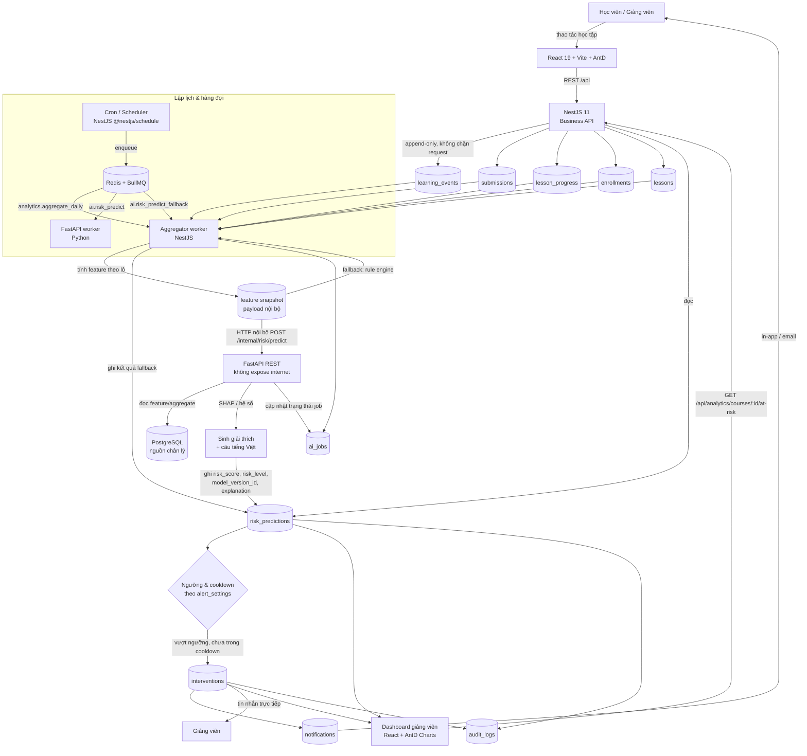
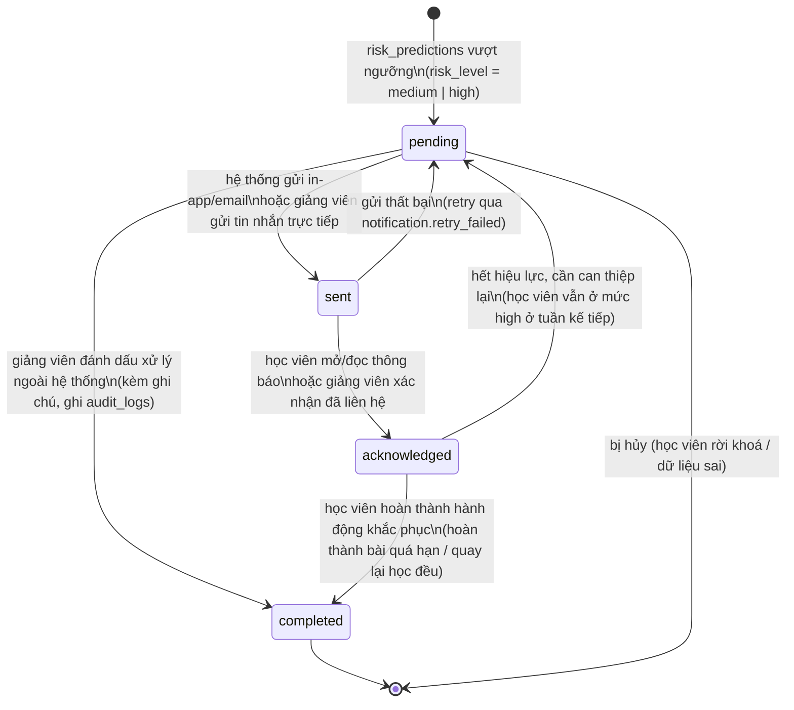
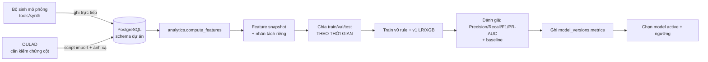

# Thiết kế Analytics & AI — Hướng 5: Learning Analytics và cảnh báo sớm học viên chậm tiến độ

**Dự án:** UniPrep — Nền tảng web hỗ trợ học tập
**Thành phần:** Hướng 5 (track 5) — AI analytics and early warning system

> Phiên bản: v0.1 — Ngày: 2026-09-26

---

## 0. Phạm vi & quan hệ tài liệu

### 0.1. Tài liệu này là gì

Tài liệu này đặc tả **thiết kế kỹ thuật của phần Analytics & AI** trong UniPrep: định nghĩa bài toán dự đoán, khung feature, pipeline xử lý, mô hình (rule-based và ML), cơ chế giải thích, ngưỡng cảnh báo, luồng can thiệp, dữ liệu dùng để đánh giá, kế hoạch đánh giá và các rủi ro kỹ thuật.

Tài liệu **không** đặc tả schema cột của các bảng nghiệp vụ. Mọi bảng được nhắc tới ở đây (`learning_events`, `submissions`, `lesson_progress`, `enrollments`, `lessons`, `risk_predictions`, `interventions`, `notifications`, `alert_settings`, `ai_jobs`, `model_versions`, `audit_logs`) đã có một tài liệu khác đặc tả chi tiết cột; tài liệu này **chỉ tham chiếu tên bảng và tên cột cần dùng**.

### 0.2. Quan hệ với các tài liệu khác

| Tài liệu | Nội dung liên quan | Tài liệu này kế thừa điều gì |
|---|---|---|
| `docs/proposal.md` §3.1 | Hạng mục "AI analytics and early warning system (track 5)": pipeline phát hiện rủi ro tự động (FastAPI), dashboard giảng viên có giải thích ở mức feature, tin nhắn can thiệp in-app | Phạm vi chức năng, và giới hạn out-of-scope ("dynamic AI-generated lesson content" bị loại khỏi phạm vi) |
| `docs/proposal.md` §4.1 | Ba thách thức kỹ thuật: event logging không làm chậm hệ thống; dự đoán phải giải thích được; schema tối ưu cho truy vấn chuỗi thời gian | Định hướng thiết kế pipeline và explainability |
| `docs/proposal.md` §4.2 | Chiến lược tích hợp: event tracking → background processing (cron/queue) → UI & action | Kiến trúc 3 tầng của pipeline (mục 5) |
| `docs/proposal.md` §4.3 | Nguồn dữ liệu test (mô phỏng theo kịch bản hành vi **hoặc** OULAD); đánh giá bằng Precision/Recall; so sánh với baseline rule-based theo điểm bài tập; 3 tiêu chí demo | Mục 10 (dữ liệu mô phỏng + OULAD), mục 11 (đánh giá), mục 12 (kế hoạch tuần) |
| `docs/proposal.md` §6.1 | Timeline tuần 39, 41–43, 44, 45–46, 47, 48, 49, 50 | Mục 12 bám đúng các mốc này |
| `docs/architecture.md` §2 | Nguyên tắc: tách trách nhiệm, **NestJS không block** với job nặng, scale độc lập, mọi dự đoán lưu kèm lý do, an toàn dữ liệu | Mục 5.3 (đồng bộ vs bất đồng bộ), mục 4, mục 13 |
| `docs/architecture.md` §3.3 | AI service FastAPI tách rời, không public, REST nội bộ + queue | Mục 5 (kiến trúc pipeline) |
| `docs/architecture.md` §4 | Phân rã module NestJS: `LearningActivityModule`, `AnalyticsModule`, `AIGatewayModule`, `NotificationModule`, `InterventionModule`, `AdminModule` | Mục 5.3, mục 9 |
| `docs/architecture.md` §7 | Định nghĩa "nguy cơ chậm tiến độ" + danh sách feature đầu vào + output `risk_score`/`risk_level`/`ai_explanations` | Mục 2, mục 3, mục 6 |
| `docs/architecture.md` §8 | Bảo mật & vận hành: không expose FastAPI, audit log mọi `intervention`/`risk_prediction`, ẩn danh hoá khi huấn luyện, RBAC dashboard | Mục 13 |
| `docs/architecture_report.md` | Bản tóm tắt kiến trúc tiếng Anh + sơ đồ tương tác thành phần | Sơ đồ mục 5.1 là bản chi tiết hoá của sơ đồ đó |
| `UniPrep/README.md` | Trạng thái thật của repo: mới scaffold; auth, course API, queue, AI service **chưa** được implement | Mục 5.4 (trạng thái triển khai), mục 12 (kế hoạch tuần) |

### 0.3. Quy ước dùng trong tài liệu

1. **Tên bảng**: `snake_case`, số nhiều, tiếng Anh (`risk_predictions`).
2. **Tên field trong code**: `camelCase` (`riskScore`, `modelVersionId`).
3. **Không dùng TypeScript `enum`** — mọi tập giá trị hữu hạn biểu diễn bằng **union type**, ví dụ `type RiskLevel = 'low' | 'medium' | 'high';`.
4. **Định danh trong code là tiếng Anh**; **mọi văn bản hiển thị cho người dùng cuối là tiếng Việt** (nhãn feature, câu giải thích, nội dung thông báo, gợi ý nội dung cần xem lại).
5. **Không bịa số liệu.** Mọi ô trong bảng kết quả benchmark/đánh giá để trống với ghi chú `<cần điền>`.
6. Với dữ liệu OULAD: chỉ nêu những gì chắc chắn; chỗ không chắc ghi rõ `cần kiểm chứng lại tên cột trong tài liệu gốc OULAD`.

### 0.4. Mục tiêu của Hướng 5

- **Mô tả & xu hướng**: dashboard cho giảng viên/admin hiển thị hành vi học tập và kết quả theo thời gian (mức độ hoạt động, tiến độ so với lộ trình, phân bố điểm, so sánh giữa các cohort/lớp) — phần "retrospective reporting" mà proposal §2.1 nhận xét các LMS hiện có làm còn yếu.
- **Dự đoán at-risk**: phát hiện và phân loại học viên có nguy cơ chậm tiến độ trong một khoảng thời gian xác định trước (mục 2.4), gắn cờ theo `risk_level` để giảng viên ưu tiên can thiệp.
- **Giải thích & can thiệp**: mỗi cảnh báo phải kèm **lý do ở mức feature** (feature nào đóng góp nhiều nhất, theo hướng nào) và **hành động gợi ý**; hệ thống tự động gửi thông báo in-app/email, giảng viên có thể gửi tin nhắn trực tiếp.
- **Đánh giá được**: pipeline có baseline bắt buộc, có bộ metric và tập test theo thời gian, có tiêu chí chất lượng cho cả độ chính xác **và** chất lượng giải thích.

---

## 1. Trạng thái hiện tại của dự án (ràng buộc thực tế)

Theo `UniPrep/README.md`, tại thời điểm soạn tài liệu này:

| Hạng mục | Trạng thái thật | Ảnh hưởng tới thiết kế này |
|---|---|---|
| Backend NestJS 11 + TypeORM 0.3 + PostgreSQL | Có scaffold, `GET /api/health`, **đủ 25 entity của schema lõi** (`user`, `course`, `lesson`, `exercise`, `discussion`, `learning-activity`, `analytics`, `ai-gateway`, `intervention`, `notification`, `admin`) | Các module còn thiếu dto/service/controller; entity đã có nên pipeline chỉ cần viết truy vấn |
| Response envelope `{ error, data, message }`, base path `/api` | Đã có (`TransformResponseInterceptor`, `AllExceptionsFilter`) | Mọi endpoint AI ở mục 5.3 tuân theo envelope này |
| Auth / RBAC (student/teacher/admin) | **Chưa có** | Không thể thực thi "giảng viên chỉ thấy lớp mình" cho tới khi có guard — xem mục 13 |
| Redis + BullMQ | **Chưa có** | Job trong mục 5.2 là thiết kế, chưa chạy được; xem rủi ro R-05 |
| FastAPI service | **Chưa có** | Fallback rule-based thuần trong NestJS (mục 14, R-05) là phương án có thật |
| Migrations | **Đã có (E0-T4/T5, 2026-10-03)** — `synchronize: false`, migration baseline 25 bảng, CI kiểm tra drift | Sinh dữ liệu mô phỏng quy mô lớn giờ chạy trên schema có version |
| Test suite | **Chưa có test cho analytics/feature computation** (đã có unit/e2e tests cho E4 progress) | Kế hoạch tuần ở mục 12 vẫn tính cả việc viết test cho feature computation |

**Hệ quả thiết kế:** tài liệu này được viết theo hướng **tăng dần (incremental)** — v0 rule-based có thể chạy chỉ với PostgreSQL + NestJS, không cần FastAPI, không cần ML. Mọi thành phần ML/queue/SHAP là lớp bổ sung sau, không phải điều kiện tiên quyết để demo được luồng cảnh báo.

---

## 2. Định nghĩa bài toán

### 2.1. Định nghĩa hình thức "học viên chậm tiến độ / at-risk"

Với một cặp `(user_id, course_id)` đã có `enrollments`, xét thời điểm quyết định `t` (thời điểm pipeline chạy). Gọi:

- `expectedLessons(t)` = số bài học mà học viên **được kỳ vọng** đã hoàn thành tính đến `t`, suy ra từ `lessons.order_index` và lộ trình của khoá (ví dụ: tuyến tính theo số ngày kể từ `enrollments.enrolled_at` tới hạn hoàn thành khoá).
- `completedLessons(t)` = số bài học có bản ghi hoàn thành trong `lesson_progress`.
- `behindRatio(t)` = `1 - completedLessons(t) / max(expectedLessons(t), 1)`.

**Định nghĩa vận hành (operational definition):**

> Một học viên được coi là **at-risk** tại thời điểm `t` nếu trong **7 ngày kể từ `t`** (horizon, mục 2.4) học viên đó rơi vào ít nhất một trong các tình huống:
> 1. **Tụt hậu so với lộ trình**: `behindRatio(t) ≥ θ_progress` (ngưỡng khởi điểm ở mục 8), hoặc
> 2. **Ngừng tương tác**: không có `learning_events` nào trong `W_inactivity` ngày gần nhất (mục 8), hoặc
> 3. **Suy giảm kết quả**: điểm trung bình của các `submissions` trong cửa sổ gần nhất thấp hơn ngưỡng tuyệt đối **hoặc** độ dốc xu hướng điểm âm vượt ngưỡng, hoặc
> 4. **Không hoàn thành đánh giá bắt buộc**: có quiz/bài tập bắt buộc quá hạn mà không có `submissions` tương ứng.

Điểm `risk_score ∈ [0, 1]` là **mức độ gần với các tình huống trên**, không phải xác suất hiệu chỉnh (calibrated probability) ở phiên bản v0; từ v1 trở đi, nếu dùng mô hình phân loại có xác suất, `risk_score` là **xác suất dự đoán** của lớp `at_risk` và phải được hiệu chỉnh (calibration) trước khi dùng làm ngưỡng nghiệp vụ.

**Lưu ý về phạm vi môn học:** định nghĩa này chỉ dùng cấu trúc `lessons.order_index`, `submissions`, `learning_events` — không phụ thuộc nội dung môn học. Sản phẩm là **nền tảng hỗ trợ học tập** theo `proposal.md` §1.1; nội dung bài học gồm text/slide/video (§3.1) và **không** có phần học tiếng Anh hay luyện nói/viết.

### 2.2. Đơn vị dự đoán (prediction unit) — CHỐT

**Chốt: dự đoán theo `(user_id, course_id, tuần)` — mỗi học viên, mỗi khoá, một lần mỗi tuần.**

| Phương án | Ưu điểm | Nhược điểm | Kết luận |
|---|---|---|---|
| Per learner per course **per ngày** | Phát hiện sớm nhất; dữ liệu dồn dập | Rất nhiều dòng `risk_predictions`; feature trong 1 ngày quá nhiễu; dễ sinh cảnh báo giật cục; tốn tài nguyên gấp 7 lần | **Không chọn** làm nhịp chính; vẫn cho phép chạy theo yêu cầu (`POST /api/ai/risk/predict`) |
| Per learner per course **per tuần** | Khớp với nhịp sư phạm (tuần học); feature có ý nghĩa thống kê; giảm nhiễu; horizon 7 ngày khớp trọn một tuần | Phát hiện chậm hơn tối đa 7 ngày; vẫn cần cơ chế cảnh báo bổ sung khi có tín hiệu mạnh | **CHỌN** |
| Per learner per course (không có nhịp) | Ít dữ liệu nhất | Mất khả năng theo dõi xu hướng, không đánh giá được model theo thời gian | Không chọn |

**Bổ sung:** ngoài nhịp tuần định kỳ, pipeline cho phép **chạy theo sự kiện** (event-triggered) trong trường hợp tín hiệu rất mạnh, ví dụ học viên vượt hạn nộp bắt buộc (`submissions` quá hạn) hoặc không hoạt động `≥ W_inactivity` ngày. Trường hợp này vẫn ghi vào cùng một bảng `risk_predictions` với cùng đơn vị `(learner, course, tuần)`, cập nhật bản ghi của tuần hiện tại thay vì tạo bản ghi mới — xem quy tắc idempotency ở mục 5.4.

**Khoá nghiệp vụ (business key):** `(user_id, course_id, week_start_date)`. `week_start_date` là ngày đầu tuần ISO (thứ Hai) theo **múi giờ cấu hình của hệ thống** (mặc định `Asia/Ho_Chi_Minh`, lấy từ biến môi trường `APP_TIMEZONE`). Mọi cửa sổ thời gian trong tài liệu này được hiểu theo múi giờ đó.

### 2.3. Nhãn ground truth — lấy từ đâu

| Bối cảnh | Nguồn nhãn | Định nghĩa nhãn | Lưu ý |
|---|---|---|---|
| **Dữ liệu thật của UniPrep** (giai đoạn sau, khi đã có người dùng thật) | Bản ghi hoàn thành khoá / kết quả cuối kỳ | `at_risk = 1` nếu tại thời điểm `t + 7 ngày`, học viên rơi vào định nghĩa vận hành ở mục 2.1 | Đây là nhãn **suy diễn từ chính định nghĩa** (proxy label), không phải nhãn do con người gán. Phải nêu rõ trong báo cáo để tránh ngộ nhận "model dự đoán đúng thực tế" |
| **Dữ liệu mô phỏng (synthetic)** | **Luật ẩn (hidden rule) của bộ sinh dữ liệu** | Bộ sinh gán nhãn `at_risk` bằng một luật nội bộ không được đưa vào feature set (mục 10.4) | Đây là **oracle label**: cho phép kiểm chứng model có học được tín hiệu hay không. Nếu model học tốt trên tập này mà kém trên dữ liệu thật → vấn đề nằm ở chuyển giao miền (domain transfer), không phải ở thuật toán |
| **OULAD** | Cột kết quả cuối môn của OULAD (tên cột cụ thể: **cần kiểm chứng lại tên cột trong tài liệu gốc OULAD**) | Ánh xạ `Withdrawn`/`Fail` → `at_risk = 1`; `Pass`/`Distinction` → `at_risk = 0` (ánh xạ này là **quyết định của nhóm**, phải ghi rõ trong báo cáo) | Khác biệt định nghĩa nhãn với UniPrep (OULAD là kết quả cuối môn, UniPrep là "tụt lại trong 7 ngày tới") — xem mục 10.6 |

**Nguyên tắc bắt buộc:** mọi tập huấn luyện/đánh giá phải ghi rõ **nguồn nhãn** và **định nghĩa nhãn**; không trộn nhãn từ các nguồn khác nhau vào cùng một tập mà không có cột phân biệt.

### 2.4. Horizon dự đoán — CHỐT

**Chốt: horizon = 7 ngày.**

> Tại thời điểm quyết định `t`, model trả lời câu hỏi: *"Trong 7 ngày tới (từ `t` đến `t + 7 ngày`), học viên này có rơi vào định nghĩa at-risk ở mục 2.1 hay không?"*

Lý do chọn 7 ngày:

1. **Khớp nhịp sư phạm**: khoá học và deadline bài tập thường theo tuần; một tuần là khoảng thời gian đủ để giảng viên can thiệp có ý nghĩa (gửi tin nhắn, gợi ý nội dung cần xem lại, gia hạn).
2. **Khớp nhịp pipeline**: pipeline chạy mỗi tuần (mục 8), horizon 7 ngày không chồng lấn giữa hai lần chạy liên tiếp → dễ đánh giá, dễ giải thích.
3. **Đủ dài để có tín hiệu**: nhiều feature (xu hướng điểm, tần suất tuần này so với tuần trước) cần cửa sổ cỡ tuần mới có ý nghĩa.
4. **Đủ ngắn để còn hành động được**: horizon 30 ngày thường quá muộn để cứu một học viên đã tụt sâu.

Horizon là tham số cấu hình (`predictionHorizonDays`, mặc định `7`), cho phép thử `14` ngày cho khoá học dài. Khi đổi horizon trong huấn luyện, **bắt buộc tạo model version mới** vì nhãn đã khác.

### 2.5. Giả định và rủi ro của định nghĩa

| # | Giả định | Rủi ro nếu giả định sai | Cách xử lý |
|---|---|---|---|
| A-1 | Lộ trình khoá là tuyến tính theo `lessons.order_index` và thời lượng khoá | Khoá có nhịp phi tuyến (học viên dồn vào giai đoạn cao điểm, tự nhịp) → `expectedLessons` sai → gắn cờ sai hàng loạt | Cho phép cấu hình lộ trình theo tuần trong `alert_settings`; ghi nhận điểm yếu này trong báo cáo |
| A-2 | `learning_events` ghi đủ và đúng loại sự kiện | Thiếu sự kiện (học viên học offline, đọc tài liệu in) → feature thấp giả tạo → báo nhầm | Ghi rõ trong UI dashboard rằng dữ liệu chỉ phản ánh hoạt động **trên nền tảng**; không dùng cảnh báo làm kết luận duy nhất |
| A-3 | `duration_seconds` phản ánh thời gian on-task thật | Học viên mở tab rồi rời đi → `duration_seconds` phình to giả tạo; hoặc click nhanh → quá ngắn | Dùng so sánh **tương đối với trung vị của lớp** thay vì ngưỡng tuyệt đối (mục 3); có quy tắc chặn outlier (mục 4.1) |
| A-4 | Nhãn suy diễn từ định nghĩa (mục 2.3) là proxy chấp nhận được cho "chậm tiến độ thật" | Model học đúng định nghĩa nhưng không đúng thực tế sư phạm | Nêu rõ trong báo cáo; đánh giá thêm bằng khảo sát giảng viên (mục 11.4) |
| A-5 | Học viên không thay đổi hành vi vì biết bị theo dõi | Hiệu ứng Hawthorne: học viên "diễn" hành vi để tránh bị gắn cờ → phân bố dữ liệu dịch chuyển | Minh bạch với học viên về việc theo dõi (mục 13); theo dõi độ lệch phân bố theo thời gian và huấn luyện lại định kỳ |
| A-6 | Trong 7 ngày tới không có biến cố ngoài hệ thống (ốm, lịch thi trường) | Cảnh báo nhầm cho học viên thực ra đang học tốt ở kênh khác | Cho phép giảng viên **bỏ qua cảnh báo có lý do** (dismiss) và ghi lại vào `interventions`/`audit_logs` |

---

## 3. Khung feature (feature engineering)

### 3.1. Quy ước chung

- **Điểm tham chiếu (as-of timestamp):** mọi feature được tính tại thời điểm `t` và **chỉ dùng dữ liệu có `occurred_at <= t`** (hoặc `submitted_at <= t`). Đây là điều kiện chống rò rỉ dữ liệu quan trọng nhất (mục 4.5).
- **Ý nghĩa cửa sổ `W`:** `[t - W ngày, t]`.
- **Trung vị lớp (class median):** trung vị tính trên tất cả học viên trong cùng `course_id` (cùng đợt/cohort) tại cùng `t`; nếu lớp có `< N_min_peers` học viên có dữ liệu (mặc định `5`), feature so sánh với lớp trả về giá trị thiếu (mục 4.2) thay vì so sánh với mẫu quá nhỏ.
- **Đơn vị `group`:** `engagement` (mức độ tương tác), `progress` (tiến độ), `performance` (kết quả), `effort` (nỗ lực/hành vi làm bài), `social` (tương tác xã hội).
- **Kiểu dữ liệu:** mọi feature là `number` (kể cả cờ nhị phân 0/1) để dễ đưa vào model; cột `type` ghi `float`/`int`/`ratio (0–1)`/`binary`.

### 3.2. Danh mục feature

| Tên feature (code) | Nhóm | Công thức / truy vấn tính | Cửa sổ thời gian | Nguồn dữ liệu (bảng/cột) | Kiểu | Xử lý giá trị thiếu | Trực giác sư phạm |
|---|---|---|---|---|---|---|---|
| `recencyDays` | engagement | Số ngày từ hoạt động gần nhất tới `t`: `(t - max(occurred_at)) / 1 ngày`, làm tròn xuống | Toàn bộ lịch sử tới `t` | `learning_events.occurred_at` | float ≥ 0 | Học viên chưa có sự kiện nào → gán `recencyDaysCap` (mặc định `30`) + cờ `isNewLearner = 1` | Khoảng cách tới lần học cuối là tín hiệu đơn giản và mạnh nhất của việc rơi khỏi nhịp học |
| `activeDays7` | engagement | Số **ngày khác nhau** có ít nhất 1 sự kiện trong 7 ngày gần nhất | `[t-7, t]` | `learning_events.occurred_at` (distinct date) | int 0–7 | Không có sự kiện → `0` (giá trị 0 là **thật**, không phải thiếu) | Học đều 4–5 ngày/tuần tốt hơn học dồn 1 ngày; số ngày hoạt động phản ánh thói quen |
| `activeDays14` | engagement | Như trên, cửa sổ 14 ngày | `[t-14, t]` | `learning_events.occurred_at` | int 0–14 | `0` | Cửa sổ trung bình, ổn định hơn `activeDays7` trước nhiễu cuối tuần |
| `activeDays28` | engagement | Như trên, cửa sổ 28 ngày | `[t-28, t]` | `learning_events.occurred_at` | int 0–28 | `0` | Cửa sổ dài, thể hiện mức gắn bó tổng thể với khoá |
| `activeDaysTrend` | engagement | `activeDays7 - activeDays7_prev`, trong đó `activeDays7_prev` tính trên `[t-14, t-7]` | hai cửa sổ 7 ngày liên tiếp | `learning_events.occurred_at` | int (−7…+7) | Học viên mới (không có dữ liệu tuần trước) → `0` + cờ `isNewLearner = 1` | Tuần này ít hoạt động hơn tuần trước = dấu hiệu tụt dần, khác với "vốn đã ít hoạt động" |
| `eventCountTrend` | engagement | `ln(1 + events7) - ln(1 + events7_prev)` (log để giảm ảnh hưởng của outlier) | hai cửa sổ 7 ngày liên tiếp | `learning_events.id` (đếm) | float | Tuần trước không có sự kiện → `ln(1 + events7)` | Khối lượng tương tác giảm mạnh là tín hiệu sớm hơn cả việc "biến mất" |
| `onTimeCompletionRatio` | progress | `completed_on_time / max(expectedLessons(t), 1)` với `completed_on_time` = số bài hoàn thành **trước** hạn của lộ trình | Từ `enrollments.enrolled_at` tới `t` | `lesson_progress` (hoàn thành), `lessons.order_index`, `enrollments` | ratio 0–1 | `expectedLessons(t) = 0` (chưa tới hạn bài nào) → `1.0` và cờ `noExpectationYet = 1` | Đây là feature sát nhất với định nghĩa at-risk ở mục 2.1; đo "đúng hạn", không chỉ "đã làm" |
| `behindRatio` | progress | `1 - completedLessons(t) / max(expectedLessons(t), 1)`, cắt về `[0, 1]` | Từ lúc ghi danh tới `t` | `lesson_progress`, `lessons.order_index`, `enrollments` | ratio 0–1 | Như trên → `0.0` | Mức độ tụt hậu so với lộ trình, dễ diễn giải cho giảng viên ("đang chậm 6 bài") |
| `completionRatio` | progress | `completedLessons / max(totalLessons, 1)` | Toàn khoá, tới `t` | `lesson_progress`, `lessons` | ratio 0–1 | `totalLessons = 0` → `0.0` + cờ `courseEmpty = 1` | Tiến độ tuyệt đối; học viên mới ghi danh có giá trị thấp một cách hợp lệ |
| `completedLessonsCount` | progress | Số bài học có bản ghi hoàn thành | Tới `t` | `lesson_progress` | int ≥ 0 | Không có bản ghi → `0` | Con số trực tiếp để hiển thị trong dashboard/giải thích |
| `avgScore` | performance | Trung bình `submissions.score` trong 28 ngày gần nhất (chuẩn hoá về thang 0–1 nếu thang điểm không phải 0–1 — xem mục 4.1) | `[t-28, t]` | `submissions.score`, `submissions.submitted_at` | ratio 0–1 | Không có bài nộp nào trong cửa sổ → giá trị thiếu; model impute bằng trung vị của lớp (mục 4.2) + cờ `noSubmission28 = 1` | Năng lực hiện tại; nhưng **không** phải tín hiệu duy nhất (đó là lý do có baseline ở mục 11.3) |
| `avgScoreAll` | performance | Trung bình `submissions.score` trên toàn bộ lịch sử | Tới `t` | `submissions` | ratio 0–1 | Không có bài nộp nào → thiếu + cờ `neverSubmitted = 1` | Mức nền năng lực, ổn định hơn `avgScore` |
| `scoreTrend` | performance | Độ dốc hồi quy tuyến tính đơn giản của `score` theo thời gian: hồi quy `score ~ a + b * (ngày kể từ bài nộp đầu trong cửa sổ)`, lấy `b` | `[t-28, t]` | `submissions.score`, `submitted_at` | float (điểm/ngày) | `< 3` điểm dữ liệu trong cửa sổ → thiếu + cờ `scoreTrendUnavailable = 1` | Học viên đang đi xuống hay đi lên; quan trọng hơn `avgScore` vì bắt được suy giảm sớm |
| `avgAttemptNo` | effort | Trung bình `submissions.attempt_no` trong 28 ngày | `[t-28, t]` | `submissions.attempt_no` | float ≥ 1 | Không có bài nộp → thiếu | Làm lại nhiều lần có thể là dấu hiệu gặp khó (hoặc luyện tập chăm — cần đọc kèm `avgScore`) |
| `maxAttemptNo` | effort | `max(submissions.attempt_no)` trong 28 ngày | `[t-28, t]` | `submissions.attempt_no` | int ≥ 1 | Không có bài nộp → thiếu | Bắt cực trị: một bài phải làm lại rất nhiều lần là tín hiệu kẹt ở một chủ đề |
| `retryConcentration` | effort | Tỷ lệ số lần làm lại tập trung vào một bài: `max(attempt_no theo exercise) / sum(attempt_no)` | `[t-28, t]` | `submissions.attempt_no` | ratio 0–1 | Không có bài nộp → thiếu | Phân biệt "làm lại rải rác" (bình thường) với "kẹt một chỗ" |
| `quizAbandonRate` | effort | `1 - (# bài đã nộp / # lượt bắt đầu làm bài)` khi có cả hai loại sự kiện; nếu schema chưa có sự kiện bắt đầu làm bài thì dùng `quiz_starts` suy từ `learning_events` (xem ghi chú 3.4) | `[t-28, t]` | `learning_events` (`event_type` bắt đầu/kết thúc), `submissions` | ratio 0–1 | Không có lượt bắt đầu nào → `0.0` | Bỏ dở giữa bài là dấu hiệu mất động lực hoặc bài quá khó |
| `durationZScore` | effort | `(avg(duration_seconds của học viên) - median(duration_seconds của lớp)) / max(MAD_lớp, 1)` (MAD = độ lệch tuyệt đối trung vị) | `[t-28, t]` | `learning_events.duration_seconds` | float | Không có sự kiện nào có `duration_seconds` → thiếu; lớp `< N_min_peers` → thiếu | Bắt cả hai bất thường: rất âm = làm quá nhanh (đoán bừa), rất dương = quá chậm (sa vào một bài, khó khăn) |
| `fastGuessRate` | effort | Tỷ lệ bài nộp có `duration_seconds < FAST_GUESS_SECONDS` (mặc định `15`, cấu hình được) **và** `score < 0.5` | `[t-28, t]` | `learning_events.duration_seconds`, `submissions.score` | ratio 0–1 | Không có bài nộp kèm duration → thiếu | Phân biệt "làm nhanh vì giỏi" với "làm bừa cho xong" — chỉ tính khi điểm cũng thấp |
| `forumPosts28` | social | Số sự kiện tương tác diễn đàn (đăng bài/trả lời) | `[t-28, t]` | `learning_events` với `event_type` thuộc nhóm diễn đàn | int ≥ 0 | `0` | Tham gia thảo luận là chỉ báo gắn bó; im lặng hoàn toàn trong lớp nhỏ đáng chú ý |
| `forumPostsTrend` | social | `ln(1 + forumPosts7) - ln(1 + forumPosts7_prev)` | hai cửa sổ 7 ngày liên tiếp | `learning_events` | float | Tuần trước không có → `ln(1 + forumPosts7)` | Rút khỏi tương tác xã hội thường đi kèm rút khỏi học tập |
| `daysSinceLastSubmission` | performance | Số ngày từ `max(submissions.submitted_at)` tới `t` | Toàn bộ lịch sử tới `t` | `submissions.submitted_at` | float ≥ 0 | Chưa nộp bài nào → gán `daysSinceLastSubmissionCap` (mặc định `45`) + `neverSubmitted = 1` | Recency **theo bài nộp** khác recency theo đăng nhập: có học viên vẫn đăng nhập nhưng né bài tập |
| `overdueMandatoryCount` | progress | Số bài tập/quiz bắt buộc đã quá hạn mà **không** có bài nộp tương ứng | Tới `t` | `lessons`/bài tập, hạn nộp, `submissions` | int ≥ 0 | `0` | Tín hiệu nghiêm trọng nhất và dễ diễn giải nhất: "quá hạn 3 bài bắt buộc" |

**Tổng: 24 feature** (trong đó 3 cờ bổ trợ `isNewLearner`, `neverSubmitted`, `noSubmission28` được mô tả trong cột "Xử lý giá trị thiếu" và được coi là **feature riêng** khi huấn luyện — xem mục 4.2). Danh sách feature chính thức được đóng băng trong `model_versions.feature_list` (mục 6.3).

### 3.3. Ghi chú về cách tính một số feature

**`expectedLessons(t)` — ba phương án, chốt phương án 2:**

1. `expectedLessons(t) = round(totalLessons * elapsedDays / courseDurationDays)` — lộ trình tuyến tính theo thời lượng khoá. **Vấn đề:** khoá tự nhịp (self-paced) không có `courseDurationDays` thật.
2. `expectedLessons(t) = round(totalLessons * elapsedDays / plannedDurationDays)` với `plannedDurationDays` **do giảng viên cấu hình** khi tạo khoá (nếu trống thì mặc định `totalLessons * 2` ngày). **CHỌN** — vì có nguồn dữ liệu xác định và giảng viên hiểu được con số này.
3. Không tính kỳ vọng, chỉ dùng `completionRatio` so với lớp. **Không chọn** làm chính vì bỏ mất yếu tố thời gian.

Ghi rõ: trường `plannedDurationDays` chưa tồn tại trong schema hiện tại → **cần bổ sung** hoặc tạm suy từ mặc định; đây là việc cần chốt ở mục 15.

**`scoreTrend` — công thức hồi quy đơn giản (không cần thư viện):**

```python
def score_trend(points: list[tuple[float, float]]) -> float | None:
    """points: [(days_since_window_start, score_0_1), ...] — đã lọc tới as-of t."""
    n = len(points)
    if n < 3:
        return None  # -> giá trị thiếu + cờ scoreTrendUnavailable
    mean_x = sum(x for x, _ in points) / n
    mean_y = sum(y for _, y in points) / n
    denom = sum((x - mean_x) ** 2 for x, _ in points)
    if denom == 0:
        return 0.0  # mọi bài nộp cùng ngày -> không có xu hướng theo thời gian
    numer = sum((x - mean_x) * (y - mean_y) for x, y in points)
    return numer / denom  # điểm/ngày; âm = đang đi xuống
```

**`durationZScore` — dùng MAD thay vì độ lệch chuẩn** vì `duration_seconds` có phân bố lệch nặng (nhiều giá trị rất lớn). MAD chịu outlier tốt hơn. Hằng số `1` ở mẫu số để tránh chia cho 0 khi MAD = 0 (lớp quá đồng nhất).

### 3.4. Điểm cần kiểm chứng với schema

| # | Điều cần | Nếu schema chưa có | Hướng xử lý |
|---|---|---|---|
| S-1 | Sự kiện "bắt đầu làm quiz" tách khỏi "nộp quiz" | `quizAbandonRate` không tính được đúng | Suy từ `learning_events.event_type` (ví dụ `quiz_started` không có `submission` tương ứng trong cùng phiên); ghi rõ đây là **xấp xỉ** và nêu trong báo cáo |
| S-2 | Hạn nộp của từng bài tập/quiz | `overdueMandatoryCount` và `onTimeCompletionRatio` không tính được theo hạn thật | Dùng hạn suy từ lộ trình (`order_index` + `plannedDurationDays`) và ghi rõ là hạn suy diễn |
| S-3 | `duration_seconds` gắn với bài nộp cụ thể (không chỉ gắn với sự kiện) | `fastGuessRate` không ghép được duration với score | Ghép theo **phiên** (session) giữa `learning_events` và `submissions` theo thời điểm gần nhất; nêu rõ là ghép xấp xỉ |
| S-4 | Trường "bắt buộc/không bắt buộc" của bài tập | `overdueMandatoryCount` mất ý nghĩa | Tạm coi mọi bài tập có hạn là bắt buộc; cần chốt ở mục 15 |

### 3.5. Bảng "feature → nguồn SQL" (mức mô tả — không viết SQL đầy đủ)

| Feature | Bảng chính | Bảng tham chiếu | Điều kiện lọc | Cửa sổ | Hàm tổng hợp |
|---|---|---|---|---|---|
| `recencyDays` | `learning_events` | — | `user_id = :id AND occurred_at <= :t` | tới `t` | `MAX(occurred_at)` |
| `activeDays7` | `learning_events` | — | như trên | `[t-7, t]` | `COUNT(DISTINCT date(occurred_at))` |
| `activeDays14` | `learning_events` | — | như trên | `[t-14, t]` | `COUNT(DISTINCT date(occurred_at))` |
| `activeDays28` | `learning_events` | — | như trên | `[t-28, t]` | `COUNT(DISTINCT date(occurred_at))` |
| `activeDaysTrend` | `learning_events` | — | như trên, hai cửa sổ | `[t-7, t]` và `[t-14, t-7]` | hiệu hai `COUNT(DISTINCT …)` |
| `eventCountTrend` | `learning_events` | — | như trên, hai cửa sổ | `[t-7, t]` và `[t-14, t-7]` | `COUNT(*)` rồi lấy `ln(1+x)` hiệu |
| `onTimeCompletionRatio` | `lesson_progress` | `lessons`, `enrollments` | `lesson_progress.user_id = :id`, `lessons.course_id = :course`, hoàn thành trước hạn lộ trình | tới `t` | `COUNT` có điều kiện / `expectedLessons` |
| `behindRatio` | `lesson_progress` | `lessons`, `enrollments` | như trên | tới `t` | `1 - COUNT/expectedLessons` |
| `completionRatio` | `lesson_progress` | `lessons` | `lessons.course_id = :course` (published) | tới `t` | `COUNT(DISTINCT lesson_id)` / `COUNT(lessons)` |
| `completedLessonsCount` | `lesson_progress` | — | `user_id = :id`, `completed_at <= :t` | tới `t` | `COUNT(*)` |
| `avgScore` | `submissions` | — | `user_id = :id`, `submitted_at <= :t` | `[t-28, t]` | `AVG(score)` (chuẩn hoá 0–1) |
| `avgScoreAll` | `submissions` | — | `submitted_at <= :t` | tới `t` | `AVG(score)` |
| `scoreTrend` | `submissions` | — | như trên, lấy từng dòng | `[t-28, t]` | hồi quy tuyến tính (tính ở tầng code) |
| `avgAttemptNo` | `submissions` | — | như trên | `[t-28, t]` | `AVG(attempt_no)` |
| `maxAttemptNo` | `submissions` | — | như trên | `[t-28, t]` | `MAX(attempt_no)` |
| `retryConcentration` | `submissions` | — | nhóm theo bài tập | `[t-28, t]` | `MAX(SUM(attempt_no) theo exercise) / SUM(attempt_no)` |
| `quizAbandonRate` | `learning_events` | `submissions` | `event_type` nhóm quiz | `[t-28, t]` | `1 - (số lượt có nộp / số lượt bắt đầu)` |
| `durationZScore` | `learning_events` | — | `duration_seconds IS NOT NULL`, so với cả lớp | `[t-28, t]` | `AVG` của học viên vs `PERCENTILE_CONT(0.5)` của lớp |
| `fastGuessRate` | `learning_events` | `submissions` | `duration_seconds < :thr AND score < 0.5` | `[t-28, t]` | `COUNT` có điều kiện / `COUNT` tổng |
| `forumPosts28` | `learning_events` | — | `event_type` nhóm diễn đàn | `[t-28, t]` | `COUNT(*)` |
| `forumPostsTrend` | `learning_events` | — | như trên, hai cửa sổ | `[t-7, t]` và `[t-14, t-7]` | hiệu hai `COUNT` rồi `ln(1+x)` |
| `daysSinceLastSubmission` | `submissions` | — | `submitted_at <= :t` | tới `t` | `MAX(submitted_at)` |
| `overdueMandatoryCount` | `submissions` | `lessons` (hạn), `enrollments` | hạn `< :t` và không có bài nộp | tới `t` | `COUNT` các bài thiếu bài nộp |

**Hiệu năng:** các truy vấn trên chạy theo lô cho toàn bộ học viên của một khoá (không chạy từng học viên một) để tránh N+1. Xem mục 5.2 (`analytics.aggregate_daily`) và mục 14 (R-03).

---

## 4. Chuẩn hoá & tiền xử lý

### 4.1. Outlier

| Loại | Cách phát hiện | Xử lý | Ghi chú |
|---|---|---|---|
| `duration_seconds` cực lớn (tab treo, để máy qua đêm) | Lớn hơn `Q3 + 3 * IQR` của lớp, hoặc lớn hơn `MAX_DURATION_SECONDS` (mặc định `7200`, cấu hình được) | **Winsorize** về ngưỡng, không xoá dòng — vẫn giữ thông tin "có hoạt động" | Không xoá vì xoá sẽ làm mất dấu hiệu hoạt động, chỉ làm sai độ lớn |
| `duration_seconds` cực nhỏ (< 3 giây) | Ngưỡng `MIN_VALID_DURATION_SECONDS` (mặc định `3`) | Coi là **sự kiện nhiễu**, loại khỏi phép tính `durationZScore` nhưng vẫn tính vào `activeDays*` | Đây là nhiễu kỹ thuật (double-click, tải lại trang) |
| `submissions.score` ngoài thang | So với thang điểm của bài (`max_score`) | Chuẩn hoá về `[0, 1]`: `score_norm = score / max_score`; giá trị ngoài `[0,1]` bị cắt | Bắt buộc vì các bài có thang điểm khác nhau |
| `expectedLessons` = 0 hoặc âm | Kiểm tra logic | Gán `1` ở mẫu số và đặt cờ `noExpectationYet` | Tránh chia cho 0 |
| `activeDays*` vượt số ngày cửa sổ | Kiểm tra logic | Cắt về giới hạn cửa sổ | Phòng lỗi dữ liệu (trùng múi giờ) |

**Nguyên tắc:** mọi phép cắt/winsorize phải **giống hệt nhau** giữa lúc huấn luyện và lúc suy luận, và phải được lưu vào `model_versions` (dạng tham số tiền xử lý) để tái lập được. Nếu ngưỡng thay đổi → model version mới.

### 4.2. Giá trị thiếu

Ba nhóm nguyên nhân thiếu, xử lý khác nhau:

1. **Thiếu vì "không có gì xảy ra" (structural zero)** — ví dụ `forumPosts28 = 0`, `activeDays7 = 0`. Đây **không phải** giá trị thiếu; giữ nguyên `0`. Gộp nhầm nhóm này với "thiếu" sẽ làm model hiểu sai.
2. **Thiếu vì không tính được (unavailable)** — ví dụ `scoreTrend` khi `< 3` điểm; `durationZScore` khi lớp `< N_min_peers`; `avgScore` khi học viên chưa nộp bài nào. Xử lý:
   - Thêm **cờ chỉ báo thiếu** (`neverSubmitted`, `noSubmission28`, `scoreTrendUnavailable`, `isNewLearner`…) làm feature nhị phân.
   - Impute bằng **trung vị của lớp** (không phải trung bình toàn cục) để bảo toàn ngữ cảnh khoá.
   - **Không** impute bằng `0` cho các feature "càng cao càng tốt" như `avgScore` — `0` sẽ bị hiểu là "điểm 0", sai lệch nghiêm trọng.
3. **Học viên hoàn toàn mới (cold start)** — chưa có bất kỳ `learning_events`/`submissions` nào:
   - Gán `recencyDays = recencyDaysCap`, `daysSinceLastSubmission = daysSinceLastSubmissionCap`, `isNewLearner = 1`.
   - **Không dự đoán** nếu số ngày kể từ `enrollments.enrolled_at` `< coldStartGraceDays` (mặc định `3`): pipeline ghi `risk_level = 'low'` với `modelVersionId` = phiên bản "insufficient-data" và `summary` nêu rõ "chưa đủ dữ liệu để đánh giá"; đây là **quyết định thiết kế**, tránh gắn cờ oan học viên vừa ghi danh. Quy tắc này phải hiển thị trên dashboard.

### 4.3. Chuẩn hoá (scaling)

| Nhóm feature | Cách chuẩn hoá | Lý do |
|---|---|---|
| `activeDays*`, `forumPosts*`, `completedLessonsCount`, `maxAttemptNo` | Không chuẩn hoá ở tầng feature cho mô hình cây (XGBoost/RandomForest); chuẩn hoá `Min-Max`/`Robust` cho Logistic Regression | Mô hình cây bất biến với biến đổi đơn điệu; Logistic Regression thì không |
| `avgScore`, `completionRatio`, `behindRatio`, `onTimeCompletionRatio` | Đã ở `[0,1]`, giữ nguyên | Phạm vi tự nhiên |
| `recencyDays`, `daysSinceLastSubmission` | `Robust scaling` bằng trung vị/IQR của tập huấn luyện, hoặc biến đổi `log1p` | Phân bố lệch |
| `scoreTrend`, `durationZScore`, `eventCountTrend` | Chuẩn hoá `z-score` theo tham số **học từ tập huấn luyện** | Có thể âm, biên độ không cố định |

**Quy tắc vàng:** tham số chuẩn hoá (median, IQR, mean, std) được **fit trên tập train** và **áp dụng nguyên trạng** cho validation/test/suy luận. Fit lại trên toàn bộ dữ liệu là một dạng rò rỉ dữ liệu (mục 4.5). Tham số này lưu trong `model_versions` cùng artifact của model.

### 4.4. Mất cân bằng lớp (class imbalance)

Trong bối cảnh cảnh báo sớm, **at-risk thường là lớp thiểu số** (giả định hợp lý, **không khẳng định tỷ lệ cụ thể** vì chưa có dữ liệu). Các biện pháp, theo thứ tự ưu tiên:

1. **Không dùng accuracy làm metric** — với lớp thiểu số, accuracy cao có thể chỉ là "đoán tất cả là không rủi ro". Xem mục 11.2.
2. **Trọng số lớp (class weight)**: đặt `scale_pos_weight` (XGBoost) hoặc `class_weight='balanced'` (Logistic Regression) thay vì resampling — ít rủi ro tạo dữ liệu giả.
3. **Điều chỉnh ngưỡng quyết định** thay vì resampling: hạ ngưỡng để tăng Recall, dựa trên phân tích chi phí (mục 11.2). Đây là cách **được ưu tiên** vì không làm méo phân bố.
4. **SMOTE/oversampling**: chỉ cân nhắc nếu (2) và (3) không đủ; nếu dùng phải áp dụng **chỉ trên tập train** và **sau khi chia theo thời gian**, tuyệt đối không sinh mẫu tổng hợp xuyên mốc thời gian.
5. **Đánh giá bằng PR-AUC** (Precision-Recall AUC) thay vì chỉ ROC-AUC, vì PR-AUC nhạy với lớp thiểu số hơn.
6. **Báo cáo cả confusion matrix ở nhiều ngưỡng** để nhóm thấy rõ đánh đổi.

### 4.5. Rò rỉ dữ liệu (data leakage) — feature nào dễ gây leakage và cách tránh

**Định nghĩa:** rò rỉ dữ liệu xảy ra khi thông tin chỉ biết được **sau** thời điểm dự đoán `t` (hoặc thông tin tổng hợp từ tương lai) lọt vào feature, làm điểm đánh giá đẹp giả tạo và model vô dụng khi triển khai.

| # | Feature / thao tác | Kiểu rò rỉ | Cách tránh (bắt buộc) |
|---|---|---|---|
| L-1 | `completionRatio`, `completedLessonsCount` nếu tính bằng "số bài hoàn thành **cuối cùng** của học viên" | Feature chứa tương lai | Mọi truy vấn `lesson_progress` **phải** có `completed_at <= t` |
| L-2 | `avgScore`, `avgScoreAll`, `scoreTrend` nếu lấy cả bài nộp sau `t` | Feature chứa tương lai | Bắt buộc `submitted_at <= t`; test tự động kiểm tra điều kiện này |
| L-3 | Nhãn `at_risk` suy từ định nghĩa ở mục 2.1 **cùng các feature dùng để định nghĩa nhãn** (`behindRatio`, `overdueMandatoryCount`) | **Vòng lặp định nghĩa (label leakage)** — model "học" lại chính công thức gán nhãn, cho điểm rất cao nhưng vô nghĩa về mặt dự đoán | Nhãn phải được tính tại `t + horizon` (tương lai thật), còn feature tại `t`. Nếu vẫn dùng cùng công thức, phải **nêu rõ** rằng đây là bài toán "học lại luật", và đánh giá thêm trên nhãn độc lập (OULAD / khảo sát giảng viên) |
| L-4 | Các feature so sánh với lớp (`durationZScore`) tính trên **tập huấn luyện + test trộn lẫn** | Rò rỉ qua thống kê tổng hợp | Trung vị/MAD của lớp phải tính **chỉ trong tập train** cho mục đích huấn luyện; khi suy luận thật thì tính tại thời điểm `t` (chấp nhận được vì đó là ngữ cảnh có thật) |
| L-5 | Tham số chuẩn hoá fit trên toàn bộ dữ liệu | Rò rỉ qua tiền xử lý | Fit trên train, áp dụng nguyên trạng cho test (mục 4.3) |
| L-6 | Chia tập **ngẫu nhiên** thay vì theo thời gian | Rò rỉ xuyên thời gian: dòng tuần 20 nằm trong train, dòng tuần 21 nằm trong test → model "thấy tương lai" | **Bắt buộc** chia theo thời gian (mục 11.1) |
| L-7 | `retryConcentration`, `maxAttemptNo` nếu đếm cả các lần thử **sau** `t` | Feature chứa tương lai | Cùng ràng buộc `submitted_at <= t` |
| L-8 | Dùng `model_versions.metrics` để chọn ngưỡng trên chính tập test | Rò rỉ qua lựa chọn (selection leakage) | Chọn ngưỡng và siêu tham số trên **validation**; tập test chỉ dùng **một lần** để báo cáo kết quả cuối |
| L-9 | Cờ `isNewLearner`/`neverSubmitted` vô tình mã hoá "học viên ghi danh muộn = rủi ro" theo cách mà nhãn cũng dựa trên thời điểm ghi danh | Rò rỉ ngầm theo thời điểm ghi danh | Kiểm tra riêng hiệu năng trên nhóm học viên ghi danh cùng đợt; nếu model chỉ học "ghi danh muộn" thì phải nêu rõ hạn chế |

**Kiểm soát kỹ thuật bắt buộc (có test tự động):**

```ts
// Kiểm tra bất biến: với mọi dòng feature, mọi timestamp nguồn phải <= asOfTimestamp
type FeatureRow = {
  asOfTimestamp: string;
  sourceTimestamps: string[]; // max(occurred_at), max(submitted_at), max(completed_at)...
};

function assertNoFutureLeakage(row: FeatureRow): void {
  const asOf = new Date(row.asOfTimestamp).getTime();
  for (const ts of row.sourceTimestamps) {
    if (new Date(ts).getTime() > asOf) {
      throw new Error(`Rò rỉ dữ liệu: timestamp nguồn ${ts} vượt quá as-of ${row.asOfTimestamp}`);
    }
  }
}
```

---

## 5. Kiến trúc pipeline

### 5.1. Sơ đồ luồng dữ liệu (Mermaid flowchart)



### 5.2. Job type trong BullMQ

Tên queue: `analytics`, `ai`, `notification`. Mọi job đều có `jobId` **xác định (deterministic)** để chống trùng (mục 5.4).

| Tên job | Queue | Payload | Tần suất | Worker | Ghi chú |
|---|---|---|---|---|---|
| `analytics.aggregate_daily` | `analytics` | `{ courseId: string; day: string /* YYYY-MM-DD */; timezone: string }` | Một lần/ngày/khoá, chạy lúc `02:00` giờ hệ thống (cấu hình `dailyAggregateCron`) | NestJS `AnalyticsModule` | Tổng hợp số liệu mô tả cho dashboard (đếm sự kiện, phân bố điểm, tỷ lệ hoàn thành) — **không** dự đoán |
| `analytics.compute_features` | `analytics` | `{ courseId: string; asOf: string /* ISO */; userIds?: string[]; windowSet: 'default' }` | Một lần/tuần/khoá sau `analytics.aggregate_daily`, hoặc theo yêu cầu | NestJS | Tính feature theo lô cho toàn khoá, tạo feature snapshot |
| `ai.risk_predict` | `ai` | `{ courseId: string; asOf: string; weekStartDate: string; userIds: string[]; featureSnapshotRef: string; modelVersionId?: string; requestedByUserId: string }` | Một lần/tuần/khoá (`weeklyPredictCron`) + theo yêu cầu qua `POST /api/ai/risk/predict` | FastAPI worker | Job nặng; chạy inference + SHAP |
| `ai.risk_predict_fallback` | `ai` | Cùng payload như trên | Khi `ai.risk_predict` thất bại `>= fallbackAfterAttempts` (mặc định `2`) hoặc khi FastAPI không phản hồi health check | NestJS (rule engine) | Phương án dự phòng (mục 14, R-05) — chạy đúng v0 rule-based |
| `ai.model_evaluate` | `ai` | `{ modelVersionId: string; datasetRef: string; split: 'validation' | 'test' }` | Thủ công (khi huấn luyện model mới) | FastAPI worker | Sinh metrics lưu vào `model_versions.metrics` |
| `notification.dispatch_risk` | `notification` | `{ riskPredictionId: string; userId: string; courseId: string; riskLevel: 'low' | 'medium' | 'high'; channel: 'in_app' | 'email' }` | Sau khi `risk_predictions` được ghi và vượt ngưỡng | NestJS `NotificationModule` | Có kiểm tra cooldown trước khi gửi (mục 8) |
| `notification.retry_failed` | `notification` | `{ notificationId: string; attempt: number }` | Backoff theo lần thử | NestJS | Retry gửi email/in-app |

**Payload dùng chung — định nghĩa TypeScript (không dùng `enum`):**

```ts
export type RiskLevel = 'low' | 'medium' | 'high';
export type JobStatus = 'queued' | 'running' | 'succeeded' | 'failed';
export type FactorDirection = 'increase_risk' | 'decrease_risk';
export type InterventionStatus = 'pending' | 'sent' | 'acknowledged' | 'completed';
export type NotificationChannel = 'in_app' | 'email';
export type NotificationStatus = 'queued' | 'sent' | 'failed' | 'read';

export type RiskPredictJobPayload = {
  courseId: string;
  asOf: string;              // ISO 8601, thời điểm quyết định t
  weekStartDate: string;     // thứ Hai của tuần chứa asOf, theo APP_TIMEZONE
  userIds: string[];
  featureSnapshotRef: string; // khoá trỏ tới feature snapshot (Redis key hoặc bảng phụ)
  modelVersionId?: string;    // bỏ trống = dùng model đang active
  requestedByUserId: string;  // phục vụ audit_logs
  predictionHorizonDays: number; // mặc định 7
};
```

### 5.3. Luồng đồng bộ (nhẹ) vs bất đồng bộ (nặng)

Theo `architecture.md` §2 — **"NestJS không block với job nặng"**:

| Loại | Ví dụ | Cơ chế | Trả kết quả thế nào | Endpoint |
|---|---|---|---|---|
| **Đồng bộ (nhẹ)** | Đọc risk hiện có của một học viên; đọc danh sách at-risk của một lớp; đọc danh sách model | NestJS đọc trực tiếp PostgreSQL, có cache ngắn (Redis, TTL `60s`) | Trả ngay trong response | `GET /api/ai/learners/:id/risk`, `GET /api/analytics/courses/:id/at-risk`, `GET /api/ai/models` |
| **Bất đồng bộ (nặng)** | Chạy dự đoán cho cả khoá, sinh SHAP cho hàng trăm học viên | NestJS tạo bản ghi `ai_jobs` (`status = 'queued'`) → đẩy job vào BullMQ → trả `jobId` ngay | Client **polling** `GET /api/ai/jobs/:id` (hoặc WebSocket nếu bật) | `POST /api/ai/risk/predict` → `{ data: { jobId, status: 'queued' } }` |
| **Nội bộ NestJS ↔ FastAPI** | FastAPI lấy feature, trả kết quả dự đoán | REST nội bộ, không qua internet | FastAPI ghi `risk_predictions` + `ai_jobs`; NestJS đọc lại | `POST /internal/risk/predict`, `GET /internal/health` |

**Endpoint AI dự kiến (đúng theo quy ước dự án — một tài liệu khác đặc tả chi tiết):**

| Method | Path | Loại | Mô tả ngắn |
|---|---|---|---|
| `POST` | `/api/ai/risk/predict` | Bất đồng bộ | Tạo job dự đoán; trả `jobId` |
| `GET` | `/api/ai/jobs/:id` | Đồng bộ | Trạng thái job (`queued`/`running`/`succeeded`/`failed`) |
| `GET` | `/api/ai/learners/:id/risk` | Đồng bộ | Dự đoán rủi ro mới nhất của học viên trong khoá đang xét |
| `GET` | `/api/ai/models` | Đồng bộ | Danh sách `model_versions` + metrics |
| `GET` | `/api/analytics/courses/:id/at-risk` | Đồng bộ | Danh sách học viên at-risk của khoá, kèm lý do |

**Bên FastAPI (REST nội bộ):**

| Method | Path | Mô tả |
|---|---|---|
| `POST` | `/internal/risk/predict` | Nhận feature snapshot (hoặc `featureSnapshotRef`), trả `risk_score`, `risk_level`, `explanation`, `modelVersionId` |
| `GET` | `/internal/health` | Health check cho NestJS trước khi quyết định dùng fallback |

**Ranh giới quyền ghi (bắt buộc theo `architecture.md` §3.3 và §8):**

> FastAPI **không có quyền ghi toàn bộ DB nghiệp vụ**. Nó **chỉ được đọc** dữ liệu phục vụ tính feature (qua payload NestJS gửi, hoặc bằng DB user chỉ có quyền `SELECT` trên các bảng `learning_events`, `submissions`, `lesson_progress`, `enrollments`, `lessons`), và **chỉ được ghi** vào `risk_predictions` và `ai_jobs`. Mọi ghi khác (thông báo, can thiệp, audit) do NestJS thực hiện.

Envelope phản hồi của NestJS luôn là `{ error, data, message }`; `message` là tiếng Việt. FastAPI dùng envelope tương tự để NestJS chuyển tiếp dễ dàng.

### 5.4. Chống chạy trùng job, retry, dead-letter, timeout

**a) Chống chạy trùng (idempotency)** — ba lớp:

1. **Khoá nghiệp vụ duy nhất**: `risk_predictions` có ràng buộc duy nhất trên `(user_id, course_id, week_start_date, model_version_id)`. Ghi đè bằng upsert (`ON CONFLICT ... DO UPDATE`) thay vì chèn mới → chạy lại pipeline trong cùng tuần không sinh bản ghi trùng.
2. **`jobId` xác định trong BullMQ**: `jobId = "risk:" + courseId + ":" + weekStartDate + ":" + modelVersionId`. BullMQ từ chối job trùng `jobId` → một khoá không thể có hai job dự đoán cùng tuần chạy song song.
3. **Khoá phân tán (distributed lock)** khi `analytics.aggregate_daily` / `compute_features` chạy trên nhiều instance: khoá Redis theo `(courseId, day)` với TTL = `lockTtlSeconds` (mặc định `600`), gia hạn khi job còn chạy.

**b) Retry:**

| Job | Số lần thử tối đa | Backoff | Điều kiện retry |
|---|---|---|---|
| `ai.risk_predict` | `3` | exponential, `5s → 25s → 125s` | Lỗi mạng/timeout/5xx từ FastAPI |
| `notification.dispatch_risk` | `3` | exponential, `10s → 60s → 300s` | Lỗi SMTP, rate limit nhà cung cấp email |
| `analytics.*` | `2` | cố định `30s` | Lỗi kết nối DB tạm thời |

**Không retry** với lỗi logic (4xx do payload sai): đẩy thẳng vào dead-letter kèm log rõ ràng — retry chỉ tạo tải vô ích.

**c) Dead-letter:** queue `*.dlq` (ví dụ `ai.dlq`). Khi job vượt số lần thử, job được ghi vào `ai_jobs.status = 'failed'` với `errorMessage` và chuyển sang `ai.dlq` để admin xem qua `AdminModule`. Có cảnh báo cho admin khi `ai.dlq` có phần tử mới.

**d) Timeout:**

| Tầng | Timeout | Hành vi khi quá hạn |
|---|---|---|
| HTTP nội bộ NestJS → FastAPI | `30s` cho `POST /internal/risk/predict` theo **lô nhỏ** (chia lô `<= 50` học viên/lần gọi) | Hủy request, đánh dấu job thất bại, tăng bộ đếm lỗi |
| Job BullMQ | `lockDuration` (mặc định `120s`), `stalledInterval` | Job bị coi là "stalled" → trả về queue để chạy lại |
| Truy vấn DB trong job aggregate | `statement_timeout` (mặc định `30s`, cấu hình theo role) | Hủy truy vấn, ghi log, không làm treo connection pool nghiệp vụ (mục 14, R-03) |
| Cron job tổng | `maxRunMinutes` (mặc định `30`) | Bỏ các khoá còn lại trong lượt đó, ghi log, lượt sau chạy lại |

**e) Tách tài nguyên DB:** job analytics dùng **connection pool riêng** (DB user read-only + pool nhỏ) để job nặng không chiếm hết connection pool của API nghiệp vụ. Đây là biện pháp trực tiếp cho rủi ro R-03.

---

## 6. Mô hình

### 6.1. v0 — Rule-based (bắt buộc có, dùng làm baseline và fallback)

**Cấu trúc điểm:** mỗi feature được ánh xạ thành một **điểm thành phần** trong `[0, 1]` qua hàm ngưỡng/kẹp, sau đó lấy trung bình có trọng số:

```
risk_score = Σ (w_i * s_i) / Σ w_i
```

trong đó `s_i ∈ [0, 1]` là điểm thành phần của feature thứ `i` (càng gần 1 = càng rủi ro), `w_i` là trọng số cấu hình được.

**Bảng điểm thành phần khởi điểm (giá trị khởi điểm — cấu hình được, **không phải kết quả đo**):**

| Feature | Công thức điểm thành phần `s_i` | Trọng số `w_i` khởi điểm | Nhãn tiếng Việt |
|---|---|---|---|
| `recencyDays` | `clamp(recencyDays / 14, 0, 1)` | `3` | Số ngày kể từ lần học gần nhất |
| `activeDays7` | `1 - clamp(activeDays7 / 4, 0, 1)` | `3` | Số ngày có hoạt động trong 7 ngày qua |
| `activeDaysTrend` | `activeDaysTrend < 0 ? clamp(-activeDaysTrend / 4, 0, 1) : 0` | `2` | Mức giảm số ngày hoạt động so với tuần trước |
| `behindRatio` | `clamp(behindRatio / 0.5, 0, 1)` | `3` | Mức tụt hậu so với lộ trình |
| `onTimeCompletionRatio` | `1 - clamp(onTimeCompletionRatio / 0.8, 0, 1)` | `2` | Tỷ lệ hoàn thành đúng hạn |
| `avgScore` | `1 - clamp(avgScore / 0.7, 0, 1)` | `2` | Điểm trung bình gần đây |
| `scoreTrend` | `scoreTrend < 0 ? clamp(-scoreTrend / 0.02, 0, 1) : 0` | `2` | Xu hướng điểm đang giảm |
| `overdueMandatoryCount` | `clamp(overdueMandatoryCount / 3, 0, 1)` | `3` | Số bài bắt buộc quá hạn chưa nộp |
| `daysSinceLastSubmission` | `clamp(daysSinceLastSubmission / 21, 0, 1)` | `2` | Số ngày kể từ lần nộp bài gần nhất |
| `quizAbandonRate` | `clamp(quizAbandonRate / 0.5, 0, 1)` | `1` | Tỷ lệ bỏ dở bài kiểm tra |
| `maxAttemptNo` | `clamp((maxAttemptNo - 2) / 4, 0, 1)` | `1` | Số lần làm lại nhiều nhất ở một bài |
| `durationZScore` | `abs(durationZScore) > 2 ? clamp((abs(durationZScore) - 2) / 4, 0, 1) : 0` | `1` | Thời gian làm bài bất thường so với lớp |
| `fastGuessRate` | `clamp(fastGuessRate / 0.4, 0, 1)` | `1` | Tỷ lệ làm bài quá nhanh kèm điểm thấp |
| `forumPostsTrend` | `forumPostsTrend < 0 ? clamp(-forumPostsTrend / 1.0, 0, 1) : 0` | `1` | Giảm tương tác diễn đàn |
| `completionRatio` | `1 - clamp(completionRatio / 0.6, 0, 1)` | `2` | Tiến độ chung của khoá |

**Feature thiếu trong công thức rule-based:** các feature chỉ có ý nghĩa khi so sánh với lớp (`durationZScore`) hoặc khi có model (`retryConcentration`, `eventCountTrend`, `avgAttemptNo`, `avgScoreAll`, `activeDays14`, `activeDays28`, `forumPosts28`) → trong v0 chúng được **bỏ khỏi tổng có trọng số** (đặt `w_i = 0`) và quy tắc xử lý là: `risk_score = Σ w_i s_i / Σ w_i` chỉ trên các feature có giá trị; nếu **một feature thiếu**, trọng số của nó bị loại khỏi mẫu số (không impute trong rule engine) và cờ thiếu được ghi vào giải thích dưới dạng "thiếu dữ liệu để đánh giá khía cạnh này".

**Chọn ngưỡng:** ngưỡng `risk_level` (mục 8) khởi điểm là `low < 0.35`, `medium [0.35, 0.65)`, `high ≥ 0.65`. Ngưỡng này **không phải kết quả đo** mà là điểm khởi đầu để hiệu chỉnh trên tập validation. Việc hiệu chỉnh phải dùng đường cong Precision-Recall trên validation (mục 11.2).

**Vì sao bắt đầu bằng rule-based:**

1. **Giải thích được ngay**: mỗi điểm thành phần ánh xạ trực tiếp sang một câu tiếng Việt — đúng yêu cầu "feature-level explainability" của proposal §4.3 mà không cần SHAP.
2. **Không cần dữ liệu huấn luyện**: repo hiện chưa có dữ liệu thật; rule-based chạy được ngay khi có `learning_events`.
3. **Là baseline bắt buộc**: proposal §4.3 yêu cầu so sánh với baseline rule-based theo điểm bài tập; rule-based đầy đủ của mục này là một baseline mạnh hơn, và baseline "điểm bài tập < X" (mục 11.3) là mức sàn.
4. **Là phương án dự phòng**: nếu FastAPI chậm tiến độ, v0 chạy thuần trong NestJS vẫn đáp ứng được tiêu chí demo (mục 14, R-05).
5. **Kiểm chứng pipeline trước**: chạy được end-to-end (event → feature → prediction → alert → dashboard) giúp phát hiện lỗi dữ liệu trước khi đổ công sức vào ML.

### 6.2. v1 — ML: so sánh và khuyến nghị

| Tiêu chí | Logistic Regression | XGBoost / RandomForest | Ghi chú |
|---|---|---|---|
| **Khả năng giải thích** | Rất tốt: hệ số `β_i` + odds ratio, diễn giải trực tiếp chiều và độ lớn ảnh hưởng; có thể tính đóng góp cho từng cá nhân bằng `β_i * (x_i - baseline)` | Tốt: SHAP `TreeExplainer` chính xác và nhanh cho mô hình cây; nhưng cần thư viện `shap` và cẩn thận khi diễn giải | Cả hai đều **đủ** cho yêu cầu "feature-level explainability"; LR đơn giản hơn để viết câu tiếng Việt |
| **Lượng dữ liệu cần** | Ít hơn; hoạt động với vài nghìn dòng và ít feature; ổn định khi dữ liệu nhỏ | Cần nhiều dữ liệu hơn để không overfit; với dữ liệu mô phỏng nhỏ vẫn chạy được nếu giới hạn độ sâu và số cây | Không nêu con số cụ thể vì chưa có thực nghiệm — **`<cần điền>` sau khi đo** |
| **Chi phí triển khai trong FastAPI** | Rất thấp: `scikit-learn`, một file `.pkl`, phụ thuộc nhẹ | Trung bình: `xgboost`/`scikit-learn`, artifact lớn hơn, cần quản lý `shap` | LR dễ đóng gói Docker hơn |
| **Khả năng demo** | Dễ: giải thích bằng bảng hệ số, dễ vẽ; kém "ấn tượng" hơn về mặt kỹ thuật | Ấn tượng hơn: SHAP summary plot, waterfall chart cho từng học viên; phù hợp minh hoạ trực quan trên dashboard | Cả hai đều demo được; XGBoost cho hình ảnh thuyết phục hơn |
| **Khả năng bắt quan hệ phi tuyến** | Kém, trừ khi tự tạo feature tương tác | Tốt | Có thể bù bằng feature tương tác thủ công cho LR |
| **Rủi ro** | Underfit nếu quan hệ thật phi tuyến → Recall thấp | Overfit trên dữ liệu mô phỏng nhỏ; giải thích SHAP dễ bị hiểu sai là quan hệ nhân quả | Cần kiểm soát bằng validation theo thời gian |
| **Chi phí suy luận** | Rất thấp (micro-giây/dòng) | Thấp (mili-giây/dòng), SHAP tăng thêm chi phí | Không đáng lo ở quy mô đồ án |

**KHUYẾN NGHỊ CHỐT cho v1: hồi quy logistic (Logistic Regression) với trọng số lớp cân bằng (`class_weight='balanced'`).**

Lý do chốt:

1. **Khớp ràng buộc thật của đồ án**: dữ liệu chủ yếu là mô phỏng với số lượng hạn chế; LR ít overfit hơn và cho kết quả ổn định hơn với tập nhỏ — điều này quan trọng hơn việc tối ưu vài điểm metric.
2. **Giải thích rẻ và chắc**: hệ số + odds ratio cho phép sinh câu tiếng Việt **trực tiếp và ổn định**, đúng yêu cầu feature-level explainability, không phụ thuộc thêm thư viện `shap` và không gặp vấn đề "SHAP không ổn định giữa các lần chạy".
3. **Thời gian triển khai ngắn**: phù hợp timeline tuần 45–48 (mục 12) khi phần lớn thời gian còn lại phải dành cho tích hợp, kiểm thử và báo cáo.
4. **Giữ XGBoost/RandomForest như mô hình so sánh**: vẫn huấn luyện và ghi metrics vào `model_versions` như một "challenger model" để báo cáo so sánh. Nếu XGBoost vượt trội rõ rệt về Recall trên validation, nhóm có thể đổi `active` model version và dùng SHAP `TreeExplainer` cho giải thích — cơ chế đổi đã có sẵn nhờ phiên bản hoá model (mục 6.3).

**Khung so sánh kết quả (để trống — không bịa số):**

| Mô hình | Precision (val) | Recall (val) | F1 (val) | PR-AUC (val) | Ghi chú |
|---|---|---|---|---|---|
| v0 Rule-based (đầy đủ) | `<cần điền>` | `<cần điền>` | `<cần điền>` | `<cần điền>` | Baseline nội bộ |
| Logistic Regression | `<cần điền>` | `<cần điền>` | `<cần điền>` | `<cần điền>` | Khuyến nghị làm v1 |
| XGBoost | `<cần điền>` | `<cần điền>` | `<cần điền>` | `<cần điền>` | Challenger |
| RandomForest | `<cần điền>` | `<cần điền>` | `<cần điền>` | `<cần điền>` | Challenger |

### 6.3. Phiên bản hoá model

Bảng `model_versions` (một tài liệu khác đặc tả chi tiết cột) lưu tối thiểu:

| Trường | Ý nghĩa | Ví dụ giá trị |
|---|---|---|
| `version` | Nhãn phiên bản, dạng `v<major>.<minor>.<patch>` | `v0.1.0`, `v1.0.0` |
| `algorithm` | Thuật toán | `rule_based`, `logistic_regression`, `xgboost`, `random_forest` |
| `trainedAt` | Ngày huấn luyện (NULL với rule-based) | ISO 8601 |
| `featureList` | Danh sách feature **đúng thứ tự** dùng khi huấn luyện | `["recencyDays", "activeDays7", ...]` |
| `preprocessingParams` | Tham số tiền xử lý (median/IQR/mean/std, caps, ngưỡng winsorize) | JSONB |
| `thresholds` | Ngưỡng `low/medium/high` và ngưỡng quyết định | JSONB |
| `metrics` | Precision/Recall/F1/PR-AUC/ROC-AUC trên validation và test | JSONB, để trống `<cần điền>` khi chưa chạy |
| `datasetId` | Tham chiếu bộ dữ liệu huấn luyện (synthetic run id hoặc OULAD) | chuỗi định danh |
| `status` | Trạng thái dùng | `active` \| `archived` \| `candidate` |

**Quy tắc bắt buộc:**

1. **Mọi dự đoán phải ghi kèm `model_version_id`** trong `risk_predictions`. Không có ngoại lệ — kể cả dự đoán fallback rule-based cũng phải trỏ tới một `model_versions` với `algorithm = 'rule_based'`.
2. **Chỉ một version ở trạng thái `active`** tại một thời điểm cho mỗi loại bài toán; đổi model = tạo version mới rồi chuyển `active`, **không sửa** version cũ.
3. **Không sửa artifact của version đã dùng để sinh dự đoán**; nếu cần sửa → version mới.
4. `featureList` và `preprocessingParams` là phần của model: thêm/bớt feature hoặc đổi cách chuẩn hoá đều tạo version mới.
5. Dự đoán cũ giữ nguyên `model_version_id` cũ; dashboard hiển thị được "dự đoán này do phiên bản nào tạo" (phục vụ yêu cầu giải trình ở `architecture.md` §8).

---

## 7. Giải thích (explainability)

### 7.1. Nguyên tắc

1. **Giải thích ở mức feature, không phải mức nội bộ model.** Người dùng là giảng viên/học viên — họ cần biết "vì sao", không cần biết "trọng số lớp thứ 3".
2. **Giải thích phải gắn với hành động.** Mỗi yếu tố đóng góp phải gợi ý được một hành vi cụ thể (ôn bài nào, làm bài quá hạn nào, quay lại học).
3. **Giải thích phải trung thực với model đang chạy.** Nếu model là rule-based thì giải thích bằng chính các điểm thành phần; nếu là Logistic Regression thì bằng hệ số; nếu là mô hình cây thì bằng SHAP. **Không** dùng SHAP để "trang trí" cho một mô hình khác.
4. **Ngôn ngữ hiển thị là tiếng Việt**, câu văn ở mức độ giảng viên không chuyên ML hiểu được.

### 7.2. Cách sinh giải thích theo từng loại model

| Loại model | Phương pháp | Công thức / công cụ | Ghi chú triển khai |
|---|---|---|---|
| `rule_based` (v0) | Đóng góp = `w_i * s_i` (đã chuẩn hoá theo `Σ w_i`) | Tính trực tiếp, không cần thư viện | Mỗi feature đã có "rule matched": ngưỡng nào bị vượt |
| `logistic_regression` (v1 khuyến nghị) | Hệ số `β_i` + odds ratio `exp(β_i)`. Đóng góp cá nhân (đóng góp tuyến tính, không phải SHAP): `c_i = β_i * (x_i - baseline_i)`, với `baseline_i` là trung vị của feature trong tập train | `scikit-learn`; xếp hạng theo `|c_i|` | Đây là **đóng góp tham chiếu** (reference-based), phải ghi rõ trong tài liệu để không bị hiểu là SHAP |
| `xgboost` / `random_forest` | SHAP `TreeExplainer`, giá trị `phi_i` cho từng feature | `shap` (Python) | `phi_i > 0` đẩy **tăng** rủi ro; `phi_i < 0` đẩy **giảm** rủi ro |

**Chuẩn hoá đóng góp để hiển thị:** sau khi có danh sách đóng góp thô, sắp xếp theo `|contribution|` giảm dần, lấy **tối đa 3 yếu tố chính** (`topK = 3`, cấu hình được) để hiển thị trên dashboard; **luôn hiển thị `summary`** để giảng viên có câu tóm tắt ngay cả khi đóng góp bị phân tán.

### 7.3. Quy đổi sang câu tiếng Việt

Mỗi feature có một **mẫu câu** với các ô điền giá trị. Bảng dưới liệt kê **tất cả feature chính** (nhất quán với mục 3.2), kèm mẫu câu tiếng Việt và ví dụ cụ thể.

| Feature | Nhãn hiển thị (tiếng Việt) | Mẫu câu | Ví dụ mẫu cụ thể |
|---|---|---|---|
| `recencyDays` | Số ngày kể từ lần học gần nhất | "Chưa đăng nhập/học trong {n} ngày" | **"Chưa đăng nhập 9 ngày"** |
| `activeDays7` | Số ngày hoạt động trong 7 ngày qua | "Chỉ hoạt động {n}/7 ngày trong tuần này" | "Chỉ hoạt động 1/7 ngày trong tuần này" |
| `activeDaysTrend` | Mức giảm số ngày hoạt động | "Số ngày hoạt động giảm {n} ngày so với tuần trước" | **"Số ngày hoạt động giảm 3 ngày so với tuần trước"** |
| `eventCountTrend` | Mức giảm khối lượng tương tác | "Số lượt tương tác giảm {p}% so với tuần trước" | "Số lượt tương tác giảm 55% so với tuần trước" |
| `onTimeCompletionRatio` | Tỷ lệ hoàn thành đúng hạn | "Chỉ hoàn thành đúng hạn {p}% bài học theo lộ trình" | "Chỉ hoàn thành đúng hạn 40% bài học theo lộ trình" |
| `behindRatio` | Mức tụt hậu so với lộ trình | "Đang chậm {n} bài so với lộ trình của khoá" | **"Đang chậm 6 bài so với lộ trình của khoá"** |
| `completionRatio` | Tiến độ chung | "Mới hoàn thành {p}% nội dung khoá học" | "Mới hoàn thành 22% nội dung khoá học" |
| `completedLessonsCount` | Số bài đã hoàn thành | "Đã hoàn thành {n} bài học" | "Đã hoàn thành 5 bài học" |
| `avgScore` | Điểm trung bình gần đây | "Điểm trung bình 4 tuần gần nhất là {x}/10" | "Điểm trung bình 4 tuần gần nhất là 4.2/10" |
| `avgScoreAll` | Điểm trung bình toàn khoá | "Điểm trung bình toàn khoá là {x}/10" | "Điểm trung bình toàn khoá là 5.8/10" |
| `scoreTrend` | Xu hướng điểm | "Điểm quiz giảm {d} điểm so với tuần trước" | **"Điểm quiz giảm 2.1 điểm so với tuần trước"** |
| `avgAttemptNo` | Số lần làm lại trung bình | "Trung bình phải làm lại {x} lần mỗi bài" | "Trung bình phải làm lại 2.4 lần mỗi bài" |
| `maxAttemptNo` | Số lần làm lại nhiều nhất | "Có bài phải làm lại tới {n} lần" | "Có bài phải làm lại tới 6 lần" |
| `retryConcentration` | Mức tập trung làm lại | "{p}% số lần làm lại tập trung vào một bài duy nhất" | "70% số lần làm lại tập trung vào một bài duy nhất" |
| `quizAbandonRate` | Tỷ lệ bỏ dở bài kiểm tra | "Bỏ dở {p}% bài kiểm tra đã bắt đầu" | "Bỏ dở 45% bài kiểm tra đã bắt đầu" |
| `durationZScore` | Thời gian làm bài so với lớp | "Thời gian làm bài {nhanh/chậm} hơn mức thông thường của lớp" | **"Thời gian làm bài nhanh hơn mức thông thường của lớp rất nhiều (dưới 15 giây/bài)"** |
| `fastGuessRate` | Tỷ lệ làm quá nhanh, điểm thấp | "{p}% bài nộp có thời gian làm bài dưới {t} giây và điểm dưới trung bình" | "35% bài nộp có thời gian làm bài dưới 15 giây và điểm dưới trung bình" |
| `forumPosts28` | Số lượt tương tác diễn đàn | "Chỉ có {n} lượt trao đổi trên diễn đàn trong 4 tuần" | "Chỉ có 0 lượt trao đổi trên diễn đàn trong 4 tuần" |
| `forumPostsTrend` | Mức giảm tương tác diễn đàn | "Tương tác diễn đàn giảm so với tuần trước" | "Tương tác diễn đàn giảm so với tuần trước" |
| `daysSinceLastSubmission` | Số ngày kể từ lần nộp bài gần nhất | "Đã {n} ngày chưa nộp bài nào" | "Đã 16 ngày chưa nộp bài nào" |
| `overdueMandatoryCount` | Số bài bắt buộc quá hạn | "Có {n} bài tập bắt buộc đã quá hạn chưa nộp" | **"Có 3 bài tập bắt buộc đã quá hạn chưa nộp"** |
| `isNewLearner` | Học viên mới | "Học viên mới ghi danh, chưa có đủ dữ liệu hoạt động" | "Học viên mới ghi danh, chưa có đủ dữ liệu hoạt động" |
| `neverSubmitted` | Chưa từng nộp bài | "Chưa có bài nộp nào kể từ khi ghi danh" | "Chưa có bài nộp nào kể từ khi ghi danh" |

**Sáu ví dụ mẫu đầy đủ (câu `summary` ghép từ các yếu tố chính):**

1. > "Học viên có nguy cơ **cao**: **chưa đăng nhập 9 ngày**, **đang chậm 6 bài so với lộ trình** và **có 3 bài tập bắt buộc đã quá hạn chưa nộp**."
2. > "Học viên có nguy cơ **cao**: **điểm quiz giảm 2.1 điểm so với tuần trước**, **bỏ dở 45% bài kiểm tra đã bắt đầu** và **đã 16 ngày chưa nộp bài nào**."
3. > "Học viên có nguy cơ **trung bình**: **chỉ hoạt động 1/7 ngày trong tuần này** (giảm 3 ngày so với tuần trước), nhưng điểm trung bình vẫn ở mức 6.8/10."
4. > "Học viên có nguy cơ **trung bình**: **35% bài nộp có thời gian làm bài dưới 15 giây và điểm dưới trung bình** — dấu hiệu làm bài qua loa, cần nhắc học viên làm cẩn thận hơn."
5. > "Học viên có nguy cơ **thấp**: tiến độ đúng hạn, điểm ổn định; chỉ **ít trao đổi trên diễn đàn (0 lượt trong 4 tuần)** — không phải yếu tố rủi ro chính."
6. > "**Chưa đủ dữ liệu để đánh giá**: học viên mới ghi danh 2 ngày, chưa có hoạt động học tập nào được ghi nhận."

### 7.4. Schema JSON của phần giải thích — CHỐT

```jsonc
{
  "riskScore": 0.78,
  "riskLevel": "high",
  "predictionHorizonDays": 7,
  "modelVersionId": "mv_v0_1_0_rule_based",
  "computedAt": "2026-09-26T02:15:00+07:00",
  "explanation": {
    "summary": "Học viên có nguy cơ cao: chưa đăng nhập 9 ngày, đang chậm 6 bài so với lộ trình và có 3 bài tập bắt buộc đã quá hạn chưa nộp.",
    "method": "rule_based",           // 'rule_based' | 'logistic_coefficients' | 'shap_tree'
    "contributingFactors": [
      {
        "feature": "recencyDays",
        "label": "Số ngày kể từ lần học gần nhất",
        "value": 9,
        "unit": "ngày",
        "contribution": 0.21,
        "direction": "increase_risk",
        "sentence": "Chưa đăng nhập 9 ngày"
      },
      {
        "feature": "behindRatio",
        "label": "Mức tụt hậu so với lộ trình",
        "value": 0.6,
        "unit": "tỷ lệ",
        "contribution": 0.18,
        "direction": "increase_risk",
        "sentence": "Đang chậm 6 bài so với lộ trình của khoá"
      },
      {
        "feature": "overdueMandatoryCount",
        "label": "Số bài bắt buộc quá hạn",
        "value": 3,
        "unit": "bài",
        "contribution": 0.15,
        "direction": "increase_risk",
        "sentence": "Có 3 bài tập bắt buộc đã quá hạn chưa nộp"
      },
      {
        "feature": "avgScore",
        "label": "Điểm trung bình gần đây",
        "value": 0.68,
        "unit": "0-1",
        "contribution": -0.07,
        "direction": "decrease_risk",
        "sentence": "Điểm trung bình 4 tuần gần nhất vẫn ở mức 6.8/10"
      }
    ],
    "missingFeatures": ["durationZScore"],
    "notes": [
      "Đây là tương quan/tham chiếu từ mô hình, không phải quan hệ nhân quả.",
      "Thiếu dữ liệu thời gian làm bài của lớp nên chưa đánh giá được khía cạnh này."
    ]
  }
}
```

**Kiểu TypeScript tương ứng (một tài liệu khác đặc tả chi tiết cột `risk_predictions`):**

```ts
export type RiskLevel = 'low' | 'medium' | 'high';
export type FactorDirection = 'increase_risk' | 'decrease_risk';
export type ExplanationMethod = 'rule_based' | 'logistic_coefficients' | 'shap_tree';

export type ContributingFactor = {
  feature: string;
  label: string;          // tiếng Việt, hiển thị trên dashboard
  value: number | string;
  unit?: string;
  contribution: number;   // > 0: đẩy tăng rủi ro; < 0: đẩy giảm rủi ro
  direction: FactorDirection;
  sentence: string;       // câu tiếng Việt hoàn chỉnh
};

export type RiskExplanation = {
  summary: string;                 // câu tiếng Việt tóm tắt, luôn có
  method: ExplanationMethod;
  contributingFactors: ContributingFactor[]; // sắp xếp theo |contribution| giảm dần
  missingFeatures: string[];
  notes: string[];
};
```

### 7.5. Giới hạn của SHAP và cảnh báo diễn giải

1. **SHAP là phân bổ đóng góp, không phải nhân quả.** Giá trị SHAP nói "feature này đẩy dự đoán của *model* lên/xuống", **không** nói "feature này gây ra việc chậm tiến độ". UI **bắt buộc** hiển thị dòng ghi chú này (trường `notes`); nhãn không được dùng từ "nguyên nhân", "do", "vì… nên".
2. **SHAP phụ thuộc model và dữ liệu nền (background dataset).** Đổi background → đổi giá trị. Vì vậy `model_versions.preprocessingParams`/artifact phải lưu cả background set; và giải thích **chỉ có giá trị trong phạm vi version đã sinh ra nó**.
3. **SHAP không ổn định với feature tương quan cao.** `activeDays7`, `activeDays14`, `recencyDays` tương quan mạnh → đóng góp có thể chia đều một cách tùy ý giữa chúng. Hướng xử lý: gộp thành nhóm feature khi hiển thị ("nhóm mức độ tương tác") thay vì khẳng định feature nào quan trọng nhất.
4. **SHAP cho mô hình cây có thể bị "phóng đại" ở ngoài miền dữ liệu huấn luyện.** Với học viên có hành vi chưa từng thấy trong tập train, giải thích kém tin cậy — phải có cờ "độ tin cậy thấp" khi feature nằm ngoài khoảng phân vị của tập train (ví dụ ngoài `[p1, p99]`).
5. **Chi phí tính toán**: SHAP cho hàng trăm học viên tốn thời gian → bắt buộc chạy trong worker bất đồng bộ (mục 5.3), không tính trong request đồng bộ.
6. **Giải thích có thể gây hiểu sai về mức độ chắc chắn**: `risk_score` 0.66 và 0.98 đều là `high`; UI nên hiển thị cả điểm số thô và mức, không chỉ nhãn màu.

---

## 8. Ngưỡng & cấu hình

### 8.1. Ánh xạ `risk_score` → `risk_level` (giá trị khởi điểm — cấu hình được)

| Mức | Khoảng `risk_score` | Nhãn hiển thị | Hành vi mặc định của hệ thống |
|---|---|---|---|
| `low` | `[0.00, 0.35)` | "Bình thường" | Không gửi thông báo; vẫn hiển thị trên dashboard |
| `medium` | `[0.35, 0.65)` | "Cần theo dõi" | Gửi thông báo in-app cho học viên; hiển thị trong danh sách theo dõi của giảng viên |
| `high` | `[0.65, 1.00]` | "Nguy cơ cao" | Gửi in-app **và** email; đưa lên đầu danh sách at-risk; tạo `interventions` ở trạng thái `pending` |

**Ghi rõ:** các ngưỡng `0.35`/`0.65` là **giá trị khởi điểm** để chạy được, **không phải kết quả đo**. Chúng **cấu hình được** qua `alert_settings` (admin portal), và phải được hiệu chỉnh lại sau khi có kết quả trên tập validation (mục 11.2). Mọi thay đổi ngưỡng được ghi vào `audit_logs`.

```ts
export type RiskAlertThresholds = {
  mediumThreshold: number; // mặc định 0.35
  highThreshold: number;   // mặc định 0.65
  modelVersionId: string;  // ngưỡng gắn với một model version cụ thể
};
```

### 8.2. Tần suất chạy pipeline

| Thành phần | Tần suất mặc định | Cấu hình | Ghi chú |
|---|---|---|---|
| `analytics.aggregate_daily` | 1 lần/ngày, `02:00` | `dailyAggregateCron` | Giờ thấp điểm; tránh trùng với giờ học |
| `analytics.compute_features` | 1 lần/tuần, thứ Hai `03:00` | `weeklyFeatureCron` | Cửa sổ `week_start_date` = thứ Hai cùng ngày |
| `ai.risk_predict` | 1 lần/tuần, thứ Hai `03:30` (sau khi feature xong) | `weeklyPredictCron` | Job nặng, chạy theo lô |
| Chạy theo sự kiện | Khi vượt hạn nộp bắt buộc, hoặc không hoạt động `≥ W_inactivity` ngày | `eventTriggerEnabled`, `W_inactivity` (mặc định `7`) | Cập nhật bản ghi tuần hiện tại (upsert), không tạo bản ghi mới |
| Cập nhật dashboard | Cache `60s` cho `GET /api/analytics/courses/:id/at-risk` | `dashboardCacheTtlSeconds` | Không tính lại trong mỗi request |

**Yêu cầu "cập nhật real-time trên dashboard" (proposal §4.3):** được đáp ứng theo nghĩa **near-real-time**: sự kiện hành vi được ghi ngay (append-only, không chặn request); số liệu dashboard mô tả cập nhật theo ngày; trạng thái risk cập nhật theo tuần hoặc theo sự kiện; client **polling** `GET /api/ai/jobs/:id` (hoặc WebSocket nếu bật) để thấy trạng thái job và kết quả mới. Cần nói rõ trong báo cáo/demo để không bị hiểu là "streaming tức thời từng sự kiện".

### 8.3. Giới hạn số học viên gắn cờ mỗi lớp (tránh quá tải giảng viên)

| Tham số | Mặc định | Ý nghĩa |
|---|---|---|
| `maxFlaggedPerCourse` | `15` | Số học viên tối đa được hiển thị trong danh sách ưu tiên can thiệp của một khoá |
| `maxFlaggedPerInstructorPerDay` | `30` | Tổng số cảnh báo giảng viên nhận được mỗi ngày (tính cả nhiều khoá) |
| `minRiskScoreToFlag` | `0.35` | Chỉ gắn cờ từ mức `medium` trở lên |

**Quy tắc chọn khi vượt giới hạn:** sắp xếp theo `risk_score` giảm dần; nếu bằng điểm, ưu tiên học viên có `overdueMandatoryCount` cao hơn, sau đó tới `recencyDays` cao hơn. Các học viên vượt giới hạn **vẫn được ghi** vào `risk_predictions` (không mất dữ liệu) nhưng **không** được đưa vào danh sách ưu tiên và **không** nhận thông báo tự động trong lượt đó; dashboard hiển thị dòng "còn {n} học viên khác ở mức cần theo dõi" để giảng viên biết.

### 8.4. Cooldown chống spam thông báo

| Tham số | Mặc định | Ý nghĩa |
|---|---|---|
| `notificationCooldownHours` | `72` | Không gửi thông báo rủi ro mới cho cùng `(learner, course)` trong vòng 72 giờ |
| `maxNotificationsPerLearnerPerWeek` | `2` | Trần số thông báo rủi ro mỗi học viên mỗi tuần |
| `escalationCooldownHours` | `24` | Thời gian tối thiểu trước khi nâng mức (`medium` → `high`) và gửi thông báo nâng mức |
| `quietHours` | `22:00–07:00` | Không gửi email trong khung giờ này; in-app vẫn ghi nhận nhưng hiển thị vào giờ làm việc |

**Quy tắc:** cooldown tính theo `(user_id, course_id, channel)`; **ngoại lệ** chỉ áp dụng khi mức rủi ro **tăng** (`medium` → `high`) và đã qua `escalationCooldownHours`. Mọi lần bỏ qua do cooldown đều được ghi log (không gửi nhưng có dấu vết để giải trình).

---

## 9. Luồng can thiệp (intervention)

### 9.1. Sơ đồ trạng thái



### 9.2. Ai làm gì

| Tác nhân | Hành động | Cơ chế | Ghi chú |
|---|---|---|---|
| **Hệ thống (tự động)** | Gửi thông báo in-app cho học viên khi `risk_level = high` (và tùy cấu hình cả `medium`) | `notification.dispatch_risk` → bảng `notifications` | Nội dung tiếng Việt, kèm lý do ở mức feature và gợi ý nội dung cần xem lại |
| **Hệ thống (tự động)** | Gửi email nhắc nhở khi `risk_level = high` | Cùng job, `channel = 'email'` | Tôn trọng `quietHours` và cooldown |
| **Hệ thống (tự động)** | Tạo bản ghi `interventions` (`status = 'pending'`) để giảng viên xử lý | Ngay sau khi ghi `risk_predictions` vượt ngưỡng | Có thể tắt bằng cấu hình trong `alert_settings` |
| **Giảng viên** | Gửi tin nhắn trực tiếp cho học viên; đánh dấu đã liên hệ; đóng can thiệp | API can thiệp (RBAC: chỉ lớp mình) | Hành động chuyển trạng thái `pending → sent → acknowledged → completed` |
| **Học viên** | Đọc thông báo, làm bài còn thiếu, quay lại học | Hành vi học tập thông thường | Không bắt buộc phản hồi tường minh; `acknowledged` có thể suy ra khi học viên mở thông báo |
| **Admin** | Cấu hình ngưỡng, cooldown, giới hạn gắn cờ; xem log job và dead-letter | `AdminModule` + `alert_settings` | Mọi thay đổi cấu hình vào `audit_logs` |
| **AI (FastAPI)** | **Không** gửi thông báo, **không** tạo can thiệp | Chỉ trả `risk_score`/`risk_level`/`explanation` | Giữ đúng ranh giới quyền ghi (mục 5.3) |

### 9.3. Nội dung gợi ý nội dung cần xem lại được sinh thế nào

**Nguyên tắc cốt lõi:** gợi ý nội dung cần xem lại được sinh bằng **luật (rule-based) theo feature yếu nhất**, **KHÔNG** sinh nội dung bài học bằng AI. Việc "sinh nội dung bài học động bằng AI" nằm trong danh sách **out-of-scope** của proposal §3.1 ("dynamic AI-generated lesson content"), nên tài liệu này không thiết kế nó.

**Ánh xạ feature yếu nhất → gợi ý (bảng luật, có thể cấu hình):**

| Feature yếu nhất (đóng góp lớn nhất) | Gợi ý hiển thị (tiếng Việt) | Hành động kèm theo |
|---|---|---|
| `recencyDays` / `activeDays7` | "Bạn đã không vào học {n} ngày. Hãy bắt đầu lại bằng một bài ngắn để lấy lại nhịp." | Deep link tới bài học tiếp theo chưa hoàn thành |
| `behindRatio` / `onTimeCompletionRatio` | "Bạn đang chậm {n} bài so với lộ trình. Ưu tiên hoàn thành các bài sau:" + danh sách bài theo `lessons.order_index` | Danh sách 3 bài gần nhất chưa hoàn thành |
| `overdueMandatoryCount` | "Bạn có {n} bài tập bắt buộc đã quá hạn. Hãy nộp các bài này trước." | Danh sách bài quá hạn, sắp theo hạn nộp |
| `avgScore` / `scoreTrend` | "Điểm của bạn đang giảm ở các bài gần đây. Hãy xem lại chương {tên chương có điểm thấp nhất} và làm lại bài kiểm tra." | Danh sách bài có điểm thấp nhất trong 28 ngày |
| `maxAttemptNo` / `retryConcentration` | "Bạn đã làm lại bài {tên bài} nhiều lần. Hãy xem lại tài liệu của bài này trước khi làm lại." | Link tới tài liệu/bài học tương ứng |
| `quizAbandonRate` | "Bạn đã bỏ dở {p}% bài kiểm tra. Hãy chọn bài ngắn hơn và hoàn thành trọn vẹn một bài." | Danh sách bài kiểm tra ngắn nhất chưa làm |
| `fastGuessRate` / `durationZScore` | "Nhiều bài bạn làm rất nhanh và điểm thấp. Hãy dành thêm thời gian đọc kỹ đề." | Nhắc nhở học tập, không kèm link cụ thể |
| `forumPosts28` / `forumPostsTrend` | "Hãy đặt câu hỏi trên diễn đàn của khoá để được giảng viên và bạn học hỗ trợ." | Link tới diễn đàn của khoá |
| `isNewLearner` | "Chào mừng bạn đến với khoá học. Hãy bắt đầu với bài đầu tiên." | Link tới `lessons` có `order_index` nhỏ nhất |
| Không có feature nào nổi trội | "Tiến độ của bạn đang ổn. Hãy duy trì nhịp học hiện tại." | Không có hành động bắt buộc |

**Thứ tự chọn:** sắp xếp `contributingFactors` theo `contribution` giảm dần (chỉ lấy các yếu tố `direction = 'increase_risk'`), lấy yếu tố đầu tiên, tra bảng luật. Nếu yếu tố đầu tiên không có luật tương ứng, thử yếu tố tiếp theo; nếu không có yếu tố nào, dùng câu mặc định.

### 9.4. Audit trail cho mọi can thiệp

Mọi thay đổi trạng thái và mọi thông báo đều được ghi vào `audit_logs` (bảng đã có trong quy ước dự án), tối thiểu các sự kiện:

| Hành động | Ai ghi | Trường bắt buộc |
|---|---|---|
| Tạo `risk_predictions` | FastAPI worker / NestJS fallback | `actorType = 'system'`, `modelVersionId`, `riskScore`, `riskLevel`, `computedAt` |
| Tạo `interventions` | NestJS | `actorType = 'system'` hoặc `userId` giảng viên, `riskPredictionId`, `courseId`, `userId` |
| Gửi thông báo | NestJS `NotificationModule` | `channel`, `notificationId`, `status`, thời điểm gửi, lý do bỏ qua nếu có cooldown |
| Giảng viên gửi tin nhắn / đổi trạng thái can thiệp | NestJS | `actorType = 'user'`, `userId`, `beforeStatus`, `afterStatus`, ghi chú |
| Đổi cấu hình `alert_settings` | NestJS `AdminModule` | `userId` admin, giá trị trước/sau |
| Truy cập dữ liệu rủi ro của học viên | NestJS | Xem mục 13.3 |

**Không được phép:** xoá cứng bản ghi `interventions` hoặc `risk_predictions`. Việc huỷ can thiệp là **đổi trạng thái**, không phải xoá.

---

## 10. Dữ liệu mô phỏng (synthetic) và OULAD

### 10.1. Vì sao phải dùng dữ liệu mô phỏng

Theo `proposal.md` §4.3, nguồn dữ liệu test là **dữ liệu mô phỏng theo kịch bản hành vi** hoặc dataset công khai như OULAD. Lý do bắt buộc phải có bộ sinh mô phỏng:

1. Repo chưa có người dùng thật và chưa có `learning_events` (trạng thái scaffold — `UniPrep/README.md`).
2. Cần dữ liệu **có nhãn ground truth đã biết** để kiểm chứng model có học được tín hiệu (oracle label).
3. Cần kiểm soát tỷ lệ lớp at-risk để thử nghiệm xử lý mất cân bằng.
4. Cần tái lập được: cùng seed → cùng dữ liệu → cùng kết quả đánh giá.

### 10.2. Persona / kịch bản hành vi

Bảy persona, mỗi persona là một **quá trình sinh sự kiện** với tham số riêng (xác suất hoạt động theo ngày, xác suất nộp bài, phân bố điểm, phân bố thời gian làm bài). Các con số dưới đây là **tham số khởi điểm của bộ sinh — không phải kết quả đo**.

| # | Persona | Mô tả hành vi | Tham số sinh (khởi điểm) | Nhãn kỳ vọng |
|---|---|---|---|---|
| P-1 | **Học viên tích cực** | Học đều 5–6 ngày/tuần, nộp bài đúng hạn, điểm cao và ổn định | `p_active_day = 0.8`, `p_submit_on_time = 0.95`, `score ~ 0.75–0.95`, `duration ~ 8–20 phút` | `at_risk = 0` |
| P-2 | **Học viên tụt dần** | Bắt đầu tốt, giảm dần tần suất và điểm từ tuần 3–4 | `p_active_day` giảm tuyến tính `0.8 → 0.15`, `score` giảm `0.1 / tuần` | `at_risk = 1` (từ giai đoạn giữa) |
| P-3 | **Học viên bỏ giữa kỳ** | Hoạt động mạnh 3–4 tuần rồi dừng hẳn | `p_active_day = 0.85` tới tuần 4, sau đó `0` | `at_risk = 1` |
| P-4 | **Học viên chỉ học trước deadline** | Rất ít hoạt động giữa các kỳ, dồn vào 1–2 ngày trước hạn | `p_active_day = 0.1`, `p_active_day = 0.95` trong ±1 ngày quanh deadline | `at_risk` **không xác định** — ca khó, dùng để thử thách model |
| P-5 | **Học viên đoán bừa** | Nộp bài với `duration_seconds` rất ngắn, điểm thấp, nhiều lần làm lại | `duration ~ 3–15 giây`, `score ~ 0.2–0.4`, `attempt_no ~ 3–6` | `at_risk = 1` |
| P-6 | **Học viên mới chưa có dữ liệu** | Ghi danh nhưng chưa phát sinh sự kiện nào | 0 sự kiện | **Không gán nhãn** (loại khỏi tập huấn luyện, dùng để kiểm tra cold start) |
| P-7 | **Học viên dao động theo tuần** | Xen kẽ tuần học tốt và tuần nghỉ; nhiễu cao, không có xu hướng rõ | `p_active_day` dao động `0.2 ↔ 0.9` theo tuần | `at_risk = 0` nếu không vi phạm luật ẩn (mục 10.4) — ca nhiễu để đo false positive |

**Tham số bộ sinh tổng thể:**

| Tham số | Mặc định khởi điểm | Ý nghĩa |
|---|---|---|
| `n_learners` | `200` | Số học viên mô phỏng |
| `n_courses` | `3` | Số khoá |
| `n_weeks` | `12` | Số tuần dữ liệu |
| `lessons_per_course` | `24` | Số bài học/khoá |
| `deadline_every_n_lessons` | `4` | Cứ 4 bài có một hạn nộp |
| `at_risk_ratio_target` | `0.20` | Tỷ lệ at-risk mục tiêu (để kiểm soát mức mất cân bằng) |
| `random_seed` | `20260926` | Seed để tái lập |

**Định dạng đầu ra:** bộ sinh ghi **trực tiếp** vào PostgreSQL theo đúng schema dự án (`learning_events`, `submissions`, `lesson_progress`, `enrollments`) để pipeline thật chạy trên đó — không dùng định dạng riêng. Nhờ vậy, cùng một pipeline phục vụ cả dữ liệu mô phỏng và dữ liệu thật.

**Khung mã (pseudocode):**

```python
# tools/synth/generate.py — pseudocode, KHÔNG phải mã hoàn chỉnh
PERSONAS = {
    "active":        dict(p_active=0.80, p_ontime=0.95, score=(0.75, 0.95), dur=(480, 1200)),
    "declining":     dict(p_active=0.80, decay=0.12,      score=(0.70, 0.85), decay_score=0.10),
    "dropout_mid":   dict(p_active=0.85, stop_week=4),
    "deadline_only": dict(p_active=0.10, p_near_deadline=0.95),
    "guesser":       dict(p_active=0.60, dur=(3, 15),     score=(0.20, 0.40), attempts=(3, 6)),
    "new_no_data":   dict(events=0),
    "oscillating":   dict(p_active=0.55, oscillation=0.35),
}

def generate(run_id: str, seed: int) -> None:
    rng = random.Random(seed)
    learners = assign_personas(n_learners, at_risk_ratio_target, rng)
    for learner in learners:
        events, submissions, progress = simulate_weeks(learner, rng)
        write_learning_events(learner, events)
        write_submissions(learner, submissions)
        write_lesson_progress(learner, progress)
        # Nhãn at-risk KHÔNG ghi vào feature; ghi ra file nhãn riêng
        # để bảo đảm model không bao giờ nhìn thấy nhãn.
        write_labels(learner, apply_hidden_rule(learner))
    write_manifest(run_id, params=..., seed=seed)  # để tái lập
```

### 10.3. Gán nhãn at-risk **có kiểm soát**

**Vấn đề:** nếu nhãn được sinh từ đúng công thức mà model dùng để dự đoán → model chỉ học lại luật, metric đẹp nhưng vô nghĩa (xem L-3 ở mục 4.5).

**Giải pháp — nhãn theo luật ẩn, tách khỏi feature:**

Luật ẩn chỉ dùng **trạng thái nội bộ của bộ sinh** (là thứ không xuất hiện trong feature set), ví dụ:

```
at_risk(learner, t) = 1 nếu trong khoảng (t, t + 7 ngày]:
    - tổng số sự kiện = 0, HOẶC
    - số bài học hoàn thành trong khoảng = 0 VÀ số bài quá hạn tích luỹ tăng thêm ≥ 2, HOẶC
    - persona thuộc {declining, dropout_mid} VÀ đã qua "điểm gãy" của persona
```

Điểm quan trọng: **các biến `persona` và `điểm gãy` không bao giờ được đưa vào feature**. Vì vậy model phải **suy ra** tín hiệu từ hành vi quan sát được (`recencyDays`, `behindRatio`, `scoreTrend`…) — đó mới là bài toán học thật.

**Yêu cầu bổ sung:** lưu `persona` và `hidden_rule_version` ra **file nhãn riêng** (không nằm trong bảng nghiệp vụ), chỉ dùng ở bước đánh giá/kiểm tra.

### 10.4. Tiêu chí "bộ dữ liệu đủ tốt"

| # | Tiêu chí | Cách kiểm tra | Ngưỡng chấp nhận |
|---|---|---|---|
| D-1 | **Có tín hiệu học được**: tỷ lệ at-risk khác biệt rõ giữa các persona | So sánh phân bố feature giữa nhóm nhãn 0 và 1 | Với mỗi feature trọng yếu (`recencyDays`, `behindRatio`, `overdueMandatoryCount`), phân bố hai nhóm phải khác nhau có ý nghĩa; nếu không → tăng cường độ persona |
| D-2 | **Không tầm thường**: một luật đơn giản không đạt Recall ≈ 1.0 | Chạy baseline "điểm trung bình" (mục 11.3) trên bộ dữ liệu | Recall của baseline phải **thấp hơn** mức tối đa rõ rệt; nếu baseline đã hoàn hảo thì bộ dữ liệu quá dễ |
| D-3 | **Mất cân bằng thực tế**: tỷ lệ at-risk không phải 50/50 | Đếm tỷ lệ nhãn | Nằm trong khoảng hợp lý quanh `at_risk_ratio_target`; **không khẳng định tỷ lệ thật của hệ thống** |
| D-4 | **Có ca khó**: tồn tại các ca mà luật đơn giản dự đoán sai | Kiểm tra P-4 và P-7 | Mỗi ca khó chiếm một tỷ lệ không nhỏ trong tập (~`10%` trở lên — tham số thiết kế, không phải kết quả đo) |
| D-5 | **Có cold start**: học viên mới chưa có sự kiện | Đếm số học viên persona P-6 | `>= 5%` số học viên |
| D-6 | **Tái lập được**: cùng seed → cùng dữ liệu | Chạy hai lần, so hash của manifest | Hash giống nhau |
| D-7 | **Không rò rỉ nhãn**: feature set không chứa trường sinh nhãn | Rà soát `featureList` so với luật ẩn | Không có feature nào trùng biến nội bộ của bộ sinh |
| D-8 | **Phân bố thời gian hợp lý**: sự kiện tập trung đúng nhịp tuần học | Vẽ histogram sự kiện theo ngày trong tuần | Có pattern rõ theo tuần, không đồng đều phẳng lì (dấu hiệu sinh ngẫu nhiên thuần) |

### 10.5. Bổ sung OULAD

**Mục tiêu:** dùng OULAD như một **nguồn dữ liệu thứ hai, độc lập với bộ sinh** để kiểm tra xem pipeline và feature có chuyển giao được sang dữ liệu giáo dục thật (dù khác miền).

**Ánh xạ cột OULAD → trường nội bộ (một phần — cần kiểm chứng):**

> ⚠️ **Cảnh báo:** bảng dưới đây mô tả **ý định ánh xạ**. Tên cột và tên bảng OULAD **cần kiểm chứng lại tên cột trong tài liệu gốc OULAD** trước khi viết script nhập liệu. Không có số liệu nào trong mục này được khẳng định.

| Nhóm dữ liệu OULAD (tên nhóm — cần kiểm chứng) | Trường nội bộ tương ứng | Ghi chú ánh xạ |
|---|---|---|
| Thông tin học viên & đăng ký môn (bảng kiểu `studentInfo` / `studentRegistration` — **cần kiểm chứng tên bảng**) | `enrollments` (`user_id`, `course_id`, `enrolled_at`) | `id_student` → `user_id` (đã ẩn danh trong OULAD); mã môn → `course_id`; ngày đăng ký → `enrolled_at` |
| Nhật ký click/lượt tương tác (bảng kiểu `studentVle` — **cần kiểm chứng**) | `learning_events` (`event_type`, `occurred_at`, `duration_seconds`) | Loại hoạt động của tài nguyên → `event_type` (ánh xạ sang nhóm sự kiện nội bộ); ngày → `occurred_at`; tổng thời gian tương tác trong ngày → `duration_seconds` (**cần kiểm chứng đơn vị và ý nghĩa cột**) |
| Thông tin tài nguyên học tập theo tuần (bảng kiểu `vle` — **cần kiểm chứng**) | `lessons` (`order_index`) | Tuần của tài nguyên → `order_index` (xấp xỉ lộ trình tuyến tính) |
| Điểm đánh giá (bảng kiểu `studentAssessment` — **cần kiểm chứng**) | `submissions` (`score`, `submitted_at`, `attempt_no`) | Điểm → `score` (chuẩn hoá theo `weight`/`max` — **cần kiểm chứng**); ngày nộp → `submitted_at`; số lần nộp lại → `attempt_no` (nếu có; nếu không thì đặt `1`) |
| Hạn nộp đánh giá (bảng kiểu `assessments` — **cần kiểm chứng**) | Hạn nộp của bài tập | Cần để tính `onTimeCompletionRatio` và `overdueMandatoryCount` |
| Kết quả cuối môn (cột kiểu `final_result` — **cần kiểm chứng tên cột**) | **Nhãn** `at_risk` | Ánh xạ: `Withdrawn`/`Fail` → `1`; `Pass`/`Distinction` → `0` (**quyết định của nhóm, phải ghi rõ**) |

**Vấn đề cần lưu ý:**

1. **Khác biệt miền (domain shift)**: OULAD là các môn đại học học theo kỳ với nhịp khác UniPrep (học tự nhịp, không ràng buộc theo tuần của môn). Feature như `expectedLessons` suy từ tuần của tài nguyên là **xấp xỉ**, không tương đương lộ trình UniPrep.
2. **Khác biệt định nghĩa nhãn**: nhãn OULAD là **kết quả cuối môn**, không phải "tụt lại trong 7 ngày tới". Vì vậy:
   - Model huấn luyện trên OULAD có thể **không** phù hợp để triển khai trực tiếp cho UniPrep.
   - Kết quả trên OULAD chỉ nên báo cáo như **kiểm chứng khả năng chuyển giao của feature**, không dùng để khẳng định chất lượng sản phẩm.
   - Nếu huấn luyện trên OULAD rồi triển khai cho UniPrep → phải tạo `model_version` riêng, ghi rõ `datasetId = OULAD` và cảnh báo trong tài liệu/báo cáo.
3. **Cần ẩn danh hoá**: dù OULAD đã ẩn danh, khi nhập vào hệ thống phải:
   - **Không** dùng OULAD trong môi trường production/demo dữ liệu thật.
   - Tách biệt bảng nhập OULAD khỏi dữ liệu người dùng thật (dùng `user_id` có tiền tố nhận biết, ví dụ `oulad_<id>`), tránh trộn hai nguồn trong cùng một cohort.
   - Ghi rõ nguồn gốc và giấy phép sử dụng trong báo cáo.
4. **Thiếu trường**: OULAD có thể không có dữ liệu tương ứng `quizAbandonRate` (không có khái niệm "bắt đầu rồi bỏ") và một số trường khác → các feature đó sẽ là "thiếu" và phải xử lý theo mục 4.2.
5. **Cần kiểm chứng trước khi cam kết**: **cần kiểm chứng lại tên cột trong tài liệu gốc OULAD** và số lượng bản ghi thực tế; tài liệu này **không** đưa ra bất kỳ con số nào về OULAD.

### 10.6. Quy trình chuẩn bị dữ liệu (tóm tắt)



**Yêu cầu bắt buộc:** nhãn được lưu **tách khỏi** feature snapshot cho tới bước chia tập, để tránh mọi khả năng model nhìn thấy nhãn.

---

## 11. Đánh giá model

### 11.1. Chia tập theo thời gian (bắt buộc — không chia ngẫu nhiên)

**Cách chia:** theo **tuần hoặc theo mốc thời gian**:

| Tập | Mốc thời gian | Tỷ lệ gợi ý | Mục đích |
|---|---|---|---|
| Train | Các tuần đầu tiên (ví dụ tuần 1–7 của bộ dữ liệu) | ~60–70% | Huấn luyện model và fit tham số tiền xử lý |
| Validation | Các tuần tiếp theo (ví dụ tuần 8–9) | ~15–20% | Chọn siêu tham số, chọn ngưỡng, chọn model |
| Test | Các tuần cuối (ví dụ tuần 10–12) | ~15–20% | Báo cáo kết quả cuối — **chỉ dùng một lần** |

**Vì sao không chia ngẫu nhiên:**

1. Dữ liệu là **chuỗi thời gian theo học viên**; chia ngẫu nhiên khiến dòng của cùng một học viên xuất hiện ở cả train và test → model "nhớ" học viên đó (leakage theo thực thể).
2. Chia ngẫu nhiên cho phép model thấy hành vi **tương lai** của học viên để dự đoán quá khứ → điểm đánh giá cao giả tạo, không phản ánh việc triển khai thật (luôn dự đoán về tương lai).
3. Bộ feature có tham số phụ thuộc thời gian (trung vị lớp, xu hướng) — chia ngẫu nhiên làm các tham số này bị "ô nhiễm" bởi tương lai.
4. Cách chia theo thời gian mô phỏng đúng điều kiện vận hành: huấn luyện trên quá khứ, dự đoán tương lai.

**Biến thể cần thử:** `GroupKFold` **theo thời gian** (nhóm theo `user_id`, chia theo mốc tuần) để báo cáo khoảng biến thiên của metric, thay vì chỉ một điểm số duy nhất.

### 11.2. Metric và metric chính

| Metric | Ý nghĩa | Vì sao dùng ở đây |
|---|---|---|
| **Precision** | Trong số học viên bị gắn cờ, bao nhiêu thực sự at-risk | Đo chi phí "báo nhầm" — giảng viên mất thời gian, học viên bị làm phiền |
| **Recall** | Trong số học viên thực sự at-risk, bao nhiêu được phát hiện | Đo chi phí "bỏ sót" — học viên tụt lại mà không ai can thiệp |
| **F1** | Trung bình điều hoà của Precision và Recall | Chỉ số tổng hợp để so sánh nhanh giữa các model |
| **PR-AUC** | Diện tích dưới đường Precision-Recall | Phù hợp khi lớp dương là thiểu số; ít bị "làm đẹp" bởi lớp âm lớn |
| **ROC-AUC** | Diện tích dưới đường ROC | Báo cáo kèm để so sánh với tài liệu khác; **không** dùng làm metric chính khi mất cân bằng |
| **Recall@k** | Recall khi chỉ gắn cờ `k` học viên rủi ro nhất mỗi lớp | Khớp trực tiếp với giới hạn `maxFlaggedPerCourse` (mục 8.3) — metric sát vận hành |
| **Accuracy** | Tỷ lệ dự đoán đúng | **Không dùng làm metric chính** — vô nghĩa khi lớp thiểu số |
| **Calibration (Brier score / reliability curve)** | Mức khớp giữa `risk_score` và tần suất thật | Cần thiết nếu dùng `risk_score` làm ngưỡng nghiệp vụ (mục 2.1) |

**METRIC CHÍNH: Recall (ở ngưỡng vận hành đã chọn), báo cáo kèm Precision và PR-AUC.**

**Vì sao Recall quan trọng hơn Precision trong bối cảnh cảnh báo sớm:**

1. **Chi phí bỏ sót cao hơn chi phí báo nhầm.** Một học viên tụt lại mà không được can thiệp có thể mất cả môn/kỳ thi; một cảnh báo nhầm chỉ tốn vài phút của giảng viên và một tin nhắn.
2. **Can thiệp có lợi ích hai chiều**: với học viên đang ổn, một tin nhắn "hãy duy trì nhịp học" gần như vô hại; với học viên at-risk bị bỏ sót, chi phí là không thể khắc phục.
3. **Hệ thống có con người ở cuối (human-in-the-loop)**: giảng viên là người quyết định cuối (mục 13.5). Vì vậy hệ thống nên **ưu tiên không bỏ sót**, để con người lọc lại — thay vì hệ thống tự lọc và bỏ sót.
4. **Giới hạn gắn cờ mỗi lớp (mục 8.3)** đã chặn tác hại của việc Recall cao: số học viên hiển thị trong danh sách ưu tiên bị giới hạn, nên "báo nhầm" không làm quá tải giảng viên một cách mất kiểm soát.

**Cách chọn ngưỡng theo chi phí:**

Đặt chi phí: `C_FN` = chi phí bỏ sót một học viên at-risk; `C_FP` = chi phí một cảnh báo nhầm. Với một ngưỡng `τ`, tổng chi phí kỳ vọng:

```
Cost(τ) = C_FN * FN(τ) + C_FP * FP(τ)
```

Chọn `τ* = argmin_τ Cost(τ)` **trên tập validation**. Vì `C_FN > C_FP` (lập luận ở trên), `τ*` sẽ **thấp hơn** ngưỡng tối ưu theo F1 → Recall cao hơn.

Bảng phân tích ngưỡng (để trống — điền sau khi có kết quả validation):

| Ngưỡng `τ` | Precision | Recall | F1 | FP | FN | `Cost(τ)` với `C_FN:C_FP = 5:1` |
|---|---|---|---|---|---|---|
| `0.20` | `<cần điền>` | `<cần điền>` | `<cần điền>` | `<cần điền>` | `<cần điền>` | `<cần điền>` |
| `0.35` | `<cần điền>` | `<cần điền>` | `<cần điền>` | `<cần điền>` | `<cần điền>` | `<cần điền>` |
| `0.50` | `<cần điền>` | `<cần điền>` | `<cần điền>` | `<cần điền>` | `<cần điền>` | `<cần điền>` |
| `0.65` | `<cần điền>` | `<cần điền>` | `<cần điền>` | `<cần điền>` | `<cần điền>` | `<cần điền>` |

**Ghi chú bắt buộc:** tỷ lệ `C_FN:C_FP` là **giả định của nhóm** để ra quyết định, không phải số liệu đo được. Phải nêu rõ trong báo cáo và nêu cách kiểm tra độ nhạy (thử `1:1`, `5:1`, `10:1` xem ngưỡng chọn ra có thay đổi lớn không).

### 11.3. Baseline bắt buộc

| # | Baseline | Định nghĩa | Vì sao bắt buộc |
|---|---|---|---|
| B-1 | **Rule-based theo điểm bài tập** | Gắn cờ nếu điểm trung bình bài tập `< X` (ví dụ `X = 5/10`) — đúng theo `proposal.md` §4.3 | Đây là baseline được proposal chỉ định; nếu model không vượt được baseline này thì mô hình phức tạp không có giá trị |
| B-2 | **Random** | Gắn cờ ngẫu nhiên theo tỷ lệ at-risk thật của tập | Sàn tham chiếu: model **phải** vượt rõ ràng; nếu không, có lỗi trong code/metric |
| B-3 | **Dự đoán theo điểm trung bình** | Gắn cờ nếu `avgScore` thấp hơn trung bình của lớp (ngưỡng tương đối thay vì tuyệt đối) | Baseline mạnh hơn B-1 ở chỗ thích ứng với từng lớp |
| B-4 | **Rule-based đầy đủ (v0, mục 6.1)** | Công thức có trọng số trên nhiều feature | Baseline "mạnh" mà model ML phải vượt để biện minh cho độ phức tạp |

**Bảng so sánh kết quả (để trống — KHÔNG được bịa số):**

| Mô hình / Baseline | Precision | Recall | F1 | PR-AUC | ROC-AUC | Recall@15 mỗi lớp | Ngưỡng dùng |
|---|---|---|---|---|---|---|---|
| B-2 Random | `<cần điền>` | `<cần điền>` | `<cần điền>` | `<cần điền>` | `<cần điền>` | `<cần điền>` | `<cần điền>` |
| B-1 Điểm bài tập `< X` | `<cần điền>` | `<cần điền>` | `<cần điền>` | `<cần điền>` | `<cần điền>` | `<cần điền>` | `<cần điền>` |
| B-3 Điểm so với trung bình lớp | `<cần điền>` | `<cần điền>` | `<cần điền>` | `<cần điền>` | `<cần điền>` | `<cần điền>` | `<cần điền>` |
| B-4 Rule-based đầy đủ (v0) | `<cần điền>` | `<cần điền>` | `<cần điền>` | `<cần điền>` | `<cần điền>` | `<cần điền>` | `<cần điền>` |
| v1 Logistic Regression | `<cần điền>` | `<cần điền>` | `<cần điền>` | `<cần điền>` | `<cần điền>` | `<cần điền>` | `<cần điền>` |
| v1 XGBoost (challenger) | `<cần điền>` | `<cần điền>` | `<cần điền>` | `<cần điền>` | `<cần điền>` | `<cần điền>` | `<cần điền>` |

Bảng chia theo nguồn dữ liệu (để trống):

| Nguồn dữ liệu | Tập | Precision | Recall | F1 | PR-AUC |
|---|---|---|---|---|---|
| Mô phỏng (synthetic) | Test (theo thời gian) | `<cần điền>` | `<cần điền>` | `<cần điền>` | `<cần điền>` |
| OULAD | Test (theo thời gian) | `<cần điền>` | `<cần điền>` | `<cần điền>` | `<cần điền>` |

### 11.4. Đánh giá chất lượng giải thích (không chỉ độ chính xác)

| # | Phương pháp | Cách tiến hành | Chỉ số / sản phẩm |
|---|---|---|---|
| E-1 | **Kiểm tra thủ công (manual review)** | Lấy mẫu ngẫu nhiên `20–30` dự đoán ở cả ba mức; hai thành viên nhóm đọc `summary` + `contributingFactors` và đối chiếu với dữ liệu thô của học viên đó | Bảng đánh giá "giải thích đúng / thiếu / sai" cho từng ca; tỷ lệ đồng thuận giữa hai người chấm |
| E-2 | **Khảo sát giảng viên** | Cho 2–3 giảng viên (hoặc giảng viên hướng dẫn) xem dashboard với các ca mẫu; hỏi: giải thích có hiểu được không? có giúp quyết định can thiệp không? có tin không? | Thang điểm 1–5 cho "dễ hiểu", "hữu ích", "đáng tin"; ghi lại nhận xét định tính |
| E-3 | **Tỷ lệ giải thích khớp với feature thực sự lệch** | Với các ca at-risk thật, xác định feature nào lệch nhất so với chuẩn lớp, rồi so với `contributingFactors` trả về | `explanationHitRate` = tỷ lệ ca mà yếu tố đứng đầu trong giải thích **cũng** là feature lệch mạnh nhất; **`<cần điền>`** sau khi đo |
| E-4 | **Độ ổn định của giải thích** | Chạy lại pipeline trên cùng dữ liệu; so `contributingFactors` | Tỷ lệ ca có cùng tập yếu tố đứng đầu; nếu thấp → giải thích không đáng tin |
| E-5 | **Kiểm tra "giải thích ngược chiều"** | Tìm các ca có yếu tố `direction = 'decrease_risk'` chiếm ưu thế trong khi `risk_level = 'high'` | Số ca mâu thuẫn; mọi ca như vậy là **lỗi hiển thị/logic** phải sửa |
| E-6 | **Kiểm tra ngôn ngữ** | Rà soát toàn bộ câu mẫu tiếng Việt: không dùng từ nhân quả ("vì", "do", "nguyên nhân") | Checklist ngôn ngữ đã duyệt |
| E-7 | **Kiểm tra giới hạn (out-of-range)** | Xác định các ca có feature ngoài khoảng phân vị tập train | Tỷ lệ ca bị gắn cờ "độ tin cậy thấp"; phải hiển thị cảnh báo trên UI |

**Tiêu chí chấp nhận cho phần giải thích (đề xuất, nhóm cần chốt — xem mục 15):**

- `E-3 explanationHitRate` đạt mức hợp lý (nhóm chốt ngưỡng, ví dụ `>= 0.6`) **trên dữ liệu mô phỏng**.
- `E-1`: không có ca nào giải thích **mâu thuẫn rõ ràng** với dữ liệu (ví dụ nói "chưa đăng nhập 9 ngày" trong khi log cho thấy có hoạt động hôm qua).
- `E-2`: điểm trung bình "dễ hiểu" `>= 4/5` từ giảng viên.

### 11.5. Kế hoạch A/B hoặc bật/tắt cảnh báo

Vì đồ án không có đủ người dùng thật để chạy A/B đúng nghĩa, thiết kế theo hai mức:

**Mức 1 — Bật/tắt theo lớp (khả thi, bắt buộc làm):**

| Nhóm | Cấu hình | Đo gì |
|---|---|---|
| A (đối chứng) | `alertsEnabled = false` cho một số khoá: hệ thống **vẫn** tính `risk_predictions` và vẫn hiển thị trên dashboard giảng viên, nhưng **không** gửi thông báo tự động cho học viên | Hành vi học tập sau 2 tuần (số ngày hoạt động, số bài hoàn thành, điểm) |
| B (can thiệp) | `alertsEnabled = true`: gửi in-app/email như thiết kế | Cùng bộ chỉ số |

- Chỉ số so sánh: số ngày hoạt động/tuần, số bài hoàn thành đúng hạn, điểm trung bình, thời gian từ lúc gắn cờ tới lúc học viên quay lại.
- **Cỡ mẫu:** báo cáo rõ số khoá/số học viên tham gia; **kết quả để trống `<cần điền>`** cho tới khi có dữ liệu. Nếu mẫu quá nhỏ, phải ghi rõ "không đủ cỡ mẫu để kết luận nhân quả".

**Mức 2 — A/B theo học viên (chỉ nếu đủ người dùng):** chia ngẫu nhiên học viên trong cùng khoá thành hai nhánh. Chỉ thực hiện nếu số học viên đủ lớn để có ý nghĩa thống kê; nếu không, ghi rõ trong báo cáo rằng đây là **hạn chế**, và dùng Mức 1.

**Lưu ý đạo đức cho A/B:** không được **từ chối** can thiệp cho học viên đã ở mức `high` chỉ để làm đối chứng. Nhóm A chỉ áp dụng cho mức `medium` (nơi lợi ích can thiệp chưa chắc chắn), hoặc dùng thiết kế "so sánh trước–sau" thay vì đối chứng.

### 11.6. Rủi ro đạo đức

| # | Rủi ro | Biểu hiện | Biện pháp |
|---|---|---|---|
| ET-1 | **Thiên lệch (bias)** | Model gắn cờ nhiều hơn cho một nhóm học viên (ví dụ ghi danh muộn, ít thiết bị, ít thời gian) không vì năng lực mà vì hoàn cảnh | Báo cáo metric **tách theo nhóm** (theo thời điểm ghi danh, theo mức độ hoạt động ban đầu); không đưa thuộc tính nhạy cảm vào feature; nêu rõ hạn chế trong báo cáo |
| ET-2 | **Kỳ thị nhãn "at-risk"** | Học viên bị gắn nhãn tiêu cực, bị đối xử khác biệt, hoặc tự kỳ thị | Không hiển thị nhãn "at-risk" cho học viên bằng ngôn ngữ tiêu cực — dùng ngôn ngữ hỗ trợ ("cần hỗ trợ thêm", "hãy bắt lại nhịp"); chỉ hiển thị cho học viên thông tin về **hành động gợi ý**, không hiển thị điểm rủi ro thô cho học viên |
| ET-3 | **Tự động hoá quyết định** | Hệ thống tự hạ điểm/đánh giá học viên dựa trên dự đoán | **Nguyên tắc bắt buộc:** cảnh báo **không** được dùng làm căn cứ chấm điểm, xếp loại, hay bất kỳ quyết định học vụ nào. Chỉ dùng để gợi ý hỗ trợ |
| ET-4 | **Con người quyết định cuối (human-in-the-loop)** | Giảng viên máy móc làm theo danh sách gắn cờ | Dashboard ghi rõ "đây là gợi ý, không phải kết luận"; cho phép giảng viên bỏ qua cảnh báo kèm lý do; ghi lại các lần bỏ qua để đánh giá |
| ET-5 | **Minh bạch với học viên** | Học viên không biết dữ liệu hành vi của mình bị dùng để dự đoán | Công bố rõ trong chính sách/quy định sử dụng: dữ liệu nào được thu thập, dùng cho mục đích gì, ai xem được; cho học viên cách yêu cầu giải thích/xem dữ liệu của mình |
| ET-6 | **Chất lượng dữ liệu dẫn tới kết luận sai** | Học viên học chủ yếu ngoài nền tảng bị gắn cờ oan | Hiển thị cảnh báo "dữ liệu chỉ phản ánh hoạt động trên nền tảng"; không dùng cảnh báo làm kết luận duy nhất |
| ET-7 | **Lạm dụng giám sát** | Dữ liệu hành vi bị dùng cho mục đích ngoài học tập | Mục đích sử dụng được giới hạn và ghi rõ; RBAC chặt; log truy cập (mục 13) |

---

## 12. Kế hoạch triển khai & đánh giá theo tuần

Bám đúng timeline `proposal.md` §6.1. Cột "Phần pipeline/model phải xong" nêu rõ mốc kỹ thuật.

| Tuần | Việc cần làm (mục tiêu tuần) | Phần Analytics/AI phải xong | Sản phẩm bàn giao |
|---|---|---|---|
| **39** | Chốt yêu cầu, wireframe UI/UX, ERD mức cao, đặc tả REST API, schema DB dùng chung, repo, CI/CD base | **Chốt định nghĩa at-risk (mục 2), horizon 7 ngày, đơn vị dự đoán theo tuần, danh sách feature v0 (mục 3)**; chốt tên bảng/cột cần dùng; chốt endpoint AI (mục 5.3) | Tài liệu này (v0.1) + ERD có các bảng `learning_events`, `submissions`, `lesson_progress`, `risk_predictions`, `ai_jobs`, `model_versions`, `alert_settings`, `interventions`, `notifications` + đặc tả API |
| **41–43** | Triển khai module MVP lõi (Auth, Course/Content, Quiz Engine) và **nguyên mẫu ban đầu của Hướng 5** | **Ghi được `learning_events`** (append-only, không chặn request); **rule engine v0 chạy được** trong NestJS; bảng `risk_predictions` ghi được `risk_score`/`risk_level`; dashboard giảng viên hiển thị danh sách at-risk thô (chưa cần giải thích đẹp) | Prototype Hướng 5: event tracking + rule-based scoring + màn hình danh sách at-risk |
| **44** | Tích hợp chức năng lõi, kiểm thử hệ thống, deploy staging, nộp báo cáo giữa kỳ (tối đa 10 trang) | Pipeline chạy **end-to-end trên staging** với dữ liệu mô phỏng nhỏ; có `ai_jobs`/queue hoặc fallback cron; báo cáo giữa kỳ nêu tiến độ Hướng 5 và các quyết định đã chốt | Staging có Hướng 5 chạy được + báo cáo giữa kỳ (mục Hướng 5: định nghĩa bài toán, feature, kết quả sơ bộ) |
| **45–46** | Hoàn thiện toàn bộ tính năng MVP, **tinh chỉnh logic gợi ý cảnh báo sớm**, sinh và kiểm chứng bộ dữ liệu đánh giá | **Bộ sinh dữ liệu mô phỏng hoàn chỉnh (mục 10)** với 7 persona và nhãn luật ẩn; **feature pipeline đầy đủ (mục 3)**; **giải thích mức feature (mục 7) + gợi ý nội dung cần xem lại theo luật (mục 9.3)**; **luồng can thiệp và thông báo (mục 9)**; FastAPI service chạy được `/internal/risk/predict` + `/internal/health` | Dataset mô phỏng có manifest + feature snapshot; service AI nội bộ; luồng thông báo in-app/email; tài liệu luật gợi ý |
| **47** | Kiểm thử chức năng, bảo mật, khả dụng, hiệu năng; sửa lỗi | **Kiểm thử:** bất biến chống rò rỉ dữ liệu (mục 4.5); idempotency job (mục 5.4); RBAC trên các endpoint AI; hiệu năng truy vấn feature theo lô (mục 14, R-03); test cho hàm tính feature | Báo cáo kiểm thử + danh sách lỗi đã sửa; test suite cho feature computation |
| **48** | Ổn định production, **đánh giá độ chính xác model**, soạn báo cáo cuối, slide, kịch bản demo | **Chạy đánh giá đầy đủ (mục 11)**: chia tập theo thời gian, chạy baselines B-1..B-4, chạy v1 LR + challenger, chọn ngưỡng theo chi phí, ghi `model_versions.metrics`; chạy đánh giá chất lượng giải thích E-1..E-7 | Bảng kết quả đã điền (thay `<cần điền>`), `model_versions` đầy đủ, chương đánh giá trong báo cáo cuối |
| **49** | Tổng duyệt demo trực tiếp, xử lý vấn đề còn lại, hoàn thiện gói demo | **Chốt kịch bản demo**: (1) dữ liệu cập nhật gần thời gian thực trên dashboard giảng viên, (2) phân loại at-risk kèm giải thích mức feature, (3) tự động chạy luồng can thiệp (in-app/email). Chuẩn bị dữ liệu demo cố định (seed) để tái lập | Kịch bản demo + gói dữ liệu demo có seed cố định + slide phần Hướng 5 |
| **50** | Nộp báo cáo cuối, mã nguồn, gói sản phẩm hoàn chỉnh / demo trực tiếp | Đảm bảo tài liệu này được cập nhật khớp với mã nguồn cuối; `model_versions` active được ghi rõ; hướng dẫn chạy lại pipeline | Báo cáo cuối + mã nguồn + tài liệu v1.0 |

**Kiểm tra tính khả thi của timeline (rủi ro chính):** phần ML (mục 6.2) chỉ có khoảng **tuần 45–48**; vì vậy thiết kế này cố ý đặt **rule-based v0 là đường găng (critical path)** và ML là lớp bổ sung — nếu ML chậm, demo vẫn đầy đủ ba tiêu chí của proposal §4.3.

---

## 13. Bảo mật & tuân thủ

### 13.1. Ẩn danh hoá khi xuất dữ liệu huấn luyện

| Yêu cầu | Cách thực hiện |
|---|---|
| Không dùng định danh thật trong tập huấn luyện | Sinh `user_key` giả (ánh xạ `user_id` → khoá ẩn danh ổn định) trước khi xuất; chỉ người có quyền admin mới giữ được bảng ánh xạ |
| Loại bỏ trường định danh cá nhân | Không xuất email, họ tên, số điện thoại, ảnh đại diện sang tập huấn luyện; chỉ xuất `user_key`, hành vi, điểm số |
| Giảm chi tiết gây nhận dạng | Với các trường có thể nhận dạng (ví dụ văn bản tự luận), không xuất vào tập feature; chỉ dùng điểm số |
| Ghi nguồn gốc dữ liệu | `model_versions.datasetId` ghi rõ nguồn; báo cáo nêu nguồn và giấy phép (đặc biệt với OULAD) |
| Không trộn OULAD với dữ liệu thật | Tiền tố định danh riêng khi nhập OULAD (mục 10.5) |

### 13.2. Quyền truy cập `risk_predictions`

| Vai trò | Được xem | Không được xem |
|---|---|---|
| **Học viên** | Chỉ dữ liệu của chính mình, và **chỉ phần hành động gợi ý** (không hiển thị điểm rủi ro thô, không hiển thị danh sách yếu tố dạng "điểm trừ") | Dữ liệu của học viên khác; chỉ số rủi ro thô |
| **Giảng viên** | Chỉ học viên thuộc **khoá/lớp mình phụ trách** (`GET /api/analytics/courses/:id/at-risk`, `GET /api/ai/learners/:id/risk` phải kiểm tra quan hệ giảng viên–khoá) | Học viên của khoá khác; toàn hệ thống |
| **Admin** | Toàn hệ thống (phục vụ vận hành) | — (nhưng mọi truy cập vẫn bị ghi log) |
| **FastAPI (service)** | Đọc bảng feature nguồn; ghi `risk_predictions`, `ai_jobs` | **Không** có quyền ghi toàn bộ DB nghiệp vụ; không truy cập được dữ liệu định danh |

**Bắt buộc ở tầng code:** mọi endpoint trả dữ liệu rủi ro phải đi qua guard kiểm tra `(actorRole, courseId, userId)`. **Cho tới khi `AuthModule`/RBAC được triển khai (hiện chưa có — `UniPrep/README.md`), các endpoint này không được phép chạy ở môi trường công khai.** Đây là điều kiện chặn (blocking condition) cho việc demo công khai.

### 13.3. Log truy cập dữ liệu nhạy cảm

Ghi vào `audit_logs` mỗi lần: ai (`userId`, `role`), xem gì (`userId`, `courseId`, `loại dữ liệu`), khi nào, từ đâu (`ip`, `userAgent`), kết quả (thành công/bị từ chối). Bao gồm:

- Xem danh sách at-risk của khoá.
- Xem chi tiết rủi ro của một học viên.
- Xuất dữ liệu (export) ra file phục vụ huấn luyện.
- Chạy lại job dự đoán thủ công.
- Thay đổi `alert_settings`.
- Mọi truy cập bị **từ chối** do thiếu quyền (để phát hiện hành vi dò quét quyền).

**Không ghi** nội dung nhạy cảm vào log (không log toàn bộ payload điểm số; chỉ log định danh bản ghi và hành động).

### 13.4. Không đưa dữ liệu học viên ra ngoài

- Không gọi API bên thứ ba với dữ liệu học viên; mọi suy luận diễn ra **trong hạ tầng của dự án** (FastAPI nội bộ).
- FastAPI **không expose internet** (`architecture.md` §3.3, §8): chỉ nghe trên mạng nội bộ, xác thực service-to-service bằng API key/JWT nội bộ; health check chỉ mở nội bộ.
- Email gửi cho học viên chỉ chứa nội dung tối thiểu cần thiết (không chứa điểm rủi ro thô hay dữ liệu của học viên khác).
- Nếu dùng dịch vụ email bên thứ ba: chỉ gửi địa chỉ email + nội dung thông báo đã soạn; không gửi dữ liệu hành vi kèm theo.
- Không đưa dữ liệu học viên vào các công cụ/LLM bên ngoài để "phân tích thêm".

### 13.5. Nguyên tắc "AI chỉ hỗ trợ, không thay thế quyết định của giảng viên"

1. `risk_score`/`risk_level` là **gợi ý**, được hiển thị kèm mức độ không chắc chắn và ghi chú giới hạn.
2. Không có hành động học vụ tự động nào (không tự hạ điểm, không tự khoá tài khoản, không tự đánh dấu "không đạt").
3. Giảng viên luôn có khả năng **bỏ qua** cảnh báo và ghi lý do; hệ thống tôn trọng quyết định đó (có cooldown để không lặp lại cảnh báo đã bị bỏ qua trong thời gian ngắn).
4. Mọi thông báo gửi cho học viên dùng **ngôn ngữ hỗ trợ**, kèm hành động cụ thể, không dùng từ mang tính phán xét.
5. Học viên có quyền biết mình bị đánh giá rủi ro dựa trên dữ liệu nào (mục ET-5).

---

## 14. Rủi ro kỹ thuật & phương án dự phòng

| Mã | Rủi ro | Khả năng | Ảnh hưởng | Phương án giảm thiểu / dự phòng |
|---|---|---|---|---|
| **R-01** | **Không đủ dữ liệu thật để huấn luyện** (repo mới scaffold; chưa có người dùng) | Cao | Trung bình | Dùng bộ sinh mô phỏng có nhãn luật ẩn (mục 10) + OULAD (mục 10.5); **chốt v0 rule-based làm phương án chính** và ML là bổ sung; báo cáo rõ giới hạn dữ liệu là hạn chế của đồ án, không che giấu |
| **R-02** | **Model không giải thích được** (chọn mô hình hộp đen, SHAP không ổn định) | Trung bình | Cao (vi phạm yêu cầu proposal §4.3) | Chốt **Logistic Regression** cho v1 (mục 6.2) — hệ số/odds ratio giải thích trực tiếp; nếu dùng mô hình cây thì bắt buộc `TreeExplainer` + gộp nhóm feature tương quan (mục 7.5); luôn có v0 rule-based làm phương án giải thích dự phòng |
| **R-03** | **Pipeline chạy chậm, ảnh hưởng DB nghiệp vụ** (job aggregate quét bảng lớn vào giờ cao điểm) | Trung bình–Cao | Cao | Chạy ngoài giờ cao điểm (`02:00`/`03:00`); **DB user + connection pool riêng** cho analytics (mục 5.4e); `statement_timeout`; tính feature **theo lô toàn khoá** thay vì từng học viên (tránh N+1); cache dashboard (`60s`); nếu vẫn chậm → dùng **materialized view** cập nhật theo lịch (đã nêu trong `architecture.md` §4 `AnalyticsModule`) |
| **R-04** | **Ngưỡng cảnh báo sai gây spam** (báo nhầm nhiều, giảng viên mất tin tưởng) | Cao (ngưỡng khởi điểm chưa hiệu chỉnh) | Cao | Ngưỡng **cấu hình được** qua `alert_settings` (mục 8.1); chọn ngưỡng theo phân tích chi phí trên validation (mục 11.2); **cooldown 72h** + trần thông báo/tuần (mục 8.4); giới hạn `maxFlaggedPerCourse` (mục 8.3); cho giảng viên bỏ qua cảnh báo và dùng phản hồi đó để tinh chỉnh; theo dõi tỷ lệ cảnh báo bị bỏ qua như chỉ số chất lượng |
| **R-05** | **FastAPI không kịp tiến độ** (không có service AI trước tuần 46–47) | Trung bình | Cao | **Phương án fallback: rule-based thuần trong NestJS** (`ai.risk_predict_fallback`, mục 5.2) chạy đúng công thức v0 (mục 6.1) và ghi `risk_predictions` với `modelVersionId` của version `rule_based`; dashboard, giải thích mức feature (bằng rule matched) và luồng can thiệp **vẫn hoạt động đầy đủ**; health check `/internal/health` quyết định dùng nhánh nào. Ba tiêu chí demo của proposal §4.3 vẫn đạt |
| **R-06** | **Rò rỉ dữ liệu làm metric đẹp giả tạo** | Trung bình | Cao (kết luận sai) | Checklist L-1..L-9 (mục 4.5) + test tự động `assertNoFutureLeakage`; chia tập theo thời gian (mục 11.1); nhãn lưu tách khỏi feature (mục 10.6); chọn ngưỡng trên validation, test dùng một lần |
| **R-07** | **Mất cân bằng lớp khiến model đoán "không rủi ro" cho tất cả** | Trung bình–Cao | Cao | Dùng `class_weight='balanced'`/`scale_pos_weight`; **không dùng accuracy**; báo cáo Recall/PR-AUC; điều chỉnh ngưỡng theo chi phí (mục 4.4, 11.2) |
| **R-08** | **Job chạy trùng gây ghi đè/trùng bản ghi** | Trung bình | Trung bình | Ràng buộc duy nhất `(user_id, course_id, week_start_date, model_version_id)` + upsert; `jobId` xác định trong BullMQ; distributed lock theo `(courseId, day)` (mục 5.4a) |
| **R-09** | **Thiếu sự kiện hành vi** (schema chưa có `quiz_started`, chưa có hạn nộp) | Cao | Trung bình | Xấp xỉ có ghi chú (mục 3.4: S-1..S-4); đánh dấu feature "thiếu" và cờ thiếu thay vì impute sai; đưa việc bổ sung trường vào danh sách cần chốt (mục 15) |
| **R-10** | **Xâm phạm quyền riêng tư / dữ liệu bị lộ** | Thấp–Trung bình | Rất cao | FastAPI không expose internet + xác thực nội bộ; ẩn danh hoá khi xuất dữ liệu (mục 13.1); RBAC chặt (mục 13.2); log truy cập (mục 13.3); **không chạy endpoint AI công khai khi chưa có AuthModule** |
| **R-11** | **OULAD khác miền/khác định nghĩa nhãn → kết luận sai** | Cao | Trung bình | Chỉ báo cáo OULAD như kiểm chứng chuyển giao feature (mục 10.5); tạo `model_version` riêng với `datasetId` rõ ràng; không trộn với dữ liệu mô phỏng; **cần kiểm chứng tên cột trước khi viết script** |
| **R-12** | **Dữ liệu mô phỏng quá dễ → model trông giỏi giả tạo** | Trung bình | Trung bình | Tiêu chí D-1..D-8 (mục 10.4), đặc biệt D-2 (baseline đơn giản không được đạt Recall gần tối đa); thêm persona khó P-4/P-7 |
| **R-13** | **Thay đổi ngưỡng/cấu hình không có dấu vết** | Thấp | Trung bình | Mọi thay đổi `alert_settings` vào `audit_logs` (mục 9.4); ngưỡng gắn với `modelVersionId`; dự đoán cũ giữ nguyên version cũ |

---

## 15. Câu hỏi mở / quyết định cần nhóm chốt

1. **Lộ trình khoá (`expectedLessons`)**: chốt có thêm trường `plannedDurationDays` (hoặc lịch trình theo tuần) vào entity `Course` hay không? Nếu không, dùng mặc định `totalLessons * 2` ngày — chấp nhận được?
2. **Hạn nộp bài tập**: chốt vị trí lưu hạn nộp (thuộc `lessons` hay bảng bài tập riêng) và trường "bắt buộc/không bắt buộc" (mục 3.4, S-2, S-4)?
3. **Sự kiện bắt đầu làm quiz**: chốt có thêm `event_type` cho "bắt đầu làm bài" để `quizAbandonRate` chính xác, hay chấp nhận xấp xỉ từ dữ liệu hiện có (S-1)?
4. **Nhãn ground truth cho dữ liệu thật**: chấp nhận **nhãn suy diễn từ định nghĩa** (mục 2.3) và ghi rõ là proxy label trong báo cáo? Có cần thêm một buổi lấy nhãn thủ công từ giảng viên cho một mẫu nhỏ để kiểm chứng không?
5. **Ngưỡng khởi điểm**: chấp nhận `0.35` / `0.65` (mục 8.1) làm giá trị chạy ban đầu trước khi hiệu chỉnh trên validation?
6. **Tỷ lệ chi phí `C_FN:C_FP`**: nhóm chốt con số nào (đề xuất `5:1`) để chọn ngưỡng theo chi phí (mục 11.2)? Có cần thử độ nhạy với `1:1` và `10:1` không?
7. **Mô hình v1**: chốt Logistic Regression làm mô hình `active` (khuyến nghị ở mục 6.2) và XGBoost chỉ là challenger? Hay ưu tiên XGBoost + SHAP để demo ấn tượng hơn?
8. **OULAD**: nhóm có đủ thời gian nhập OULAD không? Nếu có, ai chịu trách nhiệm **kiểm chứng tên cột trong tài liệu gốc** (mục 10.5) và viết script ánh xạ?
9. **Số học viên gắn cờ mỗi lớp**: chốt `maxFlaggedPerCourse = 15` và `maxFlaggedPerInstructorPerDay = 30` (mục 8.3), hay điều chỉnh theo quy mô lớp thật?
10. **Cooldown**: chốt `notificationCooldownHours = 72` và `maxNotificationsPerLearnerPerWeek = 2` (mục 8.4)?
11. **Kênh thông báo**: email dùng SMTP nào (nội bộ trường hay dịch vụ ngoài)? Nếu dùng dịch vụ ngoài, xác nhận chỉ gửi địa chỉ email + nội dung, không gửi dữ liệu hành vi (mục 13.4)?
12. **Thời điểm chạy pipeline**: giữ `02:00`/`03:00` (mục 8.2) hay đổi theo múi giờ/giờ học thật? `APP_TIMEZONE` chốt là gì?
13. **Chạy theo sự kiện**: có bật `eventTriggerEnabled` (dự đoán lại khi vượt hạn nộp/không hoạt động) trong phạm vi đồ án, hay chỉ chạy theo tuần để đơn giản?
14. **"Real-time" trong demo**: chốt cách trình bày là **near-real-time** (polling, cập nhật theo ngày/tuần, kèm WebSocket nếu kịp) — cần thống nhất trong báo cáo và slide để tránh hiểu sai (mục 8.2)?
15. **A/B test**: có đủ điều kiện chạy Mức 1 (bật/tắt theo lớp) không, hay chỉ báo cáo đánh giá offline và ghi rõ hạn chế (mục 11.5)?
16. **Tiêu chí chấp nhận cho chất lượng giải thích**: chốt ngưỡng cho `explanationHitRate` (mục 11.4, đề xuất `>= 0.6` trên dữ liệu mô phỏng) và số giảng viên tham gia khảo sát?
17. **Ai chịu trách nhiệm RBAC cho endpoint AI** — hạ tầng phân quyền **đã có từ E1** (`@Roles()`, `RolesGuard` toàn cục), nên khi làm endpoint AI (E9-T8) chỉ cần chọn vai trò cho từng route; câu hỏi còn lại là mốc thời gian phải xong trước khi demo công khai (mục 13.2)?
18. **Ngôn ngữ hiển thị**: xác nhận toàn bộ nhãn feature/câu giải thích/thông báo là tiếng Việt, còn mã định danh feature trong code là tiếng Anh — có ngoại lệ nào không (ví dụ tên khoá học tiếng Anh)?
19. **Lưu trữ feature snapshot**: dùng Redis (TTL ngắn) hay một bảng phụ trong PostgreSQL để lưu snapshot phục vụ tái lập đánh giá? Điều này ảnh hưởng tới khả năng tái lập kết quả trong báo cáo.
20. **Định kỳ huấn luyện lại**: có cơ chế huấn luyện lại định kỳ trong phạm vi đồ án, hay chỉ huấn luyện một lần và ghi rõ là hạn chế?

---

## 16. Phụ lục — Thuật ngữ (giải thích cho thành viên không chuyên ML)

| Thuật ngữ | Giải thích ngắn (tiếng Việt) |
|---|---|
| **at-risk** | "Có nguy cơ chậm tiến độ" — học viên có khả năng cao sẽ tụt lại so với lộ trình khoá học trong một khoảng thời gian xác định (ở tài liệu này: 7 ngày tới). Đây là **nhãn dự đoán**, không phải đánh giá năng lực hay kết luận về học viên. |
| **recency** | "Độ mới của hoạt động" — khoảng thời gian kể từ lần cuối học viên có hoạt động trên nền tảng. Recency càng lớn (càng lâu không vào học) thì càng đáng lo. |
| **cohort** | "Nhóm cùng đợt" — tập hợp học viên có cùng bối cảnh để so sánh, ví dụ cùng ghi danh một khoá trong cùng khoảng thời gian, hoặc cùng lớp. So sánh với cohort giúp tránh kết luận sai khi so một học viên với toàn hệ thống. |
| **feature (đặc trưng)** | Một con số mô tả một khía cạnh hành vi hoặc kết quả học tập, được tính từ dữ liệu thô. Ví dụ: "số ngày kể từ lần học gần nhất" = 9. Model chỉ "nhìn thấy" các feature, không nhìn thấy dữ liệu thô. |
| **ground truth (nhãn thật)** | Câu trả lời đúng mà model cần học để dự đoán. Với dữ liệu mô phỏng, nhãn được sinh theo luật ẩn của bộ sinh. Với dữ liệu thật, nhãn phải suy ra từ kết quả học tập thực tế — và điều này có giới hạn riêng (mục 2.3). |
| **SHAP** | Một phương pháp chia nhỏ dự đoán của model thành phần đóng góp của từng feature, để biết "feature nào đẩy dự đoán lên, feature nào kéo xuống". **SHAP giải thích model, không giải thích nguyên nhân thực tế** — cần hết sức cẩn thận khi diễn giải. |
| **PR-AUC** | Diện tích dưới đường Precision–Recall. Là chỉ số đánh giá model khi lớp cần dự đoán là **thiểu số** (như at-risk thường là ít học viên so với cả lớp). Trị số càng cao càng tốt. |
| **Precision / Recall** | **Precision** = trong số học viên bị gắn cờ, bao nhiêu phần trăm thực sự at-risk (đo "báo nhầm"). **Recall** = trong số học viên thực sự at-risk, bao nhiêu phần trăm được phát hiện (đo "bỏ sót"). Trong cảnh báo sớm, **bỏ sót tốn kém hơn báo nhầm**, nên ưu tiên Recall. |
| **data leakage (rò rỉ dữ liệu)** | Lỗi khiến model được "nhìn thấy" thông tin mà lúc triển khai thật nó sẽ không có — đặc biệt là thông tin từ **tương lai**. Hậu quả: điểm đánh giá rất đẹp nhưng model vô dụng khi dùng thật. |
| **class imbalance (mất cân bằng lớp)** | Hiện tượng số mẫu của một lớp ít hơn hẳn lớp kia. Ở đây, học viên at-risk thường ít hơn học viên bình thường, nên model dễ "đoán tất cả là bình thường" mà vẫn có độ chính xác cao — vì vậy không dùng accuracy làm chỉ số chính. |
| **baseline** | Mô hình/rule đơn giản dùng làm mốc so sánh. Nếu model phức tạp không vượt được baseline, thì không nên dùng model phức tạp. Ở đây baseline bắt buộc là "điểm bài tập dưới X" (proposal §4.3). |
| **horizon (khoảng dự đoán)** | Model dự đoán cho khoảng thời gian bao xa trong tương lai. Tài liệu này chốt **7 ngày**. |
| **rule-based** | Cách tính bằng luật "nếu… thì…" và công thức có trọng số, không cần huấn luyện. Ưu điểm: giải thích được ngay, chạy được khi chưa có dữ liệu. |
| **model version** | Phiên bản của model. Mỗi lần đổi thuật toán, feature, cách chuẩn hoá hay ngưỡng đều tạo phiên bản mới, để biết một dự đoán được tạo bởi phiên bản nào (phục vụ giải trình và tái lập). |
| **cooldown** | Khoảng thời gian "chờ" tối thiểu trước khi gửi lại cùng một loại thông báo cho cùng một người, để tránh làm phiền. |
| **intervention (can thiệp)** | Hành động hỗ trợ sau khi phát hiện rủi ro: gửi thông báo in-app/email, giảng viên nhắn tin trực tiếp, gợi ý nội dung cần xem lại. |
| **cold start** | Trường hợp học viên mới chưa có đủ dữ liệu hành vi để đánh giá. Hệ thống không nên gắn cờ rủi ro cho nhóm này mà chỉ nêu "chưa đủ dữ liệu". |
| **human-in-the-loop** | Nguyên tắc con người là người quyết định cuối; AI chỉ đưa gợi ý, không tự đưa ra quyết định học vụ. |
| **idempotency** | Tính chất "chạy lại nhiều lần vẫn cho cùng một kết quả, không sinh bản ghi trùng". Cần thiết cho job chạy theo lịch. |
| **dead-letter queue (DLQ)** | Hàng đợi chứa các job đã thất bại quá số lần cho phép, để admin xem xét thủ công thay vì thử lại vô hạn. |
| **SHAP TreeExplainer** | Biến thể của SHAP dùng cho mô hình cây (XGBoost, RandomForest), tính nhanh và chính xác cho loại mô hình này. |
| **odds ratio** | Tỷ số odds — cách diễn giải hệ số của hồi quy logistic: `exp(β)` cho biết odds của việc "at-risk" thay đổi bao nhiêu lần khi feature tăng 1 đơn vị. |

---

## 17. Tóm tắt các quyết định đã chốt trong tài liệu này

| # | Quyết định | Mục |
|---|---|---|
| 1 | Đơn vị dự đoán: **per learner, per course, per tuần** (khoá nghiệp vụ `(user_id, course_id, week_start_date)`) | 2.2 |
| 2 | Horizon dự đoán: **7 ngày** | 2.4 |
| 3 | Nhãn: **proxy label suy từ định nghĩa** (dữ liệu thật), **luật ẩn của bộ sinh** (mô phỏng), **ánh xạ kết quả cuối kỳ** (OULAD) | 2.3 |
| 4 | 24 feature chính, 5 nhóm | 3.2 |
| 5 | Chia tập **theo thời gian**, không ngẫu nhiên | 11.1 |
| 6 | Metric chính: **Recall** (kèm Precision, PR-AUC), ngưỡng chọn theo chi phí | 11.2 |
| 7 | v0: **rule-based có trọng số** (baseline + fallback); v1 khuyến nghị: **Logistic Regression**, XGBoost là challenger | 6.1, 6.2 |
| 8 | Mọi dự đoán **bắt buộc** ghi `model_version_id` | 6.3 |
| 9 | Giải thích: **rule matched** (v0), **hệ số + odds ratio** (LR), **SHAP TreeExplainer** (mô hình cây); schema `contributingFactors` + `summary` | 7.4 |
| 10 | Ngưỡng khởi điểm: `low < 0.35`, `medium [0.35, 0.65)`, `high ≥ 0.65` — cấu hình qua `alert_settings` | 8.1 |
| 11 | Giới hạn `maxFlaggedPerCourse = 15`; cooldown `72h`, trần `2` thông báo/tuần/học viên | 8.3, 8.4 |
| 12 | Can thiệp: `pending → sent → acknowledged → completed`; gợi ý nội dung cần xem lại **theo luật**, **không** sinh nội dung bài học bằng AI | 9 |
| 13 | FastAPI chỉ **đọc feature** và **ghi `risk_predictions`/`ai_jobs`** | 5.3 |
| 14 | Mọi cảnh báo là **gợi ý**, giảng viên quyết định cuối | 13.5 |

---

*Tài liệu này được soạn từ `docs/proposal.md` và `docs/architecture.md`. Khi hai tài liệu đó thay đổi, cập nhật lại file này.*
